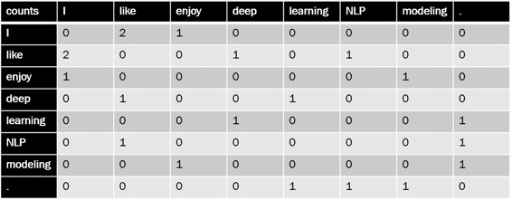
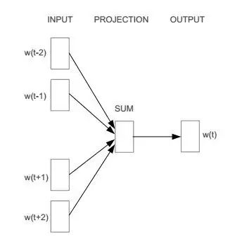
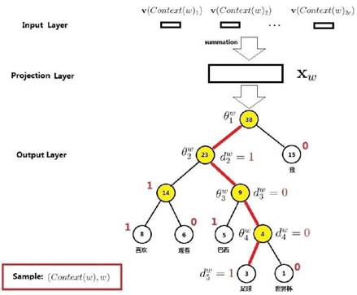
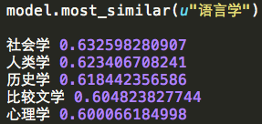
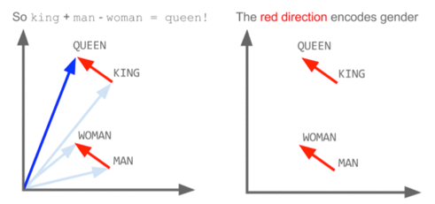
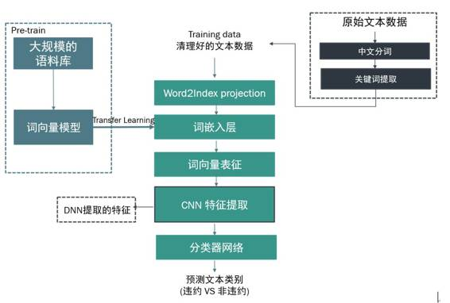

# 专栏 | 用 Word2vec 轻松处理新金融风控场景中的文本类数据

机器之心投稿

**作者：唐正阳**

*编者注：本文作者为 CreditX 氪信市场经理唐正阳，深入浅出的介绍了 word2vec 这一深度学习技术，及其在金融风控领域的应用。*

在当前更加普惠的市场环境下，新金融服务的客群和范围进一步下沉扩大，业务形态也趋于更加小额分散、高效率和规模化，这对传统风控提出了更大的挑战，一方面针对此类客群的高价值金融数据覆盖率大为降低，另一方面业务专家在面对更多非结构化数据时到底该如何与风险挂钩也存有诸多疑惑。事实上，这些不同于传统强征信的数据在新金融风控业务中正显现出越来越重要的作用，大量成熟场景中的实践也证明合理地运用和发挥其价值往往能为整体风控效果带来超出想象的提升。

下面以文本数据为例，为大家简单介绍一下轻松处理和使用这类数据的深度学习技术 word2vec 到底长啥样，具体是怎么来的，以及在我们金融风控场景中应用的案例。

**one hot vector 与 distributed representation**

问你这样一个问题：如果有几个词语摆在你面前，你希望你的计算机能够理解每个词，你可能会采取哪种方式？当然方法有很多种，这里小氪为大家介绍一种稀疏表达的方式——one hot vector，也就是以下这种向量表示：

这种表示方式解决了我们的问题，但也存在一定缺陷，即每个词语都是一个维度，如果词语数量急剧增加，就会形成维度灾难，给我们的建模过程造成较大的困难。这个时候你可能会换另外一种思路，仅用 4 个维度来分别识别性别、老年、成年、婴儿基础信息，这样也可以表示出所有词语，这种表示方法叫做 distributed representation，也称词向量：

 **词向量**

深度学习出来之后，由于突破计算瓶颈，词向量概念也火了起来。首先大家都有这样一种认知假设，即意思相近的词语，它在文本中出现的上下文也是相似的，也就是说，相似的词语拥有相似的语境。因此，我们可以利用一个词语的上下文，如一个词语与其它词语共同出现的次数，这样一个次数组成的向量，来表示这个词语。当然，如果句子特别长，我们可以限定窗口，只取该单词前后 n 个单词的词共现次数来表示这个单词。

比如，仅有以下三个句子的一个语料库：

*   I like deep learning.

*   I like NLP.

*   I enjoy modeling.

取窗口长度 n=1，则下图每一列都是该列单词的词向量。

 

**Word2vec**

下面就是我们的主角 word2vec 出场啦，与之前一般的共现计数不同，word2vec 作为现在主流的词嵌入算法，主要是通过预测一个窗口长度为 c 的窗口内每个单词的周边单词概率，来作为这个单词的词向量。通过这种方式，把单词映射到一个高维向量空间，借此可以计算单词之间的距离，即计算语义相似性。

在 word2vec 中使用最重要的两个模型分别是 CBOW 和 Skip-gram 模型，前者是利用词的上下文预测当前的单词，后者则是利用当前词来预测上下文。

我们先以 CBOW 为例，CBOW 全称是 Continuous Bag-of-Words Model，即连续的词袋，因为它用连续空间来表示词，而且这些词的先后顺序并不重要。它的神经网络结构设计如下：

 

*   输入层：词 w 的上下文一共 2c 个词的词向量

*   投影层：将输入层的 2c 个向量做求和累加

*   输出层：一个霍夫曼树，其中叶子节点是语料中出现过的词，权重是出现的次数

上面的 CBOW 输出层为什么要建成一个霍夫曼树呢？因为我们是要基于训练语料得到每一个可能的 w 的概率。具体怎么得到？我们先来看一下这个例子。比如句子为：我，喜欢，观看，巴西，足球，世界杯；W=足球。

 

在这个霍夫曼树中，词「足球」走过的路径图上容易看到，其中非根节点上的θ表示待训练的参数向量，也就是要达到这种效果：当在投射层产出了一个新的向量 x，那么我通过逻辑回归公式：

σ(xTθ) = 1/(1+e^(-xTθ))

就可以得出在每一层被分到左节点 (1) 还是右节点 (0) 的概率分别是：

p(d|x,θ) = 1-σ(xTθ)和 p(d|x,θ) = σ(xTθ)

那么就有：

p(足球|Context(足球)) = ∏ p(d|x,θ)

现在模型已经有了，接着通过语料来训练 v(Context(w))、x 和θ就可以进行调整优化，由于篇幅原因，具体公式不再赘述。

同样的道理，对于 Skip-gram 模型，即 Continuous Skip-gram Model，利用已知当前词来预测上下文的推理过程和 CBOW 也是大同小异的。

**实际效果举例**

说了这么多，word2vec 到底有多神奇呢？我们以中文维基百科作为训练语料库，给大家看一下直观的例子：比如我们想要看一下和「语言学」语义相似性最高的几个词及其概率，得到结果如下：

 更有趣的是，如下图，X(KING) – X(QUEEN) ≈ X(MAN) – X(WOMAN)，这里 X(w) 表示利用 word2vec 学习得到的单词 w 的词向量。也就是说，词向量能够捕捉到 KING 和 QUEEN 之间、MAN 和 WOMAN 之间某种相同的隐含语义关系。  

 

**新金融风控场景的成熟应用案例**

事实上，在新金融风控场景中，诸如文本等数据往往蕴含着与违约风险深度关联的深层含义，而通过传统统计、标记甚至正则等人工定义的方式往往都难以充分挖掘其风险价值。如下图所示，通过复杂的词向量模型将文本转化为计算机能够「理解」和计算的词向量表征，并基于深度学习技术对其进行特征提取，我们就可以运用成熟的分类器网络将文本数据与违约风险实现高度的风险挂钩。

 

诸多大型成熟风控场景中的实践也发现，对于新金融业务形态下越来越多的诸如文本、时序、影像等非结构化数据，通过充分的价值挖掘正显现出对风控效果超出想象的提升。