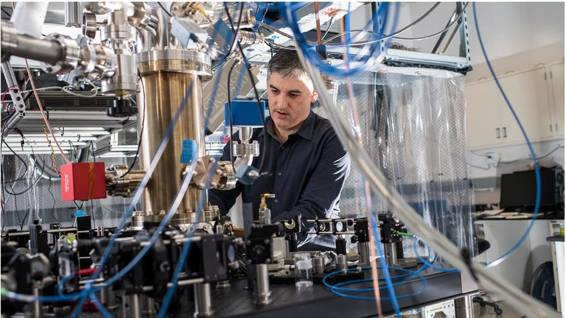
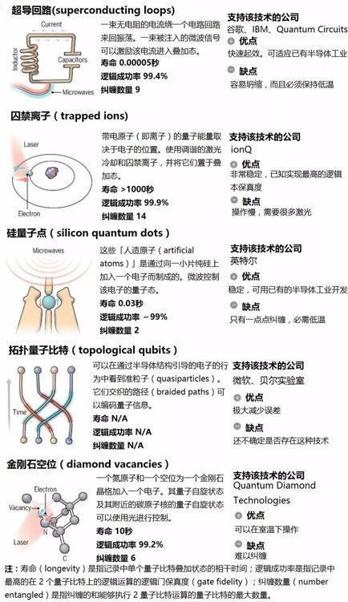
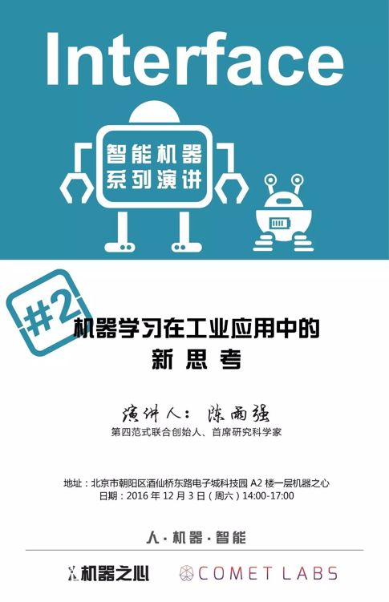

# 重磅 | Science：实用量子计算机已近在咫尺

选自 Science

**作者：Gabriel Popkin**

**机器之心编译**

 

9 月，一个周日的下午，量子计算创业公司 ionQ 的两位联合创始人正和他们的首位受雇人——他们的新 CEO 碰头开战略会议。坐在马里兰大学的 Physical Sciences Complex 里舒适的皮椅上，两位创始人正体验着一丝文化碰撞。终身从事研究的科学家、马里兰大学的物理学家 Chris Monroe 和杜克大学的电子工程师 Jungsan Kim 很放松，甚至在记者面前大谈公司规划。他们列举了为什么选择囚禁离子（trapped ions），他们的专长将有助于打造一台伟大的量子计算机——完美的再现性、耐久性以及利用激光实现的良好的可控性。

公司 CEO David Moehring 是 Monroe 和 Kim 刚从美国 Intelligence Advanced Research Projects Activity（IARPA，[机器之心介绍过这个项目](http://mp.weixin.qq.com/s?__biz=MzA3MzI4MjgzMw==&mid=402748228&idx=3&sn=0ae2f7e04ea672d0376caeba57494661&scene=21#wechat_redirect)）里雇来的，他更为警觉。他警告 Monroe 和 Kim 不要泄露创业公司应予保密的信息——包括从风投 New Enterprise Associates 那里获得的投资额。（他乐意证实这个数字是几百万美元）。Kim 对 Moehring 点着头并轻笑。「在某个时点，这个家伙会要求我们的谈话经过他的许可。」

这几个看似不可能的合伙人都有一个共同的确信：量子计算——旨在利用量子力学来大幅加速计算——已经准备迎来黄金时期。他们并非孤军奋战。科技巨头英特尔、微软、IBM 和谷歌正在量子计算上投入数千万美元。然而这些竞争者们正将赌注下在不同的技术黑马上：仍然无人知晓驱动一台实用的量子计算机需要什么类型的量子比特（qubit）。

谷歌常常被视为这一领域的领头羊，该公司已经示意了其选择：微型超导电路。其研究团队已经打造出了一台 9 量子比特的机器，并希望一年内扩展至 49 量子比特——这是一个非常重要的门槛。在 50 量子比特阶段，许多人认为一台量子计算机就可以成为「量子霸权（quantum supremacy）」，这是加州理工的物理学家 John Preskill 创造的词汇以表示一台可以完成超越传统计算机范围的任务的量子计算机，比如模拟化学和材料科学中的分子结构，或解决机器学习或密码学中的某些问题。

ionQ 的团队并没有被谷歌的成功所折服。

> *「我并不担心谷歌会在下个月宣布游戏已经结束，」Kim 说，「或者他们可以这么宣布，但游戏并未结束。」*

虽然这么说，但是 ionQ 还是有很多劣势，他们还没有专门的办公室，甚至还没有网站。这家创业公司仍然在坚持囚禁离子（trapped ions），这也是世界上最早的量子逻辑门背后的技术，这是由 Monroe 本人在 1995 年亲自帮助创造出来的。使用精准调制的激光脉冲，Monroe 可以将离子激发到可以维持数秒的量子态——这可比谷歌的量子比特维持的时间长多了。Kim 已经开发出了一个可以将离子群（groups of ions）连接到一起的模块化方案。但是到目前为止，其中最好的成绩也不过是实现了 5 个量子比特的可编程机器。

「囚禁离子现在确实有点害群之马（black sheep）的感觉，」Monroe 承认，「但我认为未来几年人们会蜂拥而至。」

有一件事是确定无疑的：打造出一台量子计算机已经不再是一些大学科学家的遥远梦想了，现在这已经成了世界上一些最大型的公司的直接目标。而且 Monroe 及其同事也只是那些希望从中获利的许多人的一部分。尽管在产业界玩家方面，超导量子比特可能已经获得了领先的发展势头，但相关专家都认为现在要说哪种技术已经获胜还为时尚早。「这些技术在齐头并进地开发着，这是件好事，」加州理工的这位量子信息科学的非官方院长 Preskill 说，「因为还可能会有惊喜出现而改变现在的局面。」

*在开发量子计算机的竞争中，不同的公司看中了不同的量子比特（qubit），其中每一种技术都有自己的优点和缺点。（制图：C. Bickel/Science，数据：Gabriel Popkin，汉化：机器之心）*

量子比特能秒杀传统计算机比特得益于两个独特的量子效应：量子叠加和量子纠缠。量子叠加能够让一个量子比特的值不单止于 0 或者 1，而是在同一时间同时具备这两种状态，这可以实现同步的计算。量子纠缠能让一个量子比特与空间上独立的其他量子比特共享自身状态，创造出一种超级叠加，每个量子比特的处理能力因此翻倍。比如，5 个纠缠的量子比特能够同时执行 25 或 32 个计算操作，而传统算机不得不按顺序进行 32 次计算。理论上，只要 300 全纠缠的量子比特（fully entangled qubits）就能支持比宇宙中原子数量更多的平行计算，

这种大规模并行可能在很多任务上并没有什么价值——没有人认为量子计算机会革命文字处理或电子邮件。但其可以极大地加速被设计用来同时探索大量不同路径的算法，这能够解决的问题包括：通过大数据进行搜索、发现新型的化学催化剂、对用于加密数据的大数进行因数分解。量子计算机也可以在物理学领域被用来模拟黑洞或其它现象。

但是，我们还有很多的工作要做。量子叠加态和纠缠态是非常脆弱的。一点来自环境的轻微扰动就能将其破环——甚至对其进行观测就会破坏其状态。量子计算机需要被保护起来，以免受耶鲁大学物理学家 Robert Schoelkopf 所说的「经典混沌之海（a sea of classical chaos）」的干扰。

虽然相关理论在 20 世纪 80 年代初就开始萌芽，但实验量子计算直到 1995 年才得以发展。1995 年，新泽西州 Murray Hill 贝尔实验室一位名叫 Peter Shor 的数学家证明了运用量子计算机能有效地进行大数的因式分解，这种能力使得现代密码学在量子计算机面前变得不堪一击。Shor 和其他一些学者也证明，从理论上来说通过邻近的量子比特来纠正错误，一直保持脆弱量子比特的稳定性是可能实现的。

突然间，一些物理学家和他们的资助人出于某种具体的原因也都开始去研发量子计算机，并且表明这个机器不会变成一大堆级联错误。David Wineland 是美国科罗拉多州博尔德国家标准技术研究所（NIST）的一位物理学家，曾经获得过诺贝尔奖，他率先提出了激光冷却离子并控制其内部量子态的方法。在 Shor 的研究发布之后不到一年的时间里，Wineland 和当时 NIST 的另外一位科学家 Monroe 就通过用激光控制铍离子中的电子态的方法，建立了第一个量子机制逻辑门（quantum mechanical logic gate）。Monroe 说，正是因为 Wineland 在离子方面的研究，我们才能在早期的量子计算实验当中就把握领先趋势。

> *我们总是爱开玩笑说，等到我们有了量子计算机，我们就用它设计下一台量子计算机。——Krysta Svore，微软研究员*

随着世界各地政府将大把研究经费投向量子物理研究团体，其他的一些类型的量子比特开始出现了。21 世纪初，囚禁离子（trapped ion）的概念受到了另一个新概念的挑战：由超导体制成的回路，所使用的超导体是一种带有振荡电路的金属材料，其在冷却到接近绝对零点时没有电阻。量子比特的 0 和 1 与不同的电流强度相对应。回路通过肉眼便可以观察，不需要用到激光，用简单的微波电子技术就可以控制，制作过程只需要使用常规的计算机芯片制造技术。此外，回路的运行也非常快。

但是超导体有一个致命的弱点：环境噪音，即使是用来控制它们的电子设备，都能在不到一微秒的时间之内打乱其量子叠加态。但是工程技术的发展已经将回路的稳定性提高了至少一百万倍，所以现在它们保持叠加态的时间可以达到几十微秒，虽然维持时间仍然比离子要短得多。

2007 年，加拿大本那比市的一家创业公司 D-Wave Systems 发布了一则让所有人都为之震惊的消息，它宣布研制成功了 16 个量子比特的超导量子计算机。D-Wave 研制的这台机器并没有纠缠所有的量子比特，在编程时也不能一个量子比特一个量子比特地进行。该计算机所依赖的是一种叫做量子退火（quantum annealing）的技术，在这种技术当中，量子比特可以和邻近的量子比特纠缠，交互产生一个单独的整体量子态，而不是一系列并行计算。D-Wave 的开发者希望能够把复杂的数学问题映射到量子态当中，并运用量子效应来找到最小值。这种技术很有前景，可有望用于解决高效航空交通路径规划等最佳化问题。

但批评声接踵而至： D-Wave 甚至没有尝试解决那些对量子计算来说至关重要的问题，例如纠错。但是各大公司仍对这种设备趋之若鹜，谷歌和洛克希德马丁公司都成为了 D-Wave 的客户。一个暂时的共识形成了：它可以进行一些量子计算，对于某些特殊任务，它可能比常规计算机处理得更快。无论量子与否，D-Wave 让一些公司开始展开思路。「它让我们睁开了双眼，」Monroe 说道。「D-Wave 的出现预示着这个市场正在形成，对于此类设备的需求已经出现。」在不久的将来，越来越多的公司就会在量子计算之上开展自己的业务。

在对未来量子计算的赌局中，英特尔押上了最重的筹码，它在 2015 年宣布，将对源自荷兰 Delft 科技大学的一家公司 QuTech 投入 5000 万美元的研究资金。这一公司致力于开发硅量子点（silicon quantum dots）研究，它也经常被称为「人工原子（artificial atoms）」。每个点量子比特是一块小材料，其中结构就像原子一样，电子的量子态可以用来表示 0 和 1。不同于离子或原子，量子点不需要用激光。

早期的实验中，量子点由砷化镓的近乎完美的晶体制成，但是研究人员目前已经转向使用硅，并希望利用上半导体工业现成的大量制造设施。「我认为英特尔的心脏是由硅组成的，」QuTech 的科学总监 Leo Kouwenhoven 说道。「这就是为什么他们拥有如此地位的原因。」然而，硅基量子比特的效率远远不及那些基于离子和超导体的竞争者，其第一个双量子比特逻辑门直到去年才由澳大利亚新南威尔士大学的研究者开发出来。

微软的行动看起来更加有远见：基于非阿贝尔任意子（nonabelian anyons）的拓扑量子比特（topological qubits）。这根本不是物体——它们是准粒子，沿着两种不同的材料的结合处运动——它们的量子态在其运行的不同路径中被编码。因为运行路径的交汇导致了量子比特的叠加，所以它们会被「拓扑保护（topologically protected）」免于塌缩，就像系好的鞋带，即使在运动中也不会松开。

这种性质意味着理论上，拓扑量子计算机不需要将大量的量子比特用在纠错上。早在 2005 年，一个微软领导的团队提出了一种在混合半导体——超导体结构中建立拓扑保护——的量子比特的方法，近年来微软已经资助了多个研究团队试图制造这样的机器。这些团队的最新论文和贝尔实验室的一项独立研究展示了这种任意子（anyon）在特定电路中的运动方式，科学家们正在接近制出真正的量子比特，Preskill 表示：「我认为再过一两年，我们就可以肯定地说：拓扑量子比特是存在的。」

而谷歌已经招募到了加州大学圣塔芭芭拉分校（UCSB）的超导量子比特专家 John Martinis。在 UCSB 的时候，John Martinis 深入研究了 D-Wave 系统的运行方式和短板。谷歌在 2014 年几乎将 Martinis 的整个研究组都挖过去了，招募了组内的 12 名成员。之后不久，Martinis 团队就宣布他们构造出了一个 9 量子比特的量子计算机。他们所构建的这个拥有 9 量子比特的量子计算机至今为止依然是最大的可编程的量子计算机之一，目前他们正在研究如何对其进行扩展。为了避免所建的量子计算机是一堆杂乱线路的混合体，他们重新将该量子计算机系统构建成了一个二维的阵列，该阵列位于一块蚀刻有控制线的晶圆之上。

在 7 月，Martinis 的团队用 3 个超导量子比特成功地模仿了一个氢分子的基态能，证明量子计算机和常规计算机一样具备模拟简单量子系统的能力。Martinis 说这个结果将大家引入对拥有量子计算超能力的机器的无限憧憬之中，他的团队现在也有科学家和工程师近 30 人。他将一年之内构建出一个 49 量子位的量子计算机的任务视为一个「不容易实现的目标」，但是他认为这个任务还是可能实现的。

与此同时，Monroe 正在和囚禁离子研究中遇到的挑战「缠斗」。囚禁离子的量子比特可以维持数秒的稳定，这一特性得益于真空腔和电极的作用，它们可以在外部噪声存在的情况下维持量子比特的稳定。但是通过真空腔将量子比特隔离后会遇到另一个问题：怎么使量子比特之间相互作用？Monroe 最近成功将 22 个镱离子纠缠成了一个直线链（linear chain），但是目前他还不能够控制或查询该链之中的所有离子对——而这正是量子计算机所需要的。

当离子数目变成以前的平方倍的时候，控制总体的复杂度会增加，因此加入更多的离子是不实际的。Monroe 相信前进的办法就是模块化并使用光纤连接不同的量子阱（traps），每个量子阱（traps）里大约有 20 个离子。如此一来，每个模块里的某些量子比特就可以充当枢纽核心，获取来自量子比特其他部分的信息，同时也可以与其他模块的核心进行信息分享；通过这种方式，绝大部分量子比特能够继续避开外部干涉。

最近一个下午，Monroe 在马里兰大学展出了他的 6 个实验室空间。在建成比较久的 3 个实验室，从上到下都是互相缠绕的电线和真空管。在一个巨型工作台上，迷阵般排列的透视镜和平面镜形塑着激光，并引导激光到达（装有所有重要的原子）钢制真空罐罐口。头顶上的加热设备，保持良好的通风以及使用空气调节系统（HAVC）是使灰尘降落的必备条件。同时 HAVC 也是稳定实验室温度的有效措施，虽然 HAVC 会产生持续的嗡嗡声。「我对 HVAC 充满爱意，」Monroe 说道。

这三个更新的实验室相比之下显得整洁和空旷。大多数激光都是集成的，而不是像鲁贝戈德堡光学桌（Rube Goldberg optics tables）那样，它们是来自诸如 Honeywell 这样公司的即插即用型组件——针对各种可立即启用系统（turnkey system) 的原型，如果 ionQ 想要成功就要完善它们。Monroe 说：「我们现在用的激光只有一个旋钮，它是『开着（on）』的」。他心痒难耐地想让 ionQ 实验室运转起来，这样他就可以将高薪的研究科学家转移到 ionQ 工作中，并能让他们继续完善在马里兰大学已经开发出的技术——多亏一个不寻常的协议，ionQ 可以进行独家授权并免税。明年，他将在第一次休假期间重点建设 ionQ。他说:「流入量子研究的私人投资是我职业生涯中最大的一笔交易。」

即使有大量资金的投入，量子计算成为一个秘密商业领域还有很长的路要走。主要的研究小组，甚至是那些隶属大公司的仍然在展示成果和出席讨论会。还说他们在宣传技术进步方面有共同的利益，不仅仅是让潜在客户想到他们可以如何使用一台量子计算机。Monroe 说：「我们都需要一个市场」。

更重要的是，没有人足够了解量子计算，所以也就没人能说用单独的哪一种量子比特就能实现量子计算机。在扩展实用的量子计算机之前，每一种方面都还需要经过精心的调制细化。超导基量子比特（Superconductor-based qubits）和硅基量子比特（silicon-based qubits）需要在更大的一致性（consistency）下制造，而冷却设备需要高效化。同时囚禁离子需要更快的逻辑门和更紧凑的激光与光学器件。拓扑量子位也还需要被创造。

未来的量子计算机很可能是一个混合物（hybrid），它利用超快的超导量子比特运行算法，然后用更稳定的离子内存输出，同时使用光子在该机器的不同部分之间或量子网络节点之间穿梭传递信息。微软研究人员 Krysta Svore 说：「可以想象我们会身处这样一个境地：有几类量子比特，它们各自扮演不同角色。」

量子计算机实在是太前沿、太奇异了，即使是世界顶级量子物理学家和计算机工程师也不知道一台商用量子计算机最终会是什么样。Svore 说：「物理学家只需要以目前的技术构建尽可能复杂的计算机，接着直面一定会冒出来的新挑战——然后构建，学习，再重复。我们喜欢开玩笑说一旦我们有了量子计算机，我们将会用它来设计下一个量子计算机。」

*延伸阅读：*

*   [重磅 | 量子计算大跃进？D-Wave 将于明年推出 2000 量子比特芯片](http://mp.weixin.qq.com/s?__biz=MzA3MzI4MjgzMw==&mid=2650719333&idx=1&sn=468fef3ccbeab4a270095b5dd635ea25&chksm=871b001bb06c890d14a1f254c517d1d6916e3cf69be9c79b8b4a9eb127b2eeda447edb063203&scene=21#wechat_redirect)

*   [深度 | MIT 量子专家 Seth Lloyd：量子计算更擅长机器学习，发现传统计算无法发现的数据模式](http://mp.weixin.qq.com/s?__biz=MzA3MzI4MjgzMw==&mid=2650719175&idx=1&sn=8acc991d101e5955fcceb044eabbdd7a&chksm=871b07b9b06c8eaff0394b41bce7a5db7dbf6ed930e86ffc2769fac86d870ee735a300f68c2b&scene=21#wechat_redirect)  

*   [前沿 | 反向工程破解大脑算法，让机器像人类一样学习](http://mp.weixin.qq.com/s?__biz=MzA3MzI4MjgzMw==&mid=402443019&idx=1&sn=728b556d2bea252e454a4cb320fb50ea&scene=21#wechat_redirect)

*   [业界｜IBM 开放量子计算平台，开发者也能使用量子计算服务](http://mp.weixin.qq.com/s?__biz=MzA3MzI4MjgzMw==&mid=2650715225&idx=2&sn=8207414b4d008e5eddbd2964d62475cf&scene=21#wechat_redirect)

*   [业界 | 量子计算未来布局：这 18 家公司走在了世界前列](http://mp.weixin.qq.com/s?__biz=MzA3MzI4MjgzMw==&mid=2650719170&idx=4&sn=3f3caf8c5ee2e12e9c9b080bba2c0e56&chksm=871b07bcb06c8eaa63b10bd97def628eebbe2f7c01a1be4a5c844c8a050578b9e362e1930677&scene=21#wechat_redirect)

*原文链接：http://www.sciencemag.org/news/2016/12/scientists-are-close-building-quantum-computer-can-beat-conventional-one*

******©本文为机器之心编译文章，***转载请联系本公众号获得授权******。***

✄------------------------------------------------

**加入机器之心（全职记者/实习生）：hr@almosthuman.cn**

**投稿或寻求报道：editor@almosthuman.cn**

**广告&商务合作：bd@almosthuman.cn**

* * *

北京时间 12 月 3 日下午 2 点，机器之心将联合第四范式举办主题为“人工智能在工业应用上的技术突破和研究方向”的线下分享活动。第四范式联合创始人、首席研究科学家陈雨强分享人工智能在工业应用中的经验历程，以及其对于未来人工智能如何以更全局、智能、低耗的方式落地的思考，包括特征组合、可控模型等最新突破技术。

无法来现场的小伙伴可点击「阅读原文」（链接 https://zoom.us/j/907901282）观看直播！

