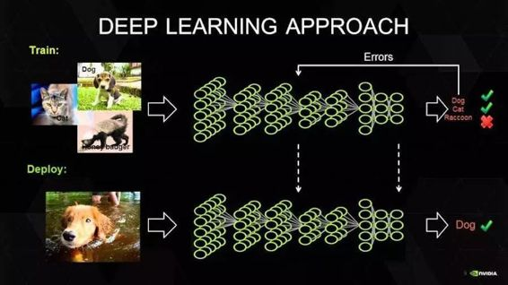
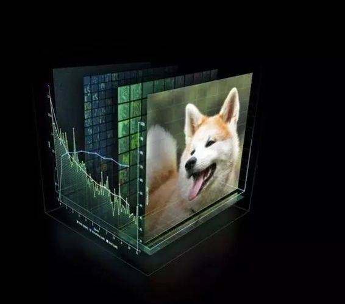

# 干货 | 深度学习硬件架构简述

选自 Fossbytes

**机器之心编译**

**参与：周文璐、吴攀**

> *深度学习具有极高的计算需求， 要对深度学习应用进行开发并商业化，就需要找到合适的硬件配置。目前，在开发用于深度学习应用的高效硬件平台这一领域，竞争十分激烈。本文将介绍具体的硬件要求，并讨论未来对深度学习硬件的展望。*

深度学习在这十年，甚至是未来几十年内都有可能是最热门的话题。虽然深度学习已是广为人知了，但它并不仅仅包含数学、建模、学习和优化。算法必须在优化后的硬件上运行，因为学习成千上万的数据可能需要长达几周的时间。因此，深度学习网络亟需更快、更高效的硬件。

众所周知，并非所有进程都能在 CPU 上高效运行。游戏和视频处理需要专门的硬件——图形处理器（GPU），信号处理则需要像数字信号处理器（DSP）等其它独立的架构。人们一直在设计用于学习（learning）的专用硬件，例如，2016 年 3 月与李世石对阵的 AlphaGo 计算机使用了由 1920 个 CPU 和 280 个 GPU 组成的分布式计算模块。而随着英伟达发布新一代的 Pascal GPU，人们也开始对深度学习的软件和硬件有了同等的关注。接下来，让我们重点来看深度学习的硬件架构。

**对深度学习硬件平台的要求**

要想明白我们需要怎样的硬件，必须了解深度学习的工作原理。首先在表层上，我们有一个巨大的数据集，并选定了一种深度学习模型。每个模型都有一些内部参数需要调整，以便学习数据。而这种参数调整实际上可以归结为优化问题，在调整这些参数时，就相当于在优化特定的约束条件。

 

*图片：英伟达*

[百度的硅谷人工智能实验室（SVAIL）已经为深度学习硬件提出了 DeepBench 基准](http://mp.weixin.qq.com/s?__biz=MzA3MzI4MjgzMw==&mid=2650719456&idx=2&sn=8c6695450f107e3932ea7c15acc536a1&chksm=871b009eb06c8988f3462bd352566ad5fcda05766bf09a8dda2e1ca36b6f1fabde685e9e0830&scene=21#wechat_redirect)，这一基准着重衡量的是基本计算的硬件性能，而不是学习模型的表现。这种方法旨在找到使计算变慢或低效的瓶颈。 因此，重点在于设计一个对于深层神经网络训练的基本操作执行效果最佳的架构。那么基本操作有哪些呢？现在的深度学习算法主要包括卷积神经网络（CNN）和循环神经网络（RNN）。基于这些算法，DeepBench 提出以下四种基本运算：

*   矩阵相乘（Matrix Multiplication）——几乎所有的深度学习模型都包含这一运算，它的计算十分密集。

*   卷积（Convolution）——这是另一个常用的运算，占用了模型中大部分的每秒浮点运算（浮点／秒）。

*   循环层（Recurrent Layers ）——模型中的反馈层，并且基本上是前两个运算的组合。

*   All Reduce——这是一个在优化前对学习到的参数进行传递或解析的运算序列。在跨硬件分布的深度学习网络上执行同步优化时（如 AlphaGo 的例子），这一操作尤其有效。

除此之外，深度学习的硬件加速器需要具备数据级别和流程化的并行性、多线程和高内存带宽等特性。 另外，由于数据的训练时间很长，所以硬件架构必须低功耗。 因此，效能功耗比（Performance per Watt）是硬件架构的评估标准之一。

**当前趋势与未来走向**

 

*英伟达的 GPU 在深度学习硬件市场上一直处于领先地位。图片：英伟达*

英伟达以其大规模的并行 GPU 和专用 GPU 编程框架 CUDA 主导着当前的深度学习市场。但是越来越多的公司开发出了用于深度学习的加速硬件，比如谷歌的张量处理单元（TPU/Tensor Processing Unit）、英特尔的 Xeon Phi Knight's Landing，以及高通的神经网络处理器（NNU/Neural Network Processor）。像 Teradeep 这样的公司现在开始使用 FPGA（现场可编程门阵列），因为它们的能效比 GPU 的高出 10 倍。 FPGA 更灵活、可扩展、并且效能功耗比更高。 但是对 FPGA 编程需要特定的硬件知识，因此近来也有对软件层面的 FPGA 编程模型的开发。

此外，一直以来广为人所接受的理念是，适合所有模型的统一架构是不存在的，因为不同的模型需要不同的硬件处理架构。 而研究人员正在努力，希望 FPGA 的广泛使用能够推翻这一说法。

大多数深度学习软件框架（如 TensorFlow、Torch、Theano、CNTK）是开源的，而 Facebook 最近也开放其 Big Sur 深度学习硬件平台，因此在不久的将来，我们应该会看到更多深度学习的开源硬件架构 。

******©本文由机器之心编译，机器之心系今日头条签约作者，本文首发于头条号，***转载请联系本公众号获得授权******。***

✄------------------------------------------------

**加入机器之心（全职记者/实习生）：hr@almosthuman.cn**

**投稿或寻求报道：editor@almosthuman.cn**

**广告&商务合作：bd@almosthuman.cn**