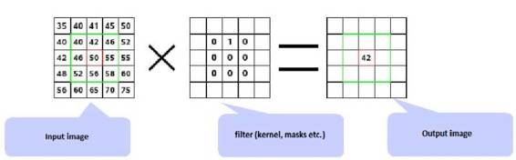
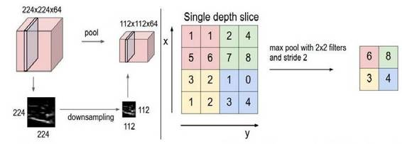
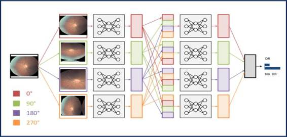

# 深度 | 深度学习系列文章 Part2：迁移学习和微调深度卷积神经网络（附论文）

选自 RevolutionAnalytics

**作者： Anusua Trivedi**

**机器之心编译**

**参与：武竞、吴攀、李亚洲**

> *本文是微软数据科学家 Anusua Trivedi 所写的《Deep Learning》系列文章的第二部分，是对迁移学习和微调深度卷积神经网络的介绍。机器之心此前也已经编译了该系列的第一部分，详情点击《[五大主流深度学习框架比较分析：MXNET 是最好选择](http://mp.weixin.qq.com/s?__biz=MzA3MzI4MjgzMw==&mid=2650718160&idx=3&sn=a2114e3324f28740d2603da26fbbdfb4&scene=21#wechat_redirect)》。文中涉及到的论文可点击阅读原文下载。*

这是由几个部分组成的博客系列，我将在此系列中聊一聊我对深度学习的经验及认识。在第一部分，我讨论了不同的有代表性的框架的优劣，以及我选择 Theano（与 Lasagne）作为我的平台的原因。

第二部分是基于我将要在 2016 年度数据科学论坛（The Data Science Conference）上的发言内容整理的。我将在这部分讲解深度卷积神经网络（DCNN：Deep Convolutional Neural Network），以及迁移学习（Transfer learning）和微调（Fine-tuning）可以如何帮助更好地完成特定领域图像的训练过程。

**引言**

一种叫糖尿病视网膜病变（DR）的眼病是视力减退的常见原因。使用荧光血管造影筛查糖尿病患者有可能降低致盲的风险。目前的研究趋势已经证明，DCNN 在自动分析大量图像和识别图像特征方面是非常有效的，它可以将图像分类的误差降到最低。DCNN 很少从头开始训练，因为得到足够大样本量的特定领域的数据集并不是那么容易。同时由于现代 DCNN 在 GPU 上训练需要耗时 2-3 周，加州大学伯克利分校的视觉和学习中心（BVLC）发布了一些最终 DCNN 检查点。在这篇文章中，我们使用一个预训练的网络：GoogLeNet。GoogLeNet 是基于大量真实图像的 ImageNet 图像库预训练的网络。我们将学习的 ImageNet 的权重迁移（transfer）作为网络的初始权重，然后微调（fine-tune）这些预训练的通用网络使它们能够识别出眼睛的荧光血管造影图像，从而提高对 DR 眼病的预测效果。   

**使用提取的明确特征预测糖尿病视网膜病变**

对于提取 DR 患者的显著特征，人们已经进行了很多算法开发和形态图像处理方面的研究。一个标准的图像分类技术所用的一般工作流程如下：

*   噪声去除和增强对比度的图像预处理技术 

*   特征提取技术

*   分类 

*   预测

Faust 等人的论文提供了一种非常全面的分析模型来提取 DR 筛选的特征。Vujosevic 等人的论文基于 55 位病人的图像数据，建立了一个明确形成单发病灶特征的二元分类器。Acharya 等人的论文使用形态图像处理技术来提取血管和出血点，然后在一个 331 张图像的数据集上训练了一个 SVM（支持向量机）模型。Nayak 等人的论文报告称在 140 张图像的数据集的二元分类任务上实现了 90% 的准确率和 90% 的灵敏度（sensitivity）。

然而，所有这些处理方法都是非常耗时耗力的。进一步提高预测精度仍需要大量有标签的数据。对于图像数据集的图像处理和特征提取是一件十分繁琐和耗费时间的事情。综上，我们需要选用一种自动处理图像和特征提取的方法——DCNN。

**深度卷积神经网络（DCNN）**

图像数据需要相关领域的专业知识来提取关键特征。DCNN 可以自动从特定领域的图像中提取特征，不需要任何特征工程技术。下列过程使得 DCNN 非常适合用来分析图像信息：

*   DCNN 可以训练有很多层的网络

*   叠加多个层可以建立改进的特征空间 

*   初始层用来学习最基本的特征（例如颜色、边缘等）

*   后面的层用来学习更高级的特征（针对输入数据集的特征）

*   最终层的特征被送入分类层  

*C 层是卷积，S 层是池化/采样*

**卷积**：卷积层由矩形网格的神经元构成。卷积层中每一个的神经元的权重相同。卷积过滤器（convolution filter）由卷积层的权重确定。

 

*卷积*

**池化：**池化层从卷积层获取小矩形块，对这些块进行子抽样（subsample），以产生该块的单个输出。

 

*池化*

在这篇文章中，我们将使用谷歌开发的 GoogLeNet DCNN。GoogLeNet 曾赢得了 2014 年的 ImageNet 挑战赛（ImageNet challenge），并创造了同期结果的最好记录。开发这个模型的动机是为了得到一个更深度的同时又在计算上更便宜的计算架构。

 

GoogLeNet

**迁移学习和微调 DCNN**

在实践中，我们通常不会完全从头开始随机初始化训练 DCNN，这是因为有能满足深度网络需求的足够大小的数据集相当的少见。作为代替，常见的是在一个大型数据集上预训练一个 DCNN，然后使用这一训练的 DCNN 的权重作为初始设置或作为相关任务的固定的特征提取器。

微调（Fine-Tuning）：迁移学习策略取决于多种因素，但最重要的两个是新数据集的大小以及新数据集与原数据集的相似度。谨记网络前面几层的 DCNN 特征更加泛型（generic），在后面层中更加具有数据集特定性（dataset-specific），以下是 4 个主要情景：

*   新数据集相比于原数据集在大小上更小，在内容上相似：如果数据过小，考虑到过拟合，这对 DCNN 的微调来说不太好。因为数据类似于原数据，我们期望 DCNN 中更高层次的特征也与此数据集相关。因此，最好的思路可能是在 CNN 特征上训练一个线性分类器。

*   新数据集相比于原数据集在大小上较大，在内容上相似：由于我们有更多的数据，如果我们试图微调整个网络那我们更有信心不会过拟合。

*   新数据集相比于原数据集更小但内容很不相同：由于数据较小，只训练一个线性分类器可能更好。因为数据集不同，从网络顶部就开始训练分类器可能不是最好的选择，这包含更多的数据集特定特征。另外，从网络前部的激活函数开始训练分类器可能更好一点。

*   新数据集相比于原数据集较大，但内容非常不同：由于数据集很大，我们可能会期望从头开始训练一个 DCNN。然而，在实践中从一个预训练模型开始初始化权重仍然是一种有益的方法。在这种情况下，我们会有足够的数据和信心对整个网络进行微调。

**微调 DCNN**：对 DR 预测问题而言，我们属于第四种情景。我们通过持续的反向传播来微调预训练的 DCNN 的权重。微调 DCNN 的所有层是可能的，或者保持前面一些层固定（由于担忧过拟合）而只微调网络的一些高层部分是可能的。可以这么做是因为我们已经观察到 DCNN 的一些早期特征中所包含的特征更为一般化（如边缘检测器或彩色斑点检测器），可以在许多任务中发挥作用；而 DCNN 中更靠后的层会越来越特定于该 DR 数据中所包含的分类的细节。

**迁移学习的限制**：因为我们使用了预训练的网络，所以我们在模型架构方面受到了一点点限制。比如说，我们不能随意移除预训练网络中的卷积层。但由于参数共享的关系，我们可以很轻松地在不同空间尺寸的图像上运行一个预训练网络。这在卷积层和池化层和情况下是显而易见的，因为它们的前向函数（forward function）独立于输入内容的空间尺寸。在全连接层（FC）的情形中，这仍然成立，因为全连接层可被转化成一个卷积层。

**学习率（learning rate）**：我们假设预训练的 DCNN 的权重是相对较好的，因此我们可以给正被微调的 DCNN 权重使用较小的学习率。我们不希望太快或过于改变它们，所以我们让我们的学习率和学习率衰减都保持得非常小。

**数据增强（Data Augmentation）**：非正则化网络的一个缺点是它们非常灵活：它们可以同样好地学习特征和噪声，而这会带来过拟合的风险。我们在我们的模型中使用了 L2 正则化来避免过拟合。但即使在那之后，我们也还是观察到了训练和验证 DR 图像上模型表现的巨大差异，这说明对训练数据集的微调过程是过拟合的。为了解决这个过拟合问题，我们在 DR 图像数据集上使用了数据增强。

数据增强的方法有很多，例如流行的水平翻转（horizontally flipping）、随机修剪（random crop）和色彩抖动（color jittering）。因为这些图像中的颜色信息是非常重要的，所以我们只是对图像进行了不同角度（0, 90, 180, 270 度）的旋转。

*使用 DR 图像替换预训练的 GoogLeNet 网络的输入层。我们对所有的层都进行了微调，除了最顶上的 2 个预训练层——这 2 层包含了更一般的独立于数据的权重。*

**微调 GoogLeNet**：我们在这里所使用的用于 DR 筛选的 GoogLeNet 最初是在 ImageNet 上训练的。ImageNet 数据集包含了大约 100 万张自然图像和 1000 个标签/分类。相对而言，我们的有标注的 DR 数据集仅有 30,000 张特定领域的图像和 4 个标签/分类。因此，我们的 DR 数据集不足以用来训练 GoogLeNet 这样复杂的网络，所以我们使用了来自根据 ImageNet 训练的 GoogLeNet 网络的权重。我们对所有的层都进行了微调，除了最顶上的 2 个预训练层——这 2 层包含了更一般的独立于数据的权重。其原本的分类层 loss3/classifier 可以输出有 1000 个类别的预测，我们将其替换成了一个二元分类层。

*微调 GoogLeNet*

**结论**

微调让我们能将顶级 DCNN 模型的能力带入到数据不足、时间/成本限制可能阻碍其使用的新领域。这一方法在平均准确率上取得了重大提升，也推进了最先进的基于图像的医学分类技术的发展。

******「[语言与智能高峰论坛](http://mp.weixin.qq.com/s?__biz=MzA3MzI4MjgzMw==&mid=2650718504&idx=4&sn=bc4a3996c0db3de7d80702721482becd&scene=21#wechat_redirect)（嘉宾：张钹院士、怀进鹏院士、洪小文、王坚、杨强、邢波、王海峰、胡郁）」明日召开，机器之心将在斗鱼平台全程直播，房间号：985893。******

