# 重磅 | 图文并茂的神经网络架构大盘点：从基本原理到衍生关系

选自 THE ASIMOV INSTITUTE

**机器之心编译**

**作者：FJODOR VAN VEEN**

**参与：吴攀、李亚洲**

随着新型神经网络架构如雨后春笋般地时不时出现，我们已经很难再跟踪全部网络了。要是一下子看到各种各样的缩写（DCIGN、BiLSTM、DCGAN……），真的会让人有点招架不住。

为此，Fjodor Van Veen 写出了一篇包含了大量架构（主要是神经网络）的盘点性文章，并绘制了直观的示意图进行说明。

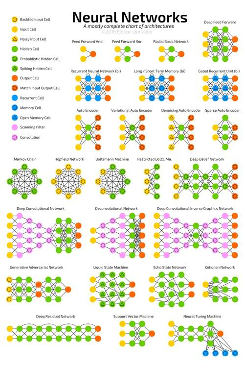

将这些架构绘制成节点图的一个问题：它并没有真正展示这些架构的工作方式。比如说，变自编码器（VAE）可能看起来和自编码器（AE）一样，但其训练过程却相当不同。训练好的网络的使用案例之间的差别甚至更大，因为 VAE 是生成器（generator），你可以在其中插入噪声来得到新样本；而 AE 只是简单地将它们的输入映射到其所「记得」的最接近的训练样本。所以必须强调：这篇概览中的不同节点结构并不能反映出这些架构的内在工作方式。

列出一份完整的列表实际上是不可能的，因为新架构一直在不断出现。即使已经发表了，我们可能很难找到它们，而且有时候还会不自觉地忽略一些。所以尽管这份清单能为你提供人工智能世界的一些见解，但无论如何请不要认为这份清单是全面的；尤其是当你在这篇文章写出后很久才读到时（注：本文原文发表于 2016 年 9 月 14 日）。

对于本文中图片所描绘的架构，作者都写了一点非常非常简短的说明。如果你很熟悉其中一些架构，但不熟悉另一些，你可能会觉得这些说明会有用处。

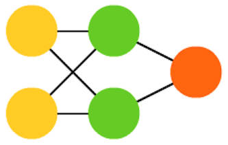

**前馈神经网络**（FF 或 FFNN：Feed Forward neural networks）是非常简单的：它们从前向后馈送信息（从输入到输出）。神经网络常被描述为层级形式，其中的层（layer）可能是输入层、隐藏层或输出层。一个单独的层不存在什么连接（connection），而通常相邻的两个层是完全连接的（一个层的每一个神经元都连接到另一个层的每一个神经元）。其中可以说是最简单的实际网络具有两个输入单元和一个输出单元，其可用于对逻辑门进行建模。人们常常通过反向传播（back-propagation）来训练 FFNN，从而让该网络获得配对的数据集——「输入的内容」和「我们想要得到的输出」。这被称为监督学习（supervised learning），其相反的方法被称为无监督学习（unsupervised learning），其中我们只需要给出输入然后让网络自己填补空白。被反向传播的误差（error）常常是输入和输出之间差分（difference）的某种变体（如 MSE 或只是线性差分）。如果该网络有足够的隐藏神经元，那么理论上它总是能够建模出输入和输出之间的关系。实际上它们的使用存在很大的限制，但它们常被用来与其它网络结合以构建新的网络。

 

**径向基函数**（RBF: Radial basis function）网络是使用径向基函数作为激活函数（activation function）的 FFNN。没什么其它的了。但这不意味着它没有用处，但大部分带有其它激活函数的 FFNN 都没有自己的专用名称。这主要是因为人们在正确的时间发明了它。

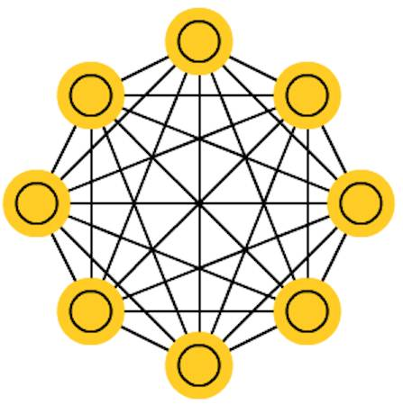 

**霍普菲尔德网络**（HN: Hopfield Network）是一种每一个神经元和其它每一个神经元都有连接的网络；它是完全纠缠在一起的意大利面条，其中所有的节点都是全功能的。在训练之前，每一个节点都是输入；在训练过程中，每一个节点都是隐藏；之后它们都是输出。这种网络的训练是：将神经元的值设置成我们想要的模式，从而计算出权重（weight）。之后权重便不再变化。一旦为一种或多种模式进行了训练之后，这种网络总是会收敛成其学习过的一种模式，因为这种网络只能稳定在这些状态。请注意它并不是符合预期的状态（悲伤的是它并不是魔法黑箱）。因为该网络的总「能量（energy）」或「温度（temperature）」在训练过程中会逐渐减小，所以它总会一部分接一部分地稳定下来。每一个神经元都一个可以扩展到这个温度的激活阈值，而如果该神经元的输入总和超过了该阈值，那么输入就会使神经元从两个状态（通常是 -1 或 1，有时候是 0 或 1）之中选择一个。网络的更新可以同步完成，但更常见的是一个接一个更新神经元。如果是一个接一个地更新，就会创建一个公平随机（fair random）的序列来组织哪些单元以哪种顺序更新（公平随机是指所有（n）的选择在每 n 个项中只恰好发生一次）。这样你就能分辨网络何时达到了稳定（收敛完成）：一旦每一单元都被更新后而其中没有任何改变，那么该网络就是稳定的（即退火了的（annealed））。这些网络常被称为联想记忆（associative memory），因为其会收敛到与输入最相似的状态；人类看到半张桌子就能想象出另一半，类似地，如果给这种网络提供半张桌子和一半噪声，那么该网络就能收敛出一张桌子。

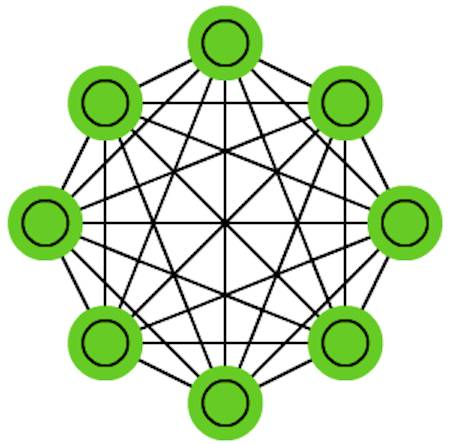 

**马尔可夫链**（MC：Markov Chain）或离散时间马尔可夫链（DTMC: discrete time Markov Chain）是 BM 和 HN 的某种前辈。可以这样理解：从我目前所处的节点开始，到达我周围任何节点的概率是多少？它们是无记忆的（即马尔可夫特性（Markov Property）），这意味着你所得到的每一个状态都完全依赖于其之前的一个状态。尽管算不上是神经网络，但它们确实类似于神经网络，并提供了 BM 和 HN 的理论基础。

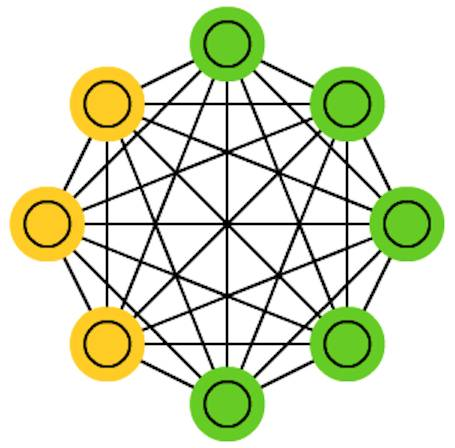

**玻尔兹曼机**（BM：Boltzmann machines）和 HN 非常相似，除了：一些神经元被标记为输入神经元，而其它的仍然是「隐藏的」。这些输入神经网络会在整个网络更新结束时变成输出神经元。其开始时是随机权重，然后通过反向传播学习，最近也有人使用对比发散（contrastive divergence）的方法（使用一个马尔可夫链来确定两个信息增益之间的梯度）。和 HN 相比，BM 的神经元有时也有二元激活模式（binary activation patterns），但其它时间它们是随机的：一个单元处在一个特定状态的可能性。BM 的训练和运行过程非常类似于 HN：首先为输入神经元设置特定的钳位值（clamped values），然后该网络就自由了（不需要外力了）。自由了之后这些单元能得到任何值，然后我们在输入和隐藏神经元之间反复来回。它最后会在合适的温度下达到平衡。

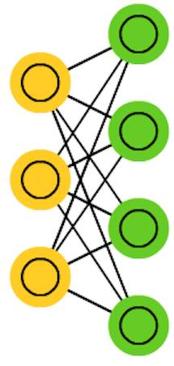 

**受限玻尔兹曼机**（RBM：Restricted Boltzmann machines）类似于 BM（这毫不奇怪），所以也类似于 HN。BM 和 RBM 之间的最大不同之处是 RBM 是更受限的，所以也可被更好地使用。它们并不将每一个神经元和其它每一个神经元连接起来，而是只将每组不同的神经元和其它每一组连接起来，所以输入神经元不会直接连接到其它输入神经元，隐藏神经元之间也没有连接。RBM 可以以类似 FFNN 的方式训练，但也有一点不同：不是前向通过数据然后反向传播误差，而是前向通过数据之后再将这些数据反向传回（回到第一层）。在那之后再使用前向和反向传播进行训练。

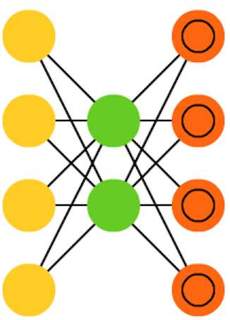 

**自编码器**（AE：Autoencoders）有一点类似于 FFNN，因为 AE 更像是 FFNN 的一种不用的用例，而非一种根本上不同的架构。自编码器背后的基本思想是自动编码信息，也因此得名。其整个网络有一种沙漏般的形状——其隐藏层比输入层和输出层都小。AE 也是围绕中间层对称的（根据层的数量是奇数或偶数，中间层有 1 层或 2 层）。最小层总是位于中间，这里的信息得到了最大的压缩（该网络的阻塞点（ chokepoint））。中间以上的所有部分被称为编码（encoding）部分，中间以下的所有部分则被称解码（decoding）部分，中间部分则被称为代码（code）。人们可以通过馈送输入以及将误差设置成输入和输出之间的差异的方式，使用反向传播来训练它们。当涉及到权重时， AE 还可以对称式的构建，所以编码权重和解码权重一样。

 

**稀疏自编码器**（SAE: Sparse autoencoders）在某种程度上是 AE 的反面。它不是在更少的「空间（space）」或节点中教一个网络表征一些数据，而我们试图在更多空间中编码信息。所以不再是网络在中间收敛然后扩展回输入大小，我们直接消除了中间内容。这些类型的网络可被用于从数据集中提取许多小特征。如果我们以类似于 AE 的方式训练一个 SAE，在几乎所有情况下你都只会得到一个相当无用的恒等网络（输入即是输出，没有任何变换或分解）。为了防止这种情况，我们不反馈输入，而是反馈输入加稀疏驱动器（sparsity driver）。这个稀疏驱动器可以以阈过滤器（threshold filter）的形式，其中只有一个特定的误差会被传播回去和训练，在这次通过过程中其它的误差都将是「无关的」，会被设置为 0。在某种程度上这类似于脉冲神经网络（spiking neural networks），其中并不是所有的神经元在所有时间都在放电（以及为生物合理性给出分数）。

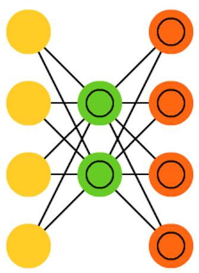 

**变自编码器**（VAE：Variational autoencoders ）的架构和 AE 一样，但被「教授」了不同的东西：输入样本的一个近似概率分布。这有点回到本源的感觉，因为它们和 BM 及 RBM 的联系更紧密一点。但它们确实依赖于贝叶斯数学来处理概率推理和独立（probabilistic inference and independence），以及依靠重新参数化（re-parametrisation）来实现这种不同的表征。这种推理和独立部件理解起来很直观，但它们或多或少依赖于复杂的数学。其基础可以归结为：将影响考虑在内。如果某种事物在一个位置发生，而其它地方则发生其它事物，那么它们不一定是相关的。如果它们不相关，那么误差传播应该考虑一下这一点。这是一种有用的方法，因为神经网络是大型的图（graph，从某种角度来看），所以在深入到更深的层时如果排除掉一些节点对其它节点的影响，就会带来帮助。

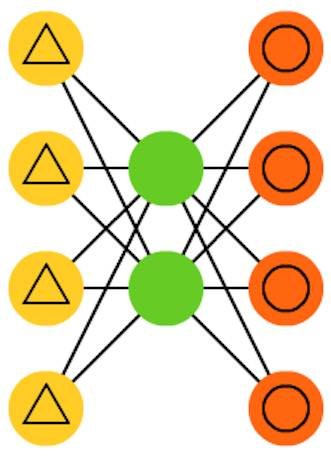

**去噪自编码器**（DAE: denoising autoencoders）是一种输入中不仅包含数据，也包含噪声（比如使图像更有颗粒感）的自动编码器。但我们以同样的方式计算误差，所以该网络的输出是与不带噪声的原始输入进行比较。这能让网络不会学习细节，而是学习更广泛的特征，因为学习更小的特征往往会被证明是「错误的」，因为更小的特征会不断随噪声变化。

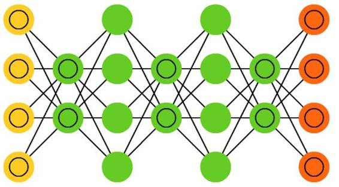 

**深度信念网络**（DBN: deep belief networks ）基本上是 RBM 或 VAE 堆叠起来的架构。事实已经证明这些网络可以堆叠起来高效地训练，其中的每一个 AE 或 REM 只必须编码编码之前的网络即可。这种技术也被称为贪婪训练（greedy training），其中贪婪是指得到局部最优的解决方案，从而得到一个合理的但可能并非最优的答案。DBN 可通过对比发散（contrastive divergence）或反向传播进行训练，以及学习将数据表征为概率模型，就像普通的 RBM 或 VAE 一样。一旦通过无监督学习训练或收敛成了一个（更）稳定的状态，该模型就可被用于生成新数据。如果采用对比发散进行训练，它甚至可以对已有的数据进行分类，因为其神经元已经学会了寻找不同的特征。

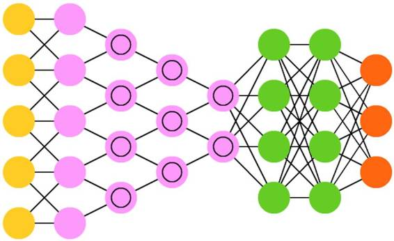 

**卷积神经网络**（CNN：convolutional neural networks）或深度卷积神经网络（DCNN：deep convolutional neural networks）和其它大多数网络非常不同。它们主要被用于图像处理，但也可应用于音频等其它类型的输入。CNN 的一种典型的用例是让网络对输入的图像进行分类，比如，当输入的图像上有猫时输出「cat」、有狗时输出「dog」。CNN 往往开始带有一个输入「扫描器（scanner）」，其目的是不一次性解析所有的训练数据。比如要输入一张 200×200 像素的图像，你并不需要一个带有 40000 个节点的层。事实上，你只需要创建一个比如说 20×20 的扫描输入层，这样你就可以从该图像的一个 20×20 像素的部分开始输入（通常是从左上角开始）；一旦这个输入完成后（可能是用于训练），你再输入下一个 20×20 像素：将该扫描器向右移 1 个像素。注意人们不会一次性移动 20 个像素（扫描器的宽度），也不是将图像分解成 20×20 的块；相反，而是让扫描器在图像上「爬行」。然后这些输入数据被送入卷积层（convolutional layers），这和普通的层不一样，其中所有的节点并非连接到所有的节点。每一个节点仅将它自己与其近邻的单元连接起来（到底多近取决于具体的实现，但通常不止一点点）。这些卷积层往往会随着网络越来越深而缩小，大部分是按照输入可以轻松整除的因子（所以 20 后面的层可能是 10 ，然后是 5）。这方面常使用 2 的幂，因为它们可以通过 32, 16, 8, 4, 2, 1 这样的定义完全整除。除了这些卷积层，它们常常还有池化层（pooling layer）。池化是一种滤除细节的方法：一种常见的池化技术是最大池化（max pooling）——其中我们取比如 2×2 的像素，然后根据最大量的红色传递这些像素。为了将 CNN 应用到音频上，基本上是输入音频波然后缓慢移动音频片段，一段接一段。CNN 的真实世界实现往往会在末端连接一个 FFNN 以便进一步处理数据，这可以实现高度非线性的抽象。这样的网络被称为 DCNN，但这两者的名字和缩写往往可以混用。

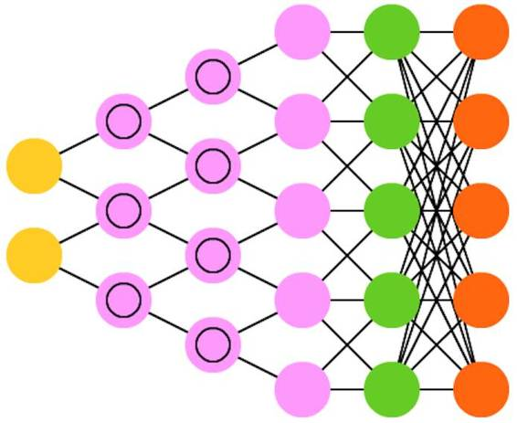 

**解卷积神经网络**（DNN：Deconvolutional neural networks）也被称为逆图形网络（IGN： inverse graphics networks），是反向的卷积神经网络。比如给网络输入一个词「cat」，然后训练它生成一张类似猫的图像（通过将其与真实的猫图片进行比较）。和普通的 CNN 一样，DNN 也能和 FFNN 结合使用，但我们就不给这种网络缩写了。我们也许可以将其称之为深度解卷积神经网络，但你也可以认为当你在 DNN 的前端和后端都接上 FFNN 时，你得到的架构应该有一个新名字。请注意在大多数应用中，人们实际上并不会为该网络送入类似文本的输入，而更多的是一个二元的分类输入向量。比如设 <0, 1> 是猫，<1, 0> 是狗，<1, 1> 是猫和狗。CNN 中常见的池化层往往会被相似的逆向运算替代，主要使用偏差假设（biased assumptions）做插值和外推（interpolation and extrapolation ）（如果一个池化层使用的是最大池化，你可以通过其逆向过程产生特定度更低的新数据）。

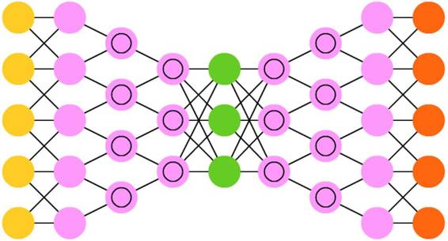 

**深度卷积逆向图网络**（DCIGN：Deep convolutional inverse graphics networks）的名字比较有误导性，因为它们实际是 VAE，但有 CNN 和 DNN 分别作为编码器和解码器。这些网络试图在编码中将特征建模为概率，以便于它能在曾经分别看到猫和狗的情况下，学习产生同时带有猫和狗的图片。类似的，你能给它输入一张带有猫和狗的图片，要求网络去掉图片中的狗，即使之前你未曾做过这样的操作。已有演示表明这些网络也能学习模型图片上的复杂变化，比如改变光源或者 3D 目标的旋转。这些网络往往通过反向传播训练。

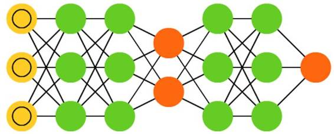 

**生成式对抗网络**（GAN：Generative adversarial networks）源于不同的网络类型，它们是双胞胎：两个网络一起工作。GAN 包含任意两种网络（尽管通常是 FF 和 CNN），一个网络的任务是生成内容，另一个是用于评判内容。判别网络要么获取训练数据，要么获取来自生成网络的内容。判别网络能够多好地准确预测数据源的程度然后被用来作为生成网络的误差。这创造了一种竞争方式，判别器区别真实数据与生成数据上做得越来越好，而生成器也变得对判别器而言越来越难以预测。这效果很好的部分原因是即使相当复杂的类噪音模式最终也是可预测的，但生成的类似于输入数据的内容更难以学习进行区别。GAN 训练起来相当难，因为不仅要训练两个网络（每个解决各自的问题），两个网络的动态也要平衡好。如果预测或生成相比于对方更好，GAN 收敛不好，因为存在有内在的分歧。

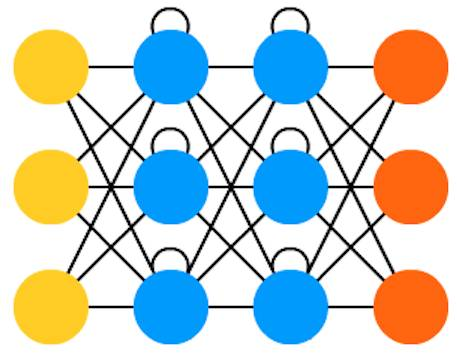 

**循环神经网络**（RNN：Recurrent neural networks）是带有时间联结的 FFNN：它们不是无状态的，它们随时间变化在通路与连接之间有联系。神经元不只从前面层中被输入信息，也从来自它们自己的之前的通过中获得信息。这意味着你输入信息和训练网络的顺序很重要：输入「牛奶」然后是「甜饼」与输入「甜饼」然后是「牛奶」相比可能会产生不同的结果。RNN 的一个重大问题是梯度消失（或爆炸）问题，取决于使用的激活函数，信息随时间渐渐损失，就像很深的 FFNN 随深度变化消失信息一样。直观上这看起来不是大问题，因为这些只是权重，不是神经元状态，但随时间变化的权重正是来自过去信息的存储。如果权重达到 0 或 1,000,000 的值，先前的状态就不在具有信息性。RNN 理论上可被用于多个领域，因为大部分的数据形式没有时间线上的变化（也就是不像声音和视频），所以时间决定的权重被用于序列之前的东西，不是多少秒之前发生的内容。大体上，循环网络是发展或完善信息的较好选择，比如 autocompletion（自动完成）任务。

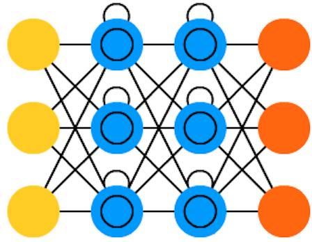

**长短期记忆网络**（LSTM：Long / short term memory）试图通过引入门（gate）和明显定义的记忆单元对抗梯度消失（爆炸）问题。这个思路受到电路图的启发，而不是生物学上的概念，每个神经元有一个记忆单元和 3 个门：输入、输出、遗忘（ input, output, forget）。这些门的功能是通过禁止或允许其流通确保信息。输入门决定来自上层的信息有多少被该单元存储。输出层在另一端做同样的事，并决定下一层多么了解该细胞的状态。遗忘门看起来像是一个奇怪的东西，但有时被遗忘反而更好。已有实验表明 LSTM 能够学习复杂的序列，比如像莎士比亚一样写作，或者创造交响乐。注意每个门在之前神经元中都有一个权重，所以运行起来需要更多的资源。

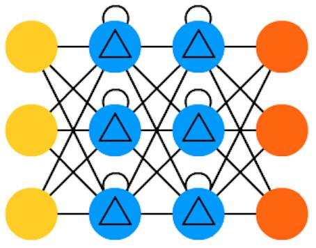 

**门循环单元**（GRU：Gated Recurrent Units）是 LSTM 的一种轻量级变体。它们有一个门，连线方式也稍微不同：没有输入、输出、遗忘门，它们有一个更新门（update gate）。该更新门既决定来自上个状态的信息保留多少，也决定允许进入多少来自上个层的信息。重置的门函数很像 LSTM 中遗忘门函数，但位置稍有不同。GRU 的门函数总是发出全部状态，它们没有一个输出门。在大多案例中，它们的职能与 LSTM 很相似。最大的不同就是 GRU 更快、更容易运行（但表达力也更弱）。在实践中，可能彼此之间要做出平衡，当你需要具有更大表达力的大型网络时，你可能要考虑性能收益。在一些案例中，额外的表达力可能就不再需要，GRU 就要比 LSTM 好。

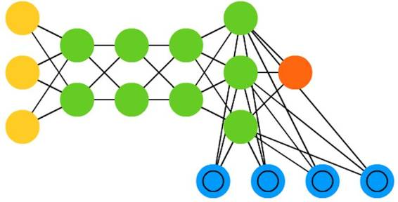 

**神经图灵机**（NTM：Neural Turing machines）可被理解为 LSTM 的抽象化，并试图将神经网络去黑箱化（ un-black-box，让我们洞见里面到底发生了什么。）NTM 中并非直接编码记忆单元到神经元中，里面的记忆是分离的。这种网络试图想将常规数字存储的功效与永久性和神经网络的效率与表达力结合起来。这种网络的思路是有一个可内容寻址的记忆库，神经网络可以直接从中读取并编写。NTM 中的「Turing」来自于图灵完备（Turing complete）：基于它所读取的内容读取、编写和改变状态的能力，意味着它能表达一个通用图灵机可表达的一切事情。

**双向循环神经网络**（BiRNN：Bidirectional recurrent neural networks）**、双向长短期记忆网络**（BiLSTM：bidirectional long / short term memory networks ）和**双向门控循环单元**（BiGRU：bidirectional gated recurrent units）在词表中并未展现，因为它们看起来和各自单向的结构一样。不同的是这些网络不仅连接过去，也连接未来。举个例子，通过一个接一个的输入 fish 这个词训练单向 LSTM 预测 fish，在这里面循环连接随时间记住最后的值。而一个 BiLSTM 在后向通路（backward pass）的序列中就被输入下一个词，给它通向未来的信息。这训练该网络填补空白而非预报信息，也就是在图像中它并非扩展图像的边界，而是可以填补一张图片中的缺失。

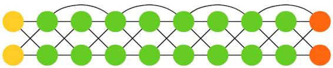 

**深度残差网络**（DRN：Deep residual networks）是非常深度的 FFNN 网络，有着额外的连接将输入从一层传到后面几层（通常是 2 到 5 层）。DRN 并非是要发现将一些输入（比如一个 5 层网络）映射到输出的解决方案，而是学习将一些输入映射到一些输出 + 输入上。大体上，它在解决方案中增加了一个恒等函数，携带旧的输入作为后面层的新输入。有结果显示，在超过 150 层后，这些网络非常擅长学习模式，这要比常规的 2 到 5 层多得多。然而，有结果证明这些网络本质上只是没有基于具体时间建造的 RNN ，它们总是与没有 gate 的 LSTM 相对比。

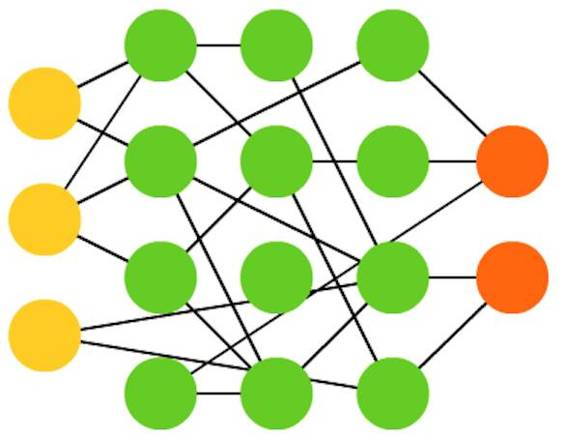 

**回声状态网络**（ESN：Echo state networks）是另一种不同类型的网络。它不同于其他网络的原因在于它在不同神经元之间有随机连接（即，不是在层之间整齐连接。），而且它们训练方式也不同。在这种网络中，我们先给予输入，向前推送并对神经元更新一段时间，然后随时间观察输出，而不是像其他网络那样输入信息然后反向传播误差。ESN 的输入和输出层有一些轻微的卷积，因为输入层被用于准备网络，输出层作为随时间展开的激活模式的观测器。在训练过程中，只有观测器和隐藏单元之间连接会被改变。

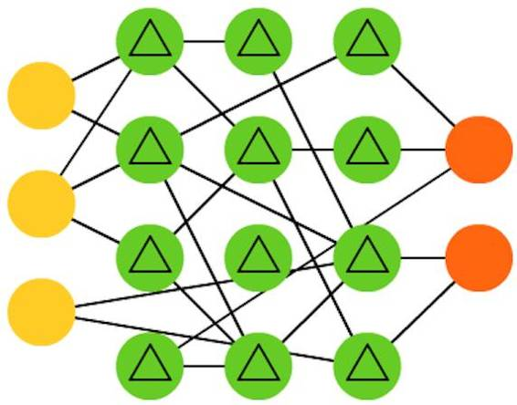 

**液态机**（LSM：Liquid state machines）看起来与 ESN 非常类似。不同的是，LSM 是脉冲神经网络（spiking neural networks）这一类型的：用阈值函数取代 sigmoid 激活函数，每个神经元也是一个累加记忆细胞。所以当更新神经元的时候，里面的值并不是被设为临近值的总和，也不是增加到它自身上。一旦达到阈值，它将能量释放到其他神经元。这就创造出了一种类似 spiking 的模式——在突然达到阈值的之前什么也不会发生。

**支持向量机**（SVM：Support Vctor Machines）能发现分类问题的最佳解决方案。传统上只能够分类线性可分的数据，比如说发现哪个图像是加菲猫，哪张图片是史努比，不可能有其他输出。在训练过程中，SVM 可被视为在一张图上（2D）标绘所有数据（加菲猫和史努比），并搞清楚如何在这些数据点间画条线。这条线将分割数据，以使得加菲猫在一边，史努比在一边。调整这条线到最佳的方式是边缘位于数据点之间，这条线最大化到两端。分类新数据可通过在这张图上标绘一个点来完成，然后就简单看到这个点位于线的哪边。使用核（kernel）方法，它们可被教授进行 n 维数据的分类。这要在 3D 图上标绘数据点，从而让其可分类史努比、加菲猫、Simon’s cat，甚至分类更多的卡通形象。

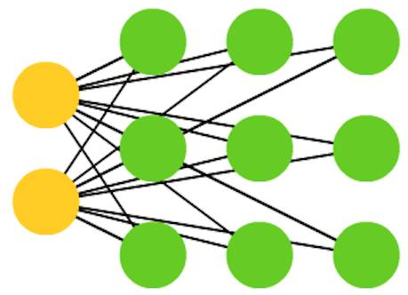

最后，我们介绍 **Kohonen 网络**（KN，也称自组织（特征）映射（SOM/SOFM：self organising (feature) map））。KN 利用竞争学习在无监督情况下分类数据。向网络输入信息，然后网络评估那个神经元最匹配该输入信息。然后调整这些神经元以更好地匹配输入，在这个过程中拖带（drag along）着临近神经元。临近神经元能移动多少取决于它们与最好的匹配单元之间的距离。

******©本文由机器之心编译，***转载请联系本公众号获得授权******。***

✄------------------------------------------------

**加入机器之心（全职记者/实习生）：hr@almosthuman.cn**

**投稿或寻求报道：editor@almosthuman.cn**

**广告&商务合作：bd@almosthuman.cn**