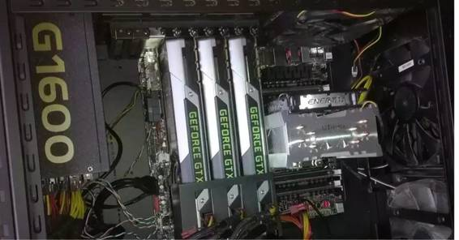
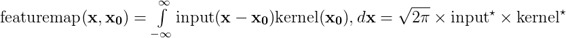
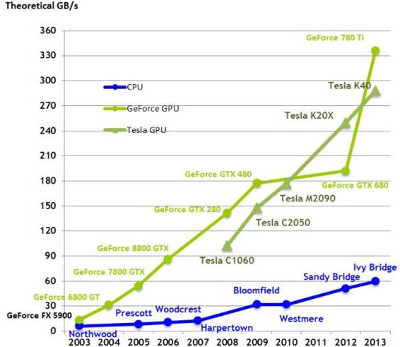

# 深度 | 为你的深度学习任务挑选最合适 GPU：从性能到价格的全方位指南

选自 Tim Dettmers Blog

**机器之心编译**

**作者：Tim Dettmers**

**参与：张可、吴攀、Rick R**

> *本文作者 Tim Dettmers 是瑞士卢加诺大学信息学硕士，热衷于开发自己的 GPU 集群和算法来加速深度学习。本文的最早版本发布于 2014 年 8 月，之后随着相关技术的发展和硬件的更新，Dettmers 也在不断对本文进行修正，截至目前已经进行了 5 次较大的更新。机器之心今天呈现的这篇是其 2016 年 6 月 25 日的最新更新：「重新编辑了多 GPU 部分；因为不再有重大作用，去掉了简单的神经网络内存部分；扩展了卷积内存部分；对 AWS 部分进行了删节，因为不再有实效；增加了我对 Xeon Phi 的看法；更新了 GTX 1000 系列。」而除了 GPU 之外，深度学习还需要其它一些硬件基础，详情可参阅机器之心之前的文章《[深度 | 史上最全面的深度学习硬件指南](http://mp.weixin.qq.com/s?__biz=MzA3MzI4MjgzMw==&mid=402261356&idx=1&sn=f66ee62b002b8a9879d3c428f846e440&scene=21#wechat_redirect)》。*

当你在深度学习中使用 GPU 时,你会一次又一次地为它带来的速度提升而感到惊叹：在一般问题中能获得相对于 CPU 快 5 倍的速度提升，在一些更大的问题中还能获得相对快 10 倍的速度提升。在 GPU 的帮助下，你可以更快地试验新的想法、算法和实验，并迅速得到反馈——哪些是可行的、哪些是不可行的。如果你对深度学习是认真的，那么你一定要使用 GPU。但是，你应该选择哪一种呢？在这篇博客中我将指导你选择一款最适合你的 GPU。

拥有一个快速的 GPU 对深度学习的初学者来说是非常重要的，因为它可以使你迅速获得有助于构建专业知识的实践经验，这些专业知识可以帮助你将深度学习应用到新问题上。没有这种迅速的反馈，从错误中汲取经验将会花费太多时间，会使人在继续深度学习的过程中感到受挫和沮丧。在 GPU 的帮助下，我很快就学会了如何在一系列 Kaggle 竞赛中应用深度学习，并且在 Partly Sunny with a Chance of Hashtags Kaggle 竞赛上获得了第二名，竞赛内容是通过一个给定的 Twitter 预测气象等级。比赛中，我使用了一个相当大的带有修正线性单元（rectified linear units）和 dropout 的两层深度神经网络进行正则化（regularization），而且勉强才能塞进我的 6GB GPU 内存里。

**应该使用多个 GPU 吗？**

在 GPU 的帮助下，深度学习可以完成很多事情，这让我感到兴奋。我投入了到多 GPU 的领域之中，用 InfiniBand 40Gbit/s 的互连组装了小型 GPU 集群。我非常激动地想了解多个 GPU 能否获得更好的结果。我很快就发现，在多个 GPU 上，不仅神经网络难以进行有效的并行化，对普通的密集神经网络加速效果也很一般。小型神经网络可以并行并且有效地利用数据并行性，但对于大一点的神经网络，例如我在 Partly Sunny with a Chance of Hashtags Kaggle 比赛中使用的，就几乎没有加速效果。

随后，我进一步试验，对比 32 位的方法，我开发了带有模型并行性的新型的 8 位压缩技术，该技术能更有效地并行处理密集或全连接的神经网络层。

然而，并行化失败了。我天真地为一系列问题对并行算法进行了优化，但只发现即使有优化过的自定义代码，它的效果也并不好——考虑到你所付出的努力。你需要非常了解你的硬件及其与深度学习算法交互的方式，这样你一开始就能衡量你是否可以受益于并行化。

 

*我的电脑主机配置：你可以看到三个 GXT Titan 和一个 InfiniBand 卡。对于深度学习来说，这是一个好的配置吗？*

然而，在并行化上还有一些不那么专业的问题。例如，卷积层很容易并行化和很好地扩展。很多框架也支持这种并行性；对大多数框架来说（比如 TensorFlow、Caffe、Theano 和 Torch），如果你使用 4 个 GPU，通常会加速约 2.5-3 倍；而对于优化过的研究代码，大约会有 3.6-3.8 倍的加速。微软的 CNTK 拥有最好的并行化性能，其与研究代码相近。CNTK 有一个缺点：它目前非常难使用，因为其使用了配置文件（config files），而非库 API。

目前我在微软研究院做实习生，我将致力于 CNTK，我可以告诉您，API 与并行性能都将会获得显著的提升。

这些变化使得在多 GPU 和多计算机下的并行化可以达到使普通用户能很容易受益于不同类型深度学习模型的快速训练的程度，无论是卷积网络、循环网络、还是全连接网络。

使用多 GPU 的另外一个好处是你可以分别在每个 GPU 上运行多个算法或实验。其速度没有变快，但你能一次性通过使用不同的算法或参数得到更多性能信息。如果你的主要目标是尽快获得深度学习经验，这是非常有用的，而且它对想同时测试新算法的不同版本的研究者也非常有用。

如果你想要学习深度学习，这对你的心理是很重要的。执行任务的间隔以及得到反馈信息的时间越短，大脑越能将相关的记忆片段整合成连贯的画面。如果你在小数据集上使用独立的 GPU 训练两个卷积网络，你就能更快地知道什么对于性能优良来说是重要的；你将更容易地检测到在交叉验证误差的模式，并正确地解释它们——即对于哪些你需要调整的模式，你需要添加、移除或调整哪些参数与层。

所以总的来说，一个 GPU 对所有任务来说就已经足够了，但多个 GPU 对于加速你的深度学习模型来说越来越重要。如果你想快速学习深度学习，多个廉价的 GPU 也很好。

**应该使用哪种加速器呢？NVIDIA、AMD、或 Xeon Phi？**

NVIDIA 的标准库使得在 CUDA 中建立第一个深度学习库很容易，但没有适合 AMD 的 OpenCL 的那样强大的标准库。目前还没有适合 AMD 显卡的深度学习库——所以只能选择 NVIDIA 了。即使未来一些 OpenCL 库可用，我仍会坚持使用 NVIDIA：因为对于 CUDA 来说，GPU 计算或者 GPGPU 社区是很大的，而对于 OpenCL 来说则较小。因此，在 CUDA 社区，好的开源解决方案和为编程提供可靠的建议是现成的。

此外，NVIDIA 公司现在对深度学习抱有很大信心。他们押注深度学习在未来十年会发展壮大，但你在 AMD 公司身上就看不到这样的信心。

至于 Xeon Phi，其广告宣称你能够使用标准的 C 代码，并可将代码轻松转换成加速过的 Xeon Phi 代码。该功能听起来很有趣，因为你可能认为你可以依靠庞大的 C 代码资源。然而，事实上，其只支持非常小部分的 C 代码，因此该功能并不真正有用，大部分的 C 运行起来是很缓慢的。

我曾研究过超过 500 个 Xeon Phi 的集群，遭遇了无止尽的挫折。我不能运行我的单元测试（unit test），因为 Xeon Phi 的 MKL（数学核心函数库）并不兼容 NumPy；我不得不重写大部分代码，因为英特尔 Xeon Phi 编译器无法让模板做出适当约简。例如，switch 语句，我不得不改变我的 C 接口，因为英特尔编译器不支持 C++ 11 的一些特性。这一切导致了在没有单元测试的情况下来执行代码的重构。它花了很长时间。这真是地狱啊。

随后当我的代码被执行时，一切都运行得很慢。如果你的操作的张量（tensor）的尺寸连续变化，线程调度器（thread scheduler）中的漏洞或问题会削弱性能。例如，如果你有不同大小的全连接层或 dropout 层，Xeon Phi 会比 CPU 还慢。所以，如果你想做深度学习，远离 Xeon Phi！

**了解卷积神经网络的基本内存需求**

当你在选择合适的 GPU 时，你得知道自己使用深度学习所要解决的问题需要多大的内存。因此接下来的两段文字会探讨卷积神经网络的内存消耗，让你可以确保自己的 GPU 有足够满足需要的内存，但又不会太多，这样能节省点钱。

卷积神经网络的内存需求非常不同于简单的神经网络。你可能会认为前者的参数更少因此需要更少内存。如果只是保存网络文件，这没什么不对，但要想训练它的话情况就不同了。

每个卷积层的激活（activation）和误差（error）相较于简单的神经网络来说都是巨大的，而正是它们占用了内存的主要部分。将激活和误差的大小加起来，我们就可以确定出大概的内存需求。然而要确定网络中哪种状态下激活和误差的尺寸大小是很难的。一般来说，前几层网络会占用很多内存，所以主要内存需求就来源于你的输入数据大小，因此可以率先考虑你的输入数据。

通常 ImageNet 使用的输入维度（input dimensions）是 224×224×3，即 224×224 像素的 3 色信道图片。要在 ImageNet 上得到当下最先进的结果至少需要 12GB 内存，而在一个 112×112×3 维的类似数据集上我们可能只需 4-6 GB 内存。另一方面，对于一个输入尺寸为 25×75×75×3 的视频数据集来说，12GB 内存可能远给不了你想要的好效果。

然而另一个重要方面就是数据集中的样本数量。比如你只取了 ImageNet 数据集图像中 10% 的样本，然后你的模型很快就会过拟合（只是没有足够多的样本来很好地训练），因此你那个消耗远远更少内存的小网络将足以与卷积网的性能媲美，所以 4GB 左右或更少的内存对于这项任务来说都绰绰有余。这就意味着图像越少，反过来所需内存就越少。

标签的分类数量也是同样的道理。如果你从 ImageNet 数据集中只选取了 2 个分类来建立模型，那么相较于拥有 1000 个分类的模型，它将消耗更少的内存。这就是这样：如果你有更少的需要彼此区分的分类，那么过拟合就会出现得快得多，或者换句话说，相比于区分 1000 个分类，区分 2 个分类所需的参数要少得多。

有关这些准则的一个实际例子是 Kaggle 的浮游生物检测比赛。起初我认为，用自己的 4 GPU 系统来参加比赛可能会有巨大优势。我以为自己或许能够在很短时间内训练出一个庞大的卷积网络——还有一点就是别人都缺少这样的硬件。然而由于数据集过小（50×50 像素，双色信道，40 万张训练图像；大约 100 个分类），我很快意识到即使对于一个大小刚好够放入一个训练很快的小 GPU 的小网络来说，过拟合也是一个问题。所以多个 GPU 并没有多少速度方面的优势，而大 GPU 内存更没有任何优势可言。因此对于这种任务，一个 4-6 GB 内存的小 GPU 就足以达到很好的效果。

虽然此例中我的内存是足够的，但你最终会遇到内存不足的情况。然而你并不需要为这个问题而买一个新 GPU，可能只需使用一个简单的内存减小技术（memory reduction technique）。

**内存减小技术及其效果**

一种方法是使用更大步态（strides ）的卷积核（convolutional kernels），也就是不对每个像素都应用批形式的（patch-wise）卷积，而是针对每 2 个或 4 个像素（即 2 或 4 个步态），这样就能产生较少的输出数据。输入层通常使用这种方法，因为它消耗了大部分的内存。

另一种减少内存占用的诀窍是引入一个能够减少维度的 1×1 卷积核层。例如 96 个 1×1 的卷积核能够使 64×64×256 大小的输入数据降为 64×64×96。

还有一个显著的技术是池化（pooling）。一个 2×2 的池化层将减少四层的数据量，从而大大减少了后续层的内存占用。

如果这些方法都不管用，你总是可以尝试减少 mini-batch 的大小。mini-batch 尺寸是一个非常重要的内存影响因素。

大小为 64 的批（batch）会比大小为 128 的批减少一半内存消耗。然而训练时间可能也会更久，特别是在训练的最后阶段，为了得到准确的梯度，它显得更加重要。大多数卷积运算也为大小为 64 或更大的 mini-batch 进行了优化，因而从 32 大小的批开始，训练速度会大大减小。所以缩小 mini-batch 的大小到或者甚至低于 32，只应作为最后的对策。

另一个经常被忽视的方法是改变卷积网络所使用的数据类型。将 32 位换为 16 位，你就可以轻松减半内存消耗且不会降低分类性能。将它运用在 P100 Tesla 卡中，这甚至能给你带来巨大的提速。

那么将这些内存减小技术应用在实际数据中会怎样？

如果我们采用 128 大小的批，3 色通道的 250×250 像素图片（250×250×3）做为输入，3×3 卷积核增长步长为 32,64,96…，则我们将有大致如下、仅包含误差及激活的内存占用情况：

> ***92MB→1906MB→3720MB->5444MB->…***

此时内存将很快被挤爆。如果现在我们使用 16 位而非 32 位的数据类型，上面的数字就可降为一半；64 大小的批同理。同时使用 64 大小的批及 16 位的数据类型将使内存占用减为原先的四分之一。然而我们仍然会需要大量内存来训练一个更多层的深度网络。

如果我们为第一层数据加 2 个步态则会带来哪些改变——后面跟着一个 2×2 的最大池化（ max pooling）？

> *92MB (输入)->952MB (卷积)->238MB (池化)->240MB (卷积)->340MB (卷积)→….*

这看起来更易于管理。在处理多达 20 至 30 层的网络时，我们仍然会遇到内存问题，而你只能应用另一个最大池化或其他技术。例如 32 个 1×1 的卷积核可将最后一层数据大小从 340MB 降为仅仅 113MB，因此我们能够轻松扩展更多层的网络而不会出现任何问题。

一旦你广泛使用了最大池化、跨越式（striding）和 1×1 卷积核，你将在这些层处理过程中扔掉非常多的信息，网络缺少数据来工作，以至于损害到模型的预测性能。因此当这些技术能够非常有效地减小内存消耗时，你应当小心地使用它们。随着时间的推移，你在训练卷积神经网络时会学到的一件事情就是，如何最佳混合这些技术来得到一个良好的结果，且不会遇到任何内存问题。

**了解卷积神经网络的临时内存需求**

上文所解释的是卷积神经网络内存消耗的主要来源以及缓解内存问题的方法。然而还有另一层不太重要且更难理解的内存消耗问题，但它也可能给出最佳的网络解决方案，或许能帮你确定深度学习任务的实际内存需求。

一般有三种类型的卷积实现方式。一种方式是采用傅里叶变换，其他两种都是先重新调整内存计算来直接做数据计算。这种调整要么发生在逐像素计算的类似批的结构中，要么发生于使用矩阵乘法计算卷积的矩阵结构中。

 *滥用符号的连续卷积定理：输入函数表示一个图像或特征映射，减去 x0 可看做是创建宽度与 x 相关的图像批，然后再乘以核（*kernel）*。最后的结果在傅里叶域中是连乘形式；这里表示一个傅立叶变换函数。对于离散「维度」（x），我们运用累加而不是积分——不过思路都是相同的。*

卷积的数学运算可以用傅里叶频域里一个简单的元素方式的矩阵乘法来描述。因此可在输入以及每个卷积核上执行一个快速的傅立叶变换，并将这些元素形式的相乘以得到特征映射——卷积层的输出。在向后传播的过程中，我们做一个快速的傅立叶逆变换来接收标准域中的梯度以更新权重。理想情况下，我们将所有的傅立叶变换存储在内存中，从而节省每个过程中分配内存的时间。这可能会增加很多额外内存，而这是为卷积网络的傅立叶方法所添加的内存块——保留所有这些内存只是为了让一切顺利进行。

这种方法显然是最快的卷积方法。通过 Winograd 快速傅里叶变换，这种卷积技术在流行的 3×3 卷积核上运行飞快。当然运用快速傅立叶变换方法的其他卷积核通常是最快。

然而这种方法会占用相当多的内存，不过这个领域的研究仍然很活跃，使用快速傅里叶变换的核在性能和内存上都非常高效，而核还在变得更好。其他两种直接操作图像块的方法是为重叠的批重新分配内存来实现连续的内存访问。缓慢的内存访问可能是对算法性能的最大伤害。连续内存中的内存预取与校准能使卷积运算速度运行更快。

连续内存意味着所有内存地址都相比邻——没有「越级」索引——并且能实现更快的内存读取。或者你可以安排矩阵内部的内存，然后使矩阵相乘以达到相同效果。既然矩阵乘法已经被高度优化，这对一个运行良好的卷积运算来说也是一个很好的策略。有关运用这种方法计算卷积的更多内容可参看 CUDA 代码，但是对输入或像素数据的预取是增加内存使用的主要原因。

由于一些条目被重复，矩阵乘法的变量使用了相对更多的内存，但这种方法在以批的方式计算卷积时往往比已过时的方法快一点。

我希望这部分内容给出了卷积神经网络中内存问题的相关思路。现在我们来看看一些实际的建议。

**给定预算下的最快 GPU**

处理性能最常由每秒浮点运算来测量（FLOPS）。这种测量标准往往被用在 GPU 计算的广告宣传中，它还确定了超级计算机领域的世界前 500 强名单。然而这种测量方式是带有误导性的，因为它测量的处理性能，所针对的是不会出现在现实世界中的问题。

原来最重要的可实践性 GPU 性能测量是以 GB/s 为单位的内存带宽，它衡量了内存每秒可读取的数据大小。内存带宽非常重要，因为几乎所有的数学运算，比如矩阵乘法、点积、求和等等，都有带宽限制，即受限于可从内存中提取多少数字，而非给定数字量的情况下可执行多少计算。

还有一些其他原因能够解释为什么 GPU 非常适合深度学习等许多计算任务；如果你想更深入地了解 GPU，可以阅读我在 Quora 上面的回答：「为什么 GPU 非常适合深度学习？」链接：https://www.quora.com/Why-are-GPUs-well-suited-to-deep-learning/answer/Tim-Dettmers-1

 

*CPU 和 GPU 随时间变化的带宽比较：带宽是 GPU 比 CPU 的计算速度更快的主要原因之一。*

带宽可直接在同一架构内进行比较，例如直接查看两张 Pascal 卡（如 GTX 1080 与 GTX 1070 ）的内存带宽来比较其性能。然而不同架构之间不能直接比较，像是 Pascal 的 GTX 1080 与 Maxwell 的 GTX Titan X，因为各自给定的内存带宽架构是非常不同的。这使得一切都有点棘手，但总的说来带宽能给你一个有关 GPU 大致运行速度的良好概述。要确定一个给定预算下的最快 GPU 类型，可以使用这篇维基百科中的内容（http://en.wikipedia.org/wiki/List_of_Nvidia_graphics_processing_units#GeForce_700_Series），看一下它的带宽是多少 GB/s；其中列出的较新款显卡价格是相当准确的（900 和 1000 系列），但是旧款卡价格明显低于列表中的价格——尤其当你通过 eBay 网购时。比如一张正版 GTX Titan 在 eBay 上卖 $350 左右、 GTX 970 卖 $210。

然而另一个需要考虑的因素是，并非所有架构都与 cuDNN 兼容。由于几乎所有的深度学习库都使用 cuDNN 做卷积运算，这就限制了对于 Kepler  GPU 或更好 GPU 的选择，即 GTX 600 系列或以上版本。另外 Kepler  GPU 通常会很慢。因此这就意味着你应该选择 900 或 1000 系列 GPU 来获得更好的性能。

为了粗略估计出深度学习任务中的显卡性能比较，我创建了一个简单的 GPU 等价表。如何阅读它呢？例如 GTX 980 的速度相当于 0.45 个 GTX 1080，或是 GTX 1080 的速度是 GTX 980 的两倍以上。

*   GTX 1080 = 0.8 GTX 1070 = 0.66 GTX Titan X = 0.66 GTX 980 Ti = 0.45 GTX 980

*   GTX 1080 = 0.4 GTX 970 = 0.33 GTX Titan = 0.2 AWS GPU instance (g2.2 and g2.8) = 0.2 GTX 960

通常我会推荐 GTX 1080 或 GTX 1070。二者都很卓越，如果你能承受 GTX 1080 的价格当然更好。GTX 1070 更便宜些且速度仍比 GTX Titan X 快。

然而这两个卡的问题是它们的 8GB 内存。这个内存容量对于大多数任务来说是相当充足的，比如 Kaggle 竞赛、大多数的数据集、深度且自然的语言理解任务。但是对研究人员而言，尤其是 ImageNet 的研究者，在处理拥有庞大背景资料的视频数据或自然语言理解任务时，选择 12GB 内存的 GTX Titan X 会更好——这里内存就尤为重要。

如果你缺钱的话就没有任何办法了。亚马逊网页服务上的 GPU 实例是相当昂贵且龟速的，没钱就买不到好东西。你可以到 eBay 上以 $210 买一个过得去的 GTX 970，但也有一些与此相关的内存问题（见下文）。

另一个选择是从 eBay 购买正版 GTX Titan；不过 $350 也已经相当贵了。GTX 680 和 GTX 960 也是较为便宜的选择，它们通常在 $200 以下，但是相较于其他更成熟的 GPU 则是相当慢。

**廉价而困扰**

GTX 970 是一个你需要留意的特例，其架构较为怪异，内存使用超过 3.5GB 时性能可能会被削弱，因此对于大的卷积神经网络的训练就很麻烦。这个问题在新闻报道中已经相当戏剧化地变多了起来，但事实证明整个问题对于深度学习来说并不像原始基准表现的那样戏剧化：如果不超过 3.75GB，它仍然比 GTX 960 要快。

不管怎样 GTX 970 是一款用来学习深度学习的优秀 GPU。它还适合于大多数未涉及太多数据的 Kaggle 数据集。

如果你不想要所有这些麻烦，那么就去 eBay 购买一个不会造成麻烦的正版 GTX Titan 或者一个便宜的 4GB GTX 960。

**亚马逊网络服务（AWS）中的 GPU 实例**

在这篇博文的前一个版本中，我推荐了 AWS GPU 的现货实例，但现在我不会再推荐它了。目前 AWS 上的 GPU 相当慢（一个 GTX 1080 的速度是 AWS GPU 的五倍）并且其价格在过去的几个月里急剧上升。现在看起来购买自己的 GPU 又似乎更为明智了。

**总结**

运用这篇文章里的所有信息，你应该能通过平衡内存大小的需要、带宽速度 GB/s 以及 GPU 的价格来找到合适的 GPU 了，这些推理在未来许多年中都会是可靠的。但现在我所推荐的是 GTX 1080 或 GTX 1070，只要价格可以接受就行；而如果你是一位研究人员，或许会想要一个 GTX TITAN X。

如果你缺少硬件投资资金并且可以接受一定的内存限制，那么 GTX 970 对于中等大小及以下的数据集来说就是个可靠的选择。如果想减少麻烦，一个 eBay 上的正版 GTX Titan 将是极好的。GTX 680 和 GTX 960 最便宜，同时也是最慢的 GPU。

如果你真的很缺钱，目前尚没有其他好的选项。

**总结性建议**

*   总的说来最好的 GPU：GTX 1080 和 GTX Titan X

*   有成本效益但价格高的：eBay 上的 GTX Titan X ， GTX 1070

*   有成本效益但麻烦多的：GTX 970（有内存问题）

*   最便宜的卡片而且没有麻烦：eBay 上正规的 GTX Titan

*   我的数据集大于 250GB：GTX Titan

*   我钱不多：eBay 上的 GTX 680 4GB   或者 GTX 960 4GB

*   我几乎没钱：尚待解决；深度学习是为壕准备的

*   我参加 Kaggle 比赛：GTX 1070 或者 GTX 970

*   我是一名研究人员：至少需要一个 GTX TITAN X 和 1-4 GTX 1080 来做原型

*   我想建立一个 GPU 集群：这真的很复杂，你可以从这里得到一些思路：https://timdettmers.wordpress.com/2014/09/21/how-to-build-and-use-a-multi-gpu-system-for-deep-learning/

*   我刚开始进行深度学习，并且我是认真的：以 eBay 上的 GTX 970 开始对小数据集上的深度学习有个大致感受；如果你想参加 Kaggle 比赛或进行正规深度学习，就把 GTX 970 卖了并升级到 GTX 1080 ；如果你想做研究的话，就升级为 GTX Titan X。

***©本文由机器之心编译，***转载请联系本公众号获得授权***。***

✄------------------------------------------------

**加入机器之心（全职记者/实习生）：hr@almosthuman.cn**

**投稿或寻求报道：editor@almosthuman.cn**

**广告&商务合作：bd@almosthuman.cn**