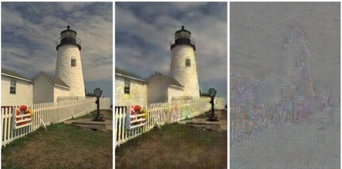
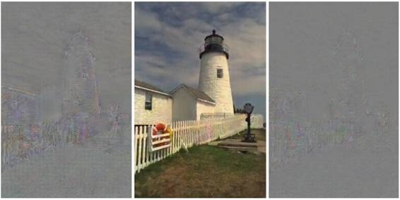
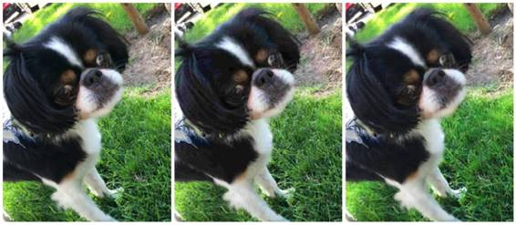
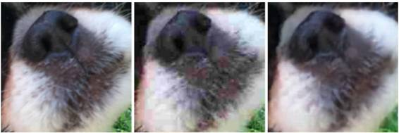
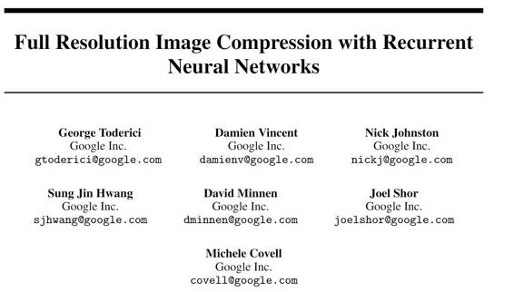
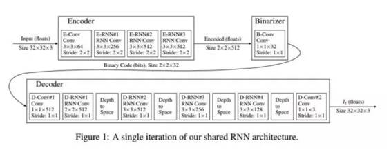

# 业界 | 详解谷歌神经网络图像压缩技术：如何高质量地将图像压缩得更小

选自 Google Research

**作者：Nick Johnston 、David Minnen**

**机器之心编译**

**参与：吴攀、李亚洲**

> *谷歌 Research Blog 今日发布文章解读了其不久前在论文[《Full Resolution Image Compression with Recurrent Neural Networks》](http://mp.weixin.qq.com/s?__biz=MzA3MzI4MjgzMw==&mid=2650718466&idx=3&sn=ffeb503724abb0934c5c60e1202b12c0&scene=21#wechat_redirect)中报告的神经网络图像压缩技术。*

数据压缩已经在互联网上无处不在。你在网上看的视频、图片，听的音乐，甚至现在正在阅读的这篇文章的背后都有使用到数据压缩技术。压缩技术让我们可以更快更高效地分享内容。如果没有数据压缩，获取你需要的信息的时间和带宽成本将会高得吓死个人！

在论文《Full Resolution Image Compression with Recurrent Neural Networks》中，我们在我们之前的使用神经网络的数据压缩的研究上进行了延展，探索了机器学习是否能够像在图像识别和文本总结上一样提供更好的图像压缩结果。此外，我们也通过 TensorFlow 发布了我们的压缩模型，这样你也可以使用我们的网络实验压缩你自己的图像。

发布地址：https://github.com/tensorflow/models/tree/master/compression

我们介绍了一种新架构——该架构使用了门控循环单元（Gated Recurrent Unit，一种允许单元保存激活和处理序列的 RNN）的一种新变体「残差门控循环单元（Residual GRU: Residual Gated Recurrent Unit）」。我们的 Residual GRU 将已有的 GRU 和论文《Deep Residual Learning for Image Recognition》中介绍的残差连接（residual connections）结合了起来，从而在给定的压缩率下实现了显著的图像质量增益。我们没有和今天所用的许多压缩方法一样使用 DCT 来生成新的位表示（bit representation），而是训练了两组神经网络——一组用于创造图像的编码（编码器（encoder）），另一组用于从这些编码中创造图像（解码器（decoder））。

我们的系统可以迭代式地细化原始图像的重建，其中的编码器和解码器都使用了 Residual GRU 层，这使得更多的信息可以从一次迭代传递到下一次迭代。每一次迭代都会给编码增加更多比特，从而可以实现更高质量的重建。从概念上讲，该网络的工作方式如下：

1\. 初始残差 R[0] 对应于原始图像 I ：R[0]=I

2\. 第一次迭代，设 i=1

3\. 第 [i] 次迭代以 R[i-1] 作为输入，并运行编码器和二值化器（binarizer）将该图像压缩成 B[i] 

4\. 第 [i] 次迭代在 B[i] 上运行解码器以生成一个重建出的图像 P[i]

5\. 计算出第 [i] 次迭代的残差：R[i] = I - P[i]

6\. 设 i=i+1，然后转到第 3 步（直到达到所需的迭代次数）

残差图像（residual image）表示了当前版本的压缩图像与原始图像之间的差异。然后该图像被用作该网络的输入，以便为压缩图像的下一个版本移除压缩误差。现在压缩图像被表示成了 B[1] 到 B[N] 的级联。对于更大的 N 值，解码器可在减少误差和生成更高质量的原始图像的重建上获得更多的信息。

为了了解其工作方式，可以看一下下面这个图像压缩网络的前两次迭代的例子，如下图所示。我们从一张灯塔的图像开始。在该网络的第一次前向通过中，原始图像作为输入（R[0]=I）。P[1] 是重建的图像。原始图像和编码图像之间的差异是残差 R[1]，其表示了压缩过程中的误差。

*左图：原始图像 I=R[0]；中图：重建的图像 P[1]；右图：残差 R[1]，其表示压缩中所产生的误差*

在该网络的第二次前向通过中，R[1] 作为该网络的输入（见下图），然后创造出一张更高质量的图像 P[2]。所以该系统是如何从残差 R[1] 中创造出一张如此高质量的图像（下面的中图 P[2]）的呢？因为该模型使用了带有记忆的循环节点（recurrent nodes with memory），所以该网络会保存每一次迭代的信息以便在下一次迭代中使用。它在第 [1] 次迭代中从原始图像上学到的东西被用在了对 R[1] 的处理上，从而可以从 B[2] 中生成更好的 P[2]。最后，通过从原始图像中减去 P[2]，该网络生成了一个新的残差 R[2]（右图）。这一次的残差更小，因为原始图像和重建的图像之间的差异更小了。

*该网络的第二次前向通过。左图：用作输入的 R[1]；中图：更高质量的重建 P[2]；右图：原始图像减去 P[2] 所得到的更小的残差 R[2]*

在更进一步的每次迭代中，该网络都会获得更多有关压缩中所引入的误差的信息（这些信息可在残差图像中获取）。如果其可以使用这些信息来预测残差（即使只有一点点），那也能得到更好的重建。我们的模型可以使用额外的比特，直到达到收益递减的程度——此时该网络的表达力（representational power）就耗尽了。

为了验证文件大小和质量差异，我们使用了一种日本犬种 Vash 的一张照片生成了两张压缩图像：一张 JPEG，一张 Residual GRU。这两张图像的目标都是达到 0.9 MS-SSIM 的感知相似度（perceptual similarity）——该感知质量标准如果达到 1.0 则表示完全等同。我们训练好的模型所生成的图像的文件大小比 JPEG 小 25%。

*左图：原始图片（1419 KB PNG）~1.0 MS-SSIM；中图：JPEG（33 KB）~0.9 MS-SSIM；右图：Residual GRU（24 KB）~0.9 MS-SSIM。图像质量差不多的情况下，图像大小减小了 25%。*

观察一下图中狗的鼻子和嘴巴，我们发现我们的方法在图像中不会产生红色块和噪声。这是由于 JPEG 产生的块效应（blocking artifacts），然而我们的压缩网络一次性地在整个图像上起作用。我们的模型会在细节上有所权衡，图像中的纹理会丢失，但在消除块效应上，该系统显示出了极大的潜力。

*左图：原始图片；中图：JPEG；右图：Residual GRU*

虽然如今的编解码器表现很好，但我们的研究表明使用神经网络压缩图片能得到更高的质量和更小的文件大小。想要了解关于该研究的更多内容，可以阅读下面的论文：

**论文：Full Resolution Image Compression with Recurrent Neural Networks**

**摘要：**

本论文提出了一套基于神经网络的全分辨率有损图像压缩方法。这些我们所描述的每一种架构都可以在实施过程中提供可变的压缩率，而不需要对网络进行再训练（retraining）：每个网络只需要训练一次。我们所有的架构都由一个基于循环神经网络（RNN：recurrent neural network）的编码器和解码器、一个 binarizer 和一个用于熵编码（entropy coding）的神经网络构成。我们对 RNN 的类型（LSTM、关联 LSTM（associative LSTM）进行了比较，并引入了一种新的 GRU 和 ResNet 的混合结构。我们还研究了 one-shot 与附加重建架构（additive reconstruction architectures）的对比，并引入了一种新的扩展过的附加框架。对比之前的研究成果，我们的成果显示出了 4.3%-8.8% AUC（率失真曲线下的区域）提升，具体数字取决于所用的感知标准（perceptual metric）。就我们所知，在 Kodak 数据集图像的率失真曲线（rate-distortion curve）的大部分比特率的图像压缩上，这是第一个表现优于 JPEG 的神经网络架构，不管有没有熵编码的辅助。

*图 1：我们共享的 RNN 架构的单次迭代*

******©本文由机器之心编译，***转载请联系本公众号获得授权******。***

✄------------------------------------------------

**加入机器之心（全职记者/实习生）：hr@almosthuman.cn**

**投稿或寻求报道：editor@almosthuman.cn**

**广告&商务合作：bd@almosthuman.cn**

