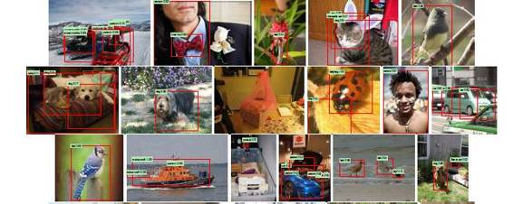

# 业界 | 用于视觉任务的 CNN 为何能在听觉任务上取得成功？

选自 TechCrunch

**作者：Nils Lenke**

**机器之心编译**

**参与：无我**

> *最初针对视觉信号设计出来的 CNN 也能处理听觉信号，最终帮助机器倾听和更好地理解我们。 CNN 在某些程度上能迁移学习，掌握多种模式的共同特征。*

有一系列神经网络机器学习方法绝对不只是「有深度的」。在这段时间，针对先进的语音技术和人工智能的神经网络变得日益流行，有趣的是当前的许多技术最初是针对图像或视频处理开发出来的。

卷积神经网络 （ CNN ）是这些方法中的一种，使得我们很容易理解为什么神经网络处理图像的方式极其类似于人脑加工声音刺激的方式。因此 CNN 很好地阐释了人脑加工听觉和视觉信息的过程以多种（而不是一种）方式彼此联系。

**关于 CNN ，你需要了解哪些？**

作为人类，我们能识别面孔或物体，不管它们出现在我们的视野（或图片）中的哪个位置。当你试图通过教机器如何搜索视觉特征（以面孔识别为例，这些视觉特征是在神经网络较低层次上的边或线，或者较高层次上的眼睛和耳朵）来培养它的这种能力，你往往针对局部区域来做这件事，因为所有相关的像素彼此非常靠近。与此对应的人类视觉是这样工作的，一簇神经元专注于一小部分感受野 （receptive field ），这是更大的整个视野的一部分。

因为你不知道相关特征将出现在哪里，你必须扫描整个视野，要么按顺序滑动你的一小部分感受野，就像（从上到下且从左到右）扫描一个窗口一样；要么使用许多更小的感受野（神经元簇），每一个都专注于（可能重叠）一小部分视觉输入。

CNN 是按后一种方式来做的。这些感受野合在一起，覆盖了整个输入，这被叫做「卷积（ convolutions ）」。然后较高层次的 CNN 压缩来自较低层次的卷积的信息，并从特定位置提取出信息，就像下图展示的一样。

 

*图源：Wikipedia*

所以，如果你在手机上用谷歌相册搜索面孔或物品，或者在苹果 iOS 10 系统中完成相同的新功能，你可以假设 CNNs 用于识别图片中有关的候选区域，在这些区域中可能出现你想要的面孔或物品。

*图源：Ross Girshick, Jeff Donahue, Trevor Darrell and Jitendra Malik*

但是我们发现 CNN 在语音和语言方面也有一些作为。

CNN 可以用于以一种端对端的方式处理原始语音信号（不需要人们定义语音特征）。 CNN 通过展开一个输入栏（ input field ）来查看语音信号，其中时间是一个维度，语音信号在不同频率上的能量分布（ energy distribution ）是第二个维度，进而自动化学习哪个频率段是与语音最相关的。然后网络中较高的层被用于语音识别的核心任务：找出语音信号中的音素和词汇。

> *研究证明，用于加工听觉信号的脑区可用于视觉任务。*

一旦你掌握了词汇，接下来要做的是自然语言理解 （ NLU ）中的「意图分类」，或者从用户的语音要求中理解用户想达到什么目的（在最近的一篇博客中，我讲解了 NLU 的其它方面，即实体识别等）。例如，用户的语音指令是「从我的存款账户中转一笔钱给 John Smith 」，其意图就是「转钱」。意图往往是由一个词或一组词（通常是双方熟悉的）表达出来的，在查询系统中这些词无处不在。

所以，类似于图像识别，我们需要通过随时空变化（发音；同时看一个词及其上下文）而不是空间域的变化而滑动窗口来搜索局部特征。而且这表现得很好：当我们为这个任务介绍 CNN 时，它们表现出的准确率比先前的技术多了 10% 以上。

**视觉和听觉是大脑内部的邻居**

为什么 CNN 在这些任务上取得了成功？一个相当直接的解释是它们只是与图像处理享有相同的特征；两者都属于「在更大的信号中找到更小的信号，而且我们不知道所需的更小的信号可能在哪里」类型。但是可能有其它稍微更有趣的解释，即 CNN 是为视觉任务而设计出来的，也在语音相关任务上发挥作用，这反映了这样一个事实，大脑用非常相似的方法加工视觉和听觉/语音刺激。

考虑一下联觉现象，或者「对一种感觉或认知通路的刺激在另一种感觉或认知通路上引起了自动化的、无意识的体验」。例如，声音或语音刺激可以导致视觉反应。（我使用一个口味温和的版本；对我而言，每周的每一天都有独特的颜色。周一是暗红色，周二是灰色，周三是暗灰色，周四是浅红色，诸如此类。）可以这样解释，声音和语音信号以及视觉加工的过程在大脑中以某种方式肯定是所谓的「邻居」。

类似地，研究证明用于加工声音信号和语音的脑区可以用于视觉任务，比如天生具有听觉障碍的人能重新部署自己大脑中的声音/语音区域，使之加工手势语。这可能意味着加工视觉或听觉信号的大脑细胞（神经元）的组织结构一定非常相似。

所以，回到所有这些观点的实际应用上。不难想象几年后你自己坐在自动驾驶汽车上与一个自动化助理聊天，命令它播放你最喜欢的音乐或预订一家餐厅。「在这种场景的背后」，可能有一些 CNN 积极发挥作用：

*   LIDAR 系统（「光探测和测距」，一种基于激光的雷达系统，被汽车用来创建周围环境的模型，包括障碍物和其他车辆）将会使用一个或一些 CNN 。

*   汽车很可能也将使用摄像头检测和解读交通信号； CNN 也将拥有被用于做这种事的好机会。

*   在语音识别和自然语言理解组件上，自动化助理将使用 CNN ，从而让两种组件分别发现语音信号中的音素和词汇以及发现词汇流中的概念。

将来可能还有其他应用。当然，所有这些任务是由不同 CNN 实现的，甚至可能在不同的控制元件中。每一个 CNN 只能在自己得到过训练的任务上表现得很准确，而不能在其他任务上表现很好（除非它在其他任务上得到再次训练）。

> *你可能说计算机游戏中的最新进展有助于切实可行地训练深度神经网络。*

然而——在此又变得令人着迷——研究表明，当 CNN 得到训练，它们（尤其是较低层）似乎获得某种能实现其他任务的通用性能（或者观念）。很容易理解这为什么能在相关领域中发挥作用；例如，在语音识别中，你可以用一种语言（比如英语）训练 CNN ，而且用另一种语言（比如德语）只重复训练较高层，然后 CNN 就能在新的语言上表现良好。显然，较低层抓住了多种语言之间的共通性。

但是——我发现这更加令人吃惊——人们也尝试过用多种模式（比如场景图像和场景的文本表征）训练 CNN 。结果，网络可以基于文本提取图像，也能基于图像提取文本。这些人总结道， CNN 在某些程度上掌握了这些模式的共同特征——在没有被告知如何去做这件事的情况下。有趣的结果又一次证明了视觉和处理语言（文本）之间肯定有很多共同点。

关于视觉和声音/语音以及语言处理的相似性，还有其他非常实际的复杂结果。我们已经发现为计算机图像（视觉通道）开发出来的图形处理单元（ GPU ），也可以用于加快语音和语言的机器学习任务。其原因是这些需要处理的任务在本质上是相似的：将相对简单的数学运算应用于许多平行的数据点上。所以，你可能说，计算机游戏的最新进展有助于切实可行地训练深度神经网络。

神经网络研究和创新产生了广泛的影响，正如我们看见的，一个应用领域（比如图像识别）的进步，也有益于其他领域（比如语音识别和自然语言理解）的发展。我们还看见，这可能是由人脑听觉和视觉感受器的诸多相似之处或大脑常用的组织方式造成的。

结果，我们在许多领域持续看到机器学习和人工智能的快速前进，这些都得益于许多领域内可以共享的研究成果。更确切地说，最初是针对视觉设计出来的 CNN 将最终帮助机器倾听和更好地理解我们，这不再值得大惊小怪——至关重要的是，我们持续地推动社会走向人机交互新时代。

***©本文由机器之心编译，***转载请联系本公众号获得授权***。***

✄------------------------------------------------

**加入机器之心（全职记者/实习生）：hr@almosthuman.cn**

**投稿或寻求报道：editor@almosthuman.cn**

**广告&商务合作：bd@almosthuman.cn**