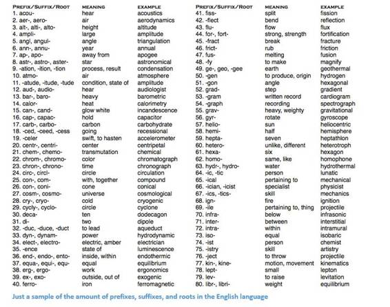
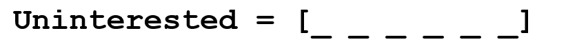

# 深度 | 自然语言处理领域深度学习研究总结：从基本概念到前沿成果

选自 adeshpande3

**机器之心编译**

> > *每隔几周，加利福尼亚大学洛杉矶分校（UCLA）的 Adit Deshpande 就会在其博客上发表一篇深度解读的深度学习研究回顾博客。今天这篇是 Adit 的这一系列的第三篇博客，将主要介绍深度学习在自然语言处理当中的应用。*
> 
> **自然语言处理简介**
> 
> 自然语言处理（NLP）是创造能够处理或是「理解」语言以完成特定的任务的系统。这些任务可能包括：
> 
> *   问答系统（也就是 Siri、 Alexa 和小娜所做的事情）
>     
>     
> *   情感分析（判断一句话隐含的积极或消极意义）
>     
>     
> *   图片题注（为输入的图像生成一个标题）
>     
>     
> *   机器翻译（将一段文本翻译成另一种语言）
>     
>     
> *   语音识别
>     
>     
> *   词性标注
>     
>     
> *   命名实体识别
>     
>     
> 
> 传统的自然语言处理方法涉及到了很多语言学本身的知识。理解诸如音素（phonemes）和语素（morphemes）等术语都是非常必须的，为了学习这些专业知识，还要学习完整的语言学课程。接下来让我们看一些传统的自然语言处理是如何理解下面这一单词的。
> 
>  
> 
> 假设我们的目标是要收集关于这一单词的一些信息（描述它的情感、寻找它的定义等）。利用我们在语言上的专业知识，我们把这个单词分为三部分。
> 
>  
> 
> 我们知道这个单词的前缀「un」表示的是一种相对立的或是相反的概念，「ed」能够限定这个单词的时态（过去时）。通过对这个单词主干部分「interest」的理解，我们能够很容易地推断出整个单词的意思和情感。看起来是不是非常地简单？但是，当你要考虑到英语中所有不同的前缀和后缀的时候，可能就需要一位非常有技巧的语言学家才能理解所有可能的组合和意义。
> 
>  
> 
> **如何将深度学习应用其中**
> 
> 深度学习，从其最基本的层面来说，是表征学习（representation learning）的一种方法。利用卷积神经网络，我们可以看到用来对事物进行分类的不同过滤器的组成。在这里，我们将要采取一种类似的方法，利用大数据集为词汇创造表征。
> 
> **本文概述**
> 
> 这篇文章中，首先我们将了解为自然语言处理建立深度网络的基本构建模块，之后将对最近研究论文的一些应用进行讨论。大多数人都不明确了解为什么我们要使用循环神经网络（RNN）或者是长短期记忆（LSTM）为什么会有用，但是我希望在我们讨论完研究论文之后，你可以对为什么深度学习会为自然语言处理提供这么大的帮助有更好的理解。
> 
> **词向量**
> 
> 因为深度学习和数学密不可分，我们将要把每一个单词都表征为一个 d 维向量。我们将 d 设定为 6。
> 
>  
> 
> 现在让我们想一想该如何填写值。我们希望填写值的方式可以让向量表征词，以及词的语境、意思或语义。一种方法就是建立一个共生矩阵（coocurence matrix）。以下面这一句话为例。
> 
>  
> 
> 在这一句话中，我们想要给每一个词都建立一个词向量。
> 
> 
> 
> 共生矩阵中包含了在语料库（或是训练集）中每一个词出现在其他词语旁边的次数。让我们看看下面这个矩阵。
> 
>  
> 
> 将这个矩阵的行提取出来能够让我们对词向量有一个简单的初始化。
> 
> 
> 
> 注意，通过这个简单的矩阵，我们将能收获非常有用的见解。例如，注意「love」和「like」，这两个词与名词（NLP 和 dogs）相连的次数都是 1。和「I」相连的次数也是 1，所以这表明这两个单词一定是动词。如果说我们拥有更大的数据集，而不是简单的一句话，你可以想象，这种相似性就会变得越来越明显，就像是「love」和「like」一样，其它的一些同义词也会开始拥有相似的词向量，因为它们一般都会在相似的语境下使用。
> 
> 现在，虽然我们的起点很好，但是我们也注意到每一个词的维度都会随着语料库的扩大直线上升。如果我们有 100 万个词（在自然语言处理的标准中不算多），我们就会有 100 万乘以 100 万大小的矩阵，而且这一矩阵会非常的稀疏（有很多的 0）。从存储效率来看这一定不是最好的。在寻找表征这些词向量的最优方法中也存在着很多的先进技术。其中最著名的就是 Word2Vec。
> 
> **Word2Vec**
> 
> 词向量初始化技术的基本思路就是要在词向量中储存尽可能多的信息，同时也要将维度控制在一个可以管理的范围之内（25 – 1000 维是理想的）。Word2Vec 让我们可以预测每一个单词周围的单词。还是以我们之前提到的句子「I love NLP and I like dogs.」为例。我们首先来看一看这句话的前三个单词，因此我们就要把我们的窗口大小 m 设置为 3.
> 
>    
> 
> 现在，我们的目标是提取中心词「love」，然后预测可能在这个词之前或之后出现的词。我们应该怎么做呢？通过将一个函数最大化/最优化！一般来说，我们的函数都会将现有中心词的上下文单词的对数概率最大化。
> 
>  
> 
> 让我们再做一些更深入的了解。上文中的成本函数基本上是在说我们要增加「I」和「love」以及「NLP」和「love」的对数概率（love 在两种情形当中都是中心词）。变量 T 代表的是训练句子的数量。让我们再来了解一下对数概率。
> 
>  
> 
> Vc 是中心词的词向量。每一个单词都有两次向量表征（Uo 和 Uw），其中一个是当单词作为中心词时，另一个是当单词用作外部词语时。这些向量都经过随机梯度下降法的训练。这一定是令人困惑的方程式之一，也是我们需要理解的，所以如果你还是难以想象正在发生的事情，你可以查看更多的资源加以了解。
> 
> 一言以蔽之：在给定一个中心词的情况下，Word2Vec 通过最大化上下文单词的对数概率并通过随机梯度下降（SGD）来修改向量，试图找到不同词的向量表征。
> 
> 注：论文《Distributed Representations of Words and Phrases and their Compositionality》谈到了更多细节：常见词的负采样和子采样能如何被用于获取更精确的词向量。）
> 
> Word2Vec 的最有趣的贡献在于展现出不同词向量之间的线性关系。训练后，词向量似乎捕捉到了不同语法和语义概念。
> 
>  
> 
> 难以置信的是，这些线性关联可以如何通过一个简单的目标函数和优化技巧得以形成。
> 
> **福利**：另一个很酷的词向量初始化方式：GloVe（将共生矩阵与 Word2Vec 结合起来）:http://nlp.stanford.edu/pubs/glove.pdf
> 
> **循环神经网络（RNN）**
> 
> 现在我们已经拥有词向量了，然后看看它们是如何拟合循环神经网络的。循环神经网络现在已是大多数自然语言处理（NLP）的必需品。循环神经网络最大的优点是它能有效地使用先前时间步骤的数据。这就是一小块循环神经网络大概的样子。
> 
>  
> 
> 在底部我们有词向量（xt，xt-1，xt+1）。每一个向量在同一时间步骤（ht， ht-1，ht+1）有一个隐藏状态向量（hidden state vector）。我们称这些为一个模块。
> 
>    
> 
> 循环神经网络每个模块中的隐藏状态是前一时间步骤（previous time step）的隐藏状态向量和词向量的函数：
> 
>  如果仔细看看上标，你会发现有一个权重矩阵 Whx，我们会将 Whx 矩阵与输入相乘，并且会有一个循环权重的矩阵（recurrent weight matrix）Whh 乘以在前一时间步骤的隐藏状态向量。切记这些循环权重矩阵在所有时间步骤都是相同的，这也是循环神经网络的关键点。仔细想想，这和传统两层神经网络有很大的不同。传统情况下，我们每一层（W1 和 W2）通常会有不同的权重矩阵 W，而这里的循环权重矩阵在整个网络中都是相同的。
> 
> 要得到特定模块的输出（Yhat），就需要将 h 乘以 WS，这是另外一个权重矩阵。
> 
>  
> 
> 现在我们退一步，了解循环神经网络的优点在哪。与传统神经网络最大的不同就是循环神经网络可以接收输入序列（我们例子中的词）。你可以将其与典型的卷积神经网络对比，其只能是将单一图片作为输入。然而使用循环神经网络，输入可以小到短句，大到有 5 个段落的文章。此外，该输入的序列顺序能极大地影响到权重矩阵和隐藏向量在训练中如何改变。隐藏状态在训练后期望能从过去（前面的时间步骤）获取信息。
> 
> **门控循环单元（GRU）**
> 
> 现在让我们看一个门控循环单元（gated recurrent unit/GRU）。这个单元的目标是提供一种更复杂的方法来计算我们在循环神经网络中的隐藏状态向量（hidden state vectors ）。这种方法将允许我们储存信息并捕获长距依赖性（long distance dependencies）。让我们想象下为什么长期依赖性（long term dependencies）在传统的循环神经网络构架中存在问题。在反向传播中，误差将流经循环神经网络，从最近的时间步骤到最早的时间步骤。如果初始梯度是较小的数字（如小于 0.25），那么在通过第三或第四模块时，梯度实际上会消失（链式规则与梯度一起乘积），因此较早时间步骤的隐藏状态将不会更新 。
> 
> 在传统循环神经网络中，隐藏状态向量是通过该公式计算的：
> 
>  
> 
> GRU 提供了一个不同的方式计算隐藏状态向量 h(t)，该计算分为三个分量，一个更新门（update gate）、一个重置门（reset gate）和一个新的记忆存储器（memory container）。两个门都是输入词向量和在前时间步骤的隐藏状态函数：
> 
>  
> 
> 关键区别是每个门使用不同的权重，这由不同上标来表示。 更新门（update gate）使用 Wz 和 Uz，而重置门（reset gate）使用 Wr 和 Ur。
> 
> 现在，新的记忆存储器（memory container）就是通过以下方式来计算的：
> 
>   
> 
> *（空心点指的是 Hadamard 积）*
> 
> 现在，如果仔细看看公式，你会发现如果重置门的值接近 0，那么这整个项也会变成 0，因此忽略了在先前时间步 ht-1 的信息。在这种情况下，计算单元仅仅只是新词向量 xt 的函数。
> 
>  h(t)的最终公式如下：
> 
>  
> 
> ht 是一个有三个部分的函数：重置门、更新门以及记忆存储器。理解这一点的最佳方式就是当 zt 接近 1 以及 0 的时候，视觉化所发生的情况。当 zt 靠近 1，新的隐藏层向量 ht 几乎取决于之前的隐藏层，而且因为(1-zt) 变成 0，我们忽略了当前记忆存储。当 zt 接近 0 时，新的隐藏层向量几乎取决于当前记忆存储，我们忽略了之前的隐藏层状态。以一种直觉的方式观察这三个组成部分，可以归纳为以下：
> 
> 1.更新门（Update Gate）：
> 
> *   如果 zt 趋向于 1，ht 就完全忽略现在的词向量，仅仅只是复制前隐藏状态（如果不是太理解，请查看 ht 方程并注意当 zt 趋向于 1 时，1-zt 有什么改变）。
>     
>     
> *   如果 zt 趋向于 0，ht 就完全忽略前一时间步骤的隐藏状态，仅仅只依赖于新的记忆存储器。
>     
>     
> *   此门控能让模型控制前一隐藏状态的信息多大程度上影响现在的隐藏状态。
>     
>     
> 
> 2.重置门（Reset Gate）：
> 
> *   如果 rt 趋向于 1，记忆存储器将保持前一隐藏状态的信息。
>     
>     
>     
> *   如果 rt 趋向于 0，记忆存储器将忽略前一隐藏状态的信息。
>     
>     
> *   此门控能允许模型在丢弃一些对未来不相干的信息。
>     
>     
> 
> 3.记忆存储器（Memory Container）： 依赖于重置门。
> 
> 一个通常用来说明 GRU 有效的例子如下：假设你遇到下面一段话
> 
>  
> 
> 以及相关问题 What is the sum of the 2 numbers 。既然中间句子对手边问题绝对没有影响，但是，重置和刷新门会让网络在某种意义上“忘记”中间的句子，并学会只有特定信息（这个例子中的数字）才应修改隐藏状态。
> 
> **长短期记忆单元（LSTM）**
> 
> 如果你对 GRU 已经很了解了，那理解 LSTM 对你一定不会太难 。一个 LSTM 也是由一连串的门（gate）组成。
> 
>    
> 
> 当然， 这里面涉及到更多的知识。 不过因为 LSTM 可以理解为 GRU 的衍生物，我将不会过多的分析，但如果你想更深入的了解每个门， 每个计算，你可以点击查看 Chris Olah 写的一篇超棒的博文：http://colah.github.io/posts/2015-08-Understanding-LSTMs/ 。这篇文章是目前关于 LSTM 最受欢迎的教程，并且一定对你们这些想要知道其背后的工作原理的人提供很大的帮助。
> 
> **比较和对比 LSTM 与 GRU**
> 
> 让我们先从相似点出发。 两者的单元组件都有一个能够记录长时间的词与句子之间依赖关系的特殊函数。 这种长期依赖性， 指的是在一些情况下， 两个词或者词组可能在不同的时间点出现，但两者间的关系对实现最终目标十分关键。 LSTM 和 GRU 能够通过一些门（gate）来忽略或者保留语句中的某种信息，从而捕捉这些依赖性。
> 
> 两者基本单元的不同处在于， 它们拥有的门（gate）的数量（GRU 有两个， LSTM 有三个）。这一点将影响到输入能够传递的非线性关系个数， 并且最终影响到总体的计算。 另外，GRU 并没有和 LSTM 的记忆单元（C_t）一样的记忆单元。 
> 
> **在阅读论文之前**
> 
> 这部分只是想快速做个提示：还有其它的深度模型对 NLP 有用。在实践中有时使用循环神经网络和 CNN，但却不像 RNN 这么流行，它是大部分深度学习 NLP 系统的支柱。现在，我们已经对 NLP 与深度学习的关系有了足够了解，接下来看几篇论文。由于 NLP 领域有不同的问题（从机器翻译到问答系统），所以圈内有大量可以看的论文，但我在此文章中发现了 3 篇很有洞见的论文。2016 年 NLP 领域有了极大的发展，但我们先从 2015 年的一篇论文开始说起。
> 
> **记忆网络（Memory Networks）**
> 
> 论文：https://arxiv.org/pdf/1410.3916v11.pdf
> 
> **介绍**
> 
> 我们首先要讨论的第一篇论文， 在问答系统这一子领域很有影响力。 这篇论文由 Jason Weston, Sumit Chopra 以及 Antoine Bordes 撰写，介绍了一类名为 memory networks 记忆网络的模型。
> 
> 这一想法来自于当你想要精准地回答一个关于一篇文本的问题， 你必须要记住该文本大致的内容。如果我来问你一个问题“RNN 表示什么’”（在你已经完全阅读了这篇博文的前提下） 你就一定能告诉我答案。 这是因为你通过阅读、存储记忆，已经吸收了这些知识。你只需要简单的花几秒钟去定位这条信息， 然后把它用通顺的语言表达出来。 目前， 我并不知道大脑是如何做到的， 但需要地方去存储信息的这一想法一定是存在的。
> 
> 这篇论文描述的记忆网络有些特别，因为它含有一个联想记忆（associative memory ）。这种联想记忆能够读写。 值得注意的是我们在 CNN 或者 Q 网络（用于强化学习）或者其它的传统网络中并不能找到这种类型的网络。这有部分是因为问答任务很大程度上依赖于系统能够建模或者追踪长期的依赖关系，比如在一个完整的故事中记录一个人物的进展，或者记录时间轴上的重要事件。在 CNN 或者 Q 网络中， 记忆模块被植入在网络的权重体系中，因为网络需要能够学习不同的滤波器或者将状态映射到动作上。 初看， RNN 和 LSTM 可能能用来实现这一记忆功能， 但它们通常不能记住来自过去的输入， 而这对于问答系统是至关重要的。
> 
> **网络架构**
> 
> 好的，让我们看看这个网络是如何处理给定的最初文本的。和几乎所有的机器学习算法一样，首先将输入转变成一个特性表征。这需要用到词向量、词性标注、解析等，这些是由程序员决定的。
> 
>  
> 
> 下一步就是提出特征表征 I(x)，并允许我们的记忆 m 进行更新，从而反映出我们已经接收到的新输入 x。
> 
>    
> 
> 你可以将记忆 m 视为由单个的记忆 mi 构成的一个序列。这些单个记忆 mi 的每一个都能成为整个记忆 m  的一个函数，特征表征 I(x)，和\或其自身。函数 G 能简单到在单个记忆单元 mi 中仅存储整个表征 I(x)。你能基于新输入修改函数 G ，更新过去的记忆。第三、四部包括根据问题读取记忆，获得一个特征表征 o,  然后将其解码输出一个最终答案。
> 
>    
> 
> 函数 R 可以是个 RNN，被用来将来自记忆的特征表征转化为一个可读的、准确的问题答案。
> 
> 现在，进一步看看第三步。我们希望 Ｏ模块能输出一个特征表征，将可能的答案最好匹配给一个给定问题 x。现在，这个问题会与每一单个的记忆单元进行比较，也会根据记忆单元能否好好支持问题来打分。
> 
>  
> 
> 我们求评分函数的 argmax，找到能最好支持问题的输出表征（你也可以取多个最高得分单元，不必限于 1 个）。评分函数就是计算不同问题嵌入和选中记忆单元之间的矩阵积。（欲知详情，请阅读论文）。当你乘以两个词向量以求其相似性时，你会想到这个。然后，这一输出表征 o 会被输入一个 RNN 或者 LSTM ，或者输入另一个会输出可读结果的评分函数。
> 
> 训练方式是监督训练，训练数据包括原始文本、问题、支撑句（ supporting sentences）以及基底真实答案。这里是目标函数。
> 
>    
> 
> 感兴趣的读者，下面这些论文谈到了构建这类记忆网络的方法：
> 
> *   End to End Memory Networks (https://arxiv.org/pdf/1503.08895v5.pdf) (仅需监督输出，不支持句子）
>     
>     
> *   Dynamic Memory Networks (https://arxiv.org/pdf/1506.07285v5.pdf)
>     
>     
> *   Dynamic Coattention Networks (https://arxiv.org/pdf/1611.01604v2.pdf)（2 个月前才发布，斯坦福问答数据组中获最高得分
>     
>     
> 
> **情感分析的树 LSTMs**
> 
> 论文：https://arxiv.org/pdf/1503.00075v3.pdf
> 
> **介绍**
> 
> 下一篇论文分析了情感分析领域取得的进展，情感分析就是判定某个短语的语气/意义是积极的还是消极的。更正式一点的说法，情感可以被定义为对某一状况或时间的观点或态度。这时，LSTMs 就是情感分析网络中最常用到的部件。这篇由 Kai Sheng Tai, Richard Socher, and Christopher Manning 合作的论文介绍了一种将 LSTMs 链入非线性结构的有趣方法。
> 
> 这种非线性安排背后的想法在于：自然语言具有这样的特质，亦即单词按某种顺序排列后就变成短语。这些依据单词顺序构成的短语所表达的意思和构成短语的单词的意思是不同的。为了能表征出这一特点，一个 LSTM 的网络单元就必须被安排进一个树结构，其中 ，不同的单元会受它们的子节点（ children nodes）影响。
> 
> **网络架构**
> 
> Tree LSTM 和 标准 LSTM 的一个不同之处在于，后者隐藏状态是一个关于当前输入和之前时间步骤上的隐藏状态的函数。不过，有了这个结构，它的隐藏状态就是关于当前输入及其子单元隐藏状态的函数。
> 
>  
> 
> 新的树结构会带来一些数学上的变化，包括子单元忽略掉门。那些对细节感兴趣的读者，可以研读这篇论文。不过我的焦点是理解这些模型会比线性的 LSTM 效果更好的原因。
> 
> 一个 Tree-LSTM，一个单独的单元就可以吸收所有子节点的隐藏状态。这很有趣，因为一个单元可以分别评估其子节点。训练过程中，网络能意识到一个特定的单词（或许是情感分析中的“not”或者“very”）对句子整体情感分析的极端重要性。能给予那个节点更高一点的估值，这一能力让网络具有了很大的灵活性，也提升了网络表现。
> 
> **神经机器翻译**
> 
> 论文：https://arxiv.org/pdf/1609.08144v2.pdf
> 
> **介绍**
> 
> 最后一篇论文讲述了解决机器翻译任务的方法。作者来自谷歌机器学习那些颇有远见的学者们 ：Jeff Dean、Greg Corrado、Orial Vinyals 等。这篇文章介绍了一种机器翻译系统，也是谷歌翻译服务背后的支柱。较之谷歌之前使用的产品系统，该系统平均降低了 60%的翻译误差。
> 
> 自动翻译的传统解决方案包括基于短语的变量匹配。这一方法需要大量语言领域的知识而且这一设计最终也被证实太脆弱也缺乏泛化能力。传统解决方案的问题之一就是一点一点地翻译输入句子。结果，更有效的解决方法是一次翻译整个句子，这种方法让更广泛的上下文以及更加自然的语词再安排成为可能。
> 
> **网络架构**
> 
> 该论文的作者介绍了一个深度 LSTM 网络，能够用 8 个解码器和编码器层进行端到端的训练。我们能把该系统分解成 3 个组件：编码器 RNN、解码器 RNN、注意模块。从高层级来看，编码器要做的任务是将输入语句转换成向量表征，然后解码器产生输入表征，然后注意模块提示解码器在解码的过程中应该注意什么（这是利用输入语句全部语境的思路所在）。
> 
>    
> 
> 论文的其他部分主要专注于规模化该服务的挑战上。计算资源量、时延、高容量部署这样的话题都进行了长篇介绍。
> 
> **结论**
> 
> 在此博客中，我们总结了深度学习如何帮助了自然语言处理任务。在我的认识中，该领域内的一些未来目标包括：改进消费者服务聊天机器人、完美的机器翻译，并且希望能让问题回答系统掌握对无结构文本或长文本（比如 wikipedia 文本页）更深的理解能力。
> 
> *原网址：https://adeshpande3.github.io/adeshpande3.github.io/Deep-Learning-Research-Review-Week-3-Natural-Language-Processing*
> 
> ******©本文为机器之心编译，***转载请联系本公众号获得授权******。***
> 
> ✄------------------------------------------------
> 
> **加入机器之心（全职记者/实习生）：hr@almosthuman.cn**
> 
> **投稿或寻求报道：editor@almosthuman.cn**
> 
> **广告&商务合作：bd@almosthuman.cn**