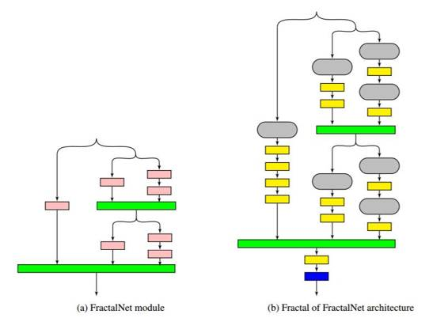
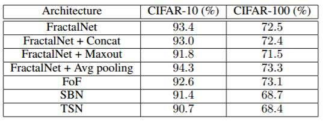
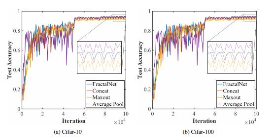
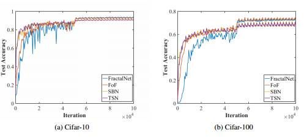

# 重磅论文 | 解析深度卷积神经网络的 14 种设计模式（附下载）

选自 arXiv.org

**机器之心编译**

**参与：吴攀、武竞、李泽南、蒋思源、李亚洲**

> *这篇论文的作者是来自美国海军研究实验室的 Leslie N. Smith 和来自美国马里兰大学的 Nicholay Topin，他们在本论文中总结了深度卷积神经网络的 14 种设计模式；其中包括：1\. 架构结构遵循应用；2\. 扩增路径；3\. 努力实现简洁；4\. 增加对称性；5\. 金字塔形状；6\. 用训练数据覆盖问题空间；7\. 过训练；8\. 增量特征构造；9\. 规范层输入；10\. 可用资源决定网络深度；11\. 转换输入；12\. 求和连接；13\. 下采样过渡；14\. 用于竞争的 MaxOut。该论文已被提交到了 ICLR 2017。论文原文可点击文末「阅读原文」下载。*

**摘要**

深度学习领域近来的研究已经产出了大量的新架构。与此同时，也有越来越多的团队在将深度学习应用到新的应用和问题上。这些团队中的许多都可能是由没有经验的深度学习实践者构成的，他们可能会对让人眼花缭乱的架构选择感到困惑，因此会选择去使用一个更古老的架构，如 AlexNet。在这里，我们尝试挖掘近来深度学习研究中包含的集体知识（collective knowledge）以发现设计神经网络架构的基本原理，从而帮助弥合这一差距。此外，我们还描述了几种架构创新，其中包括 Fractal of FractalNet、Stagewise Boosting Networks 和 Taylor Series Networks（我们的 Caffe 代码和 prototxt 文件将会在被 ICLR 接受后公开）。我们希望这项初步的工作能够激励进一步的研究。

**1.引言**

最近，关于新型神经网络架构的文章已经出现了很多，特别是关于残差网络（Residual Network）的，比如 He et al. (2015; 2016); Larsson et al. (2016); Zhang et al. (2016); Huang et al. (2016b)。这促使我们在一个更高的层面上来看待这些架构——将这些架构看作是普遍设计原理的潜在来源。这是相当重要的，因为现在有许多没有经验的实践者在想办法将深度学习应用到不同的新应用上。缺乏指导会导致深度学习实践新手忽视最新的研究而选择 AlexNet（或一些类似的标准架构），不管其是否合适他们的应用。

这种研究的极大丰富也是一个机会：可以确认能为特定背景的应用带来好处的元素。我们提出了一些基本的问题：深度网络设计的普遍原理是否存在？这些原理可以从深度学习的集体知识（collective knowledge）中挖掘出来吗？哪些架构选择在哪些特定的背景（context）中效果最好？哪些架构或部分架构看起来很简洁优美？

设计模式（design pattern）的概念最早由 Christopher Alexander (Alexander (1979)) 引入到建筑物和城镇的结构设计上。Alexander 写道：一种永恒的架构可以一直存在，这种质量可以通过基于普遍原理进行设计而实现。这种设计模式的基础是它们能在给定的背景中解决力量的冲突，并实现类似于自然生态平衡那样的均衡。设计模式既是高度特定的（使得它们可以很清楚地遵循），也是灵活的（让它们可被适配到不同的环境和情景中）。受 Alexander 的工作的启发，「gang of four」（Gamma et al. (1995)）将设计模式的概念应用到了面向对象的软件的架构设计上。这本经典的计算机科学书籍描述了 23 种可以用来解决软件设计中普遍存在的问题的模式，例如「需求总是在改变」。我们受到了之前这些在架构上的工作的启发，决定阐释神经网络架构的可能设计模式。

设计模式可以提供普遍性的指导原则，在这里我们首先要定义用于神经网络架构的设计模式。整体而言，要为所有的神经网络和所有的应用定义设计原理是一项巨大的任务，所以我们将这篇论文的范围限制在了卷积神经网络（CNN）及其基本的图像分类应用上。但是，我们认识到架构必须依赖于具备我们的第一设计模式的应用——设计模式 1：架构结构遵循应用；但相关的细节留待未来解决。此外，这些原理让我们可以发现已有研究中的一些缺陷和阐释全新的架构特征，比如 freeze-drop-path（参见 4.1 节）。这里阐述的经验法则可能对有经验的和新手的实践者都有价值。另外，我们真心希望这项初步的研究能够成为其它研究的垫脚石，能帮助其他人发现和分享其它深度学习设计模式。

**2.相关工作**

本节介绍和总结了其它一些神经网络架构上的相关研究工作，但由于篇幅限制，机器之心未对此节进行编译，详情请查看原论文。

**3.设计模式**

就我们所知，提供合适架构选择的指导与理解的文献资料很少。《Neural Networks: Tricks of the Trade》(Orr & Muller, ¨ 2003) 这本书包含了网络模型推荐，但没有参考过去几年的大量研究。与这项工作最接近的可能是 Szegedy et al. (2015b)，作者在其中描述了几种基于他们自己的经验的设计原理。

我们仔细审阅了文献以提取出它们的共性并将它们的设计归结成了基本的元素——这些元素也许可被认为是设计模式。在审阅文献的过程中，我们似乎很清楚一些设计似乎是简洁优雅的，而另一些则没那么简洁优雅。在这里，我们将首先描述一些高层面的设计模式，然后再提出一些更为详细的设计模式。

**3.1 高层面的架构设计**

一些研究者已经指出 ImageNet 挑战赛 (Russakovsky et al., 2015) 的获胜者在不断使用越来越深度的网络（参见：Krizhevsky et al. (2012), Szegedy et al. (2015a), Simonyan & Zisserman (2014), He et al. (2015)）。另外在 ImageNet 挑战赛上很明显的一点是：将通过网络的路径的数量倍增是最近的一个趋势；如果看一看 AlexNet 到 Inception 到 ResNets 的演变，就能明显看到这个趋势。比如说，Veit et al. (2016) 表明 ResNets 可被看作是带有不同长度的网络的指数集合（exponential ensemble）。这引出了设计模式 2：扩增路径。开发者可以通过将多个分支包含在架构中来实现。最近的例子包括 FractalNet (Larsson et al. 2016)、Xception (Chollet 2016) 和决策森林卷积网络（Decision Forest Convolutional Networks (Ioannou et al. 2016)）。我们甚至可以更进一步预测今年的 ImageNet 获胜者也还会增加他们的架构中的分支数量，而不是继续增加深度。

科学家们已经拥抱简洁性/简约性（simplicity/parsimony）几个世纪了。简洁性的例子可参考论文「Striving for Simplicity」(Springenberg et al. 2014)，其使用更少类型的单元实现了当时最佳的结果。我们将其加为设计模式 3：努力实现简洁——使用更少类型的层以保持网络尽可能简单。我们还在 FractalNet (Larsson et al. 2016) 设计中注意到了一种特定程度的简洁性，我们将其归功于其结构的对称性。架构的对称性（architectural symmetry）通常被看作是美丽和质量的标志，所以我们在这里得到了设计模式 4：增加对称性。除了对称性以外，FractalNets 还遵循了「扩增路径」设计模式，所以它是我们第 4 节的实验的基础。

为了理解相关的力量，考察权衡是设计模式的关键元素。一种基本的权衡是最大化表征的力量 vs 冗余的和非区分的信息的压缩。这普遍存在于所有卷积神经网络中，从数据到最后的卷积层，激活（activation）被下采样（downsample）并且信道数量增加。一个例子是深度金字塔残差网络（Deep Pyramidal Residual Networks (Han et al. (2016))）。这让我们得到了设计模式 5：金字塔形状，其中在整个架构中应该有一次整体的平滑的下采样，而且该下采样应该与信道数量的增长结合起来。

深度学习中另一个重要的权衡是：训练精度 vs 网络泛化到其从未见过的案例的能力。泛化的能力是深度神经网络的一个很重要的性质。一种提升泛化的方法是设计模式 6：用训练数据覆盖问题空间（Ratner et al. 2016, Hu et al. 2016, Wong et al. 2016, Johnson-Roberson et al. 2016）。这让训练精度可以直接提升测试精度。此外，正则化（regularization）常被用于提升泛化。正则化包括 dropout (Srivastava et al. 2014a) 和 drop-path (Huang et al. 2016b) 等方法。正如 Srivastava et al. 2014b 指出的那样，dropout 可通过向架构中注入噪声来提升泛化能力。我们将在训练过程使用正则化技术和谨慎的噪声注入可以提升泛化（Srivastava et al. 2014b, Gulcehre et al. 2016）的结论归结为设计模式 7：过训练（over-training）。过训练包含网络在一个更艰难的问题上训练的任何训练方法——该问题的难度超过了必要，因此在更容易的推理情况中的表现可以得到提升。除了正则化方法，设计模式 7 还包括有噪声的数据的使用（Rasmus et al. 2015, Krause et al. 2015, Pezeshki et al. 2015）。

**3.2 细节上的架构设计**

很多更成功的架构的一个共同点是使每个层更容易完成任务。使用极深层网络（very deep network）就是这样的例子，因为任何单个层只需要递增地修改输入。这部分解释了残差网络（residual network）的成功，因为在极深层网络中，每层的输出可能与输入相似，因此将输入代替层的输出能使层更容易完成任务。这也是扩增路径设计模式背后的一部分动机，但是使每个层简化任务的想法超越了这一概念。设计模式 8 ：增量特征构造（Incremental Feature Construction）的一个例子是在 ResNets 中使用短距离跳跃（skip）。最近的一篇论文（Alain & Bengio (2016)）证明在深度 128 的网络中使用长度为 64 跳越会导致网络的第一部分不训练，并且导致不变化的权重，这是需要避免的。

设计模式 9：规范层输入（Normalize layer inputs）是另一个简化层任务的方法：使层输入标准化。已经显示，层输入的标准化能改善训练结果和提高准确性，但是潜在机理并不清楚（Ioffe & Szegedy 2015, Ba et al. 2016, Salimans & Kingma 2016）。Batch 标准化的论文（Ioffe & Szegedy 2015）将提高归因于解决内部协变量偏移问题，而流标准化（streaming normalization）的作者（Liao et al. 2016）认为这也许是其它原因造成的。我们认为标准化使所有输入样本更加平等，就好像它们通过单位转换进行缩放一样，这使得反向传播（back-propagation）训练更有效。

一些研究，如 Wide ResNets（Zagoruyko & Komodakis 2016），显示增加信道（channel）的数量提高了性能，但是多余的信道会产生额外的代价。许多基准数据集的输入数据有 3 个通道（即颜色 RGB）。几乎是普遍现象，CNN 的第一层的输出增加了信道的数量。设计模式 11：转换输入。增加信道的几个例子 / ImageNet 的第一层输出的数量分别为 AlexNet (96)，Inception (32)，VGG (224)，以及 ResNets (64)。直观上讲，第一层中信道数量从 3 增加是合理的，因为它允许以多种方式检查输入数据，但是不清楚使用多少个过滤器。另一个是成本与精确度的权衡。成本包括网络中的参数的数量，这直接反映在训练的计算量和存储成本中。增加信道数量会增加成本，这导致设计模式 10：可用资源决定网络深度。除了在下采样（down-sampling）时使输出数量加倍（见设计模式 13），根据内存、计算资源和期望的精确度来选择第一层的深度。深度学习的计算开销很高，每个从业者必须平衡这些成本与其应用程序的性能。

**3.2.1 分支连接：串联、求和/平均与 Maxout**

当存在多个分支时，有三种方法来合并输出：串联、求和（或平均）与 Maxout。目前看来研究人员对它们的看法各不相同，没有哪一种方式更具优势。在本节中，我们提出一些简单的规则来决定如何合并分支。

求和是合并输出的最常见方法之一：求和/平均将分支间的近似工作分割，最终形成设计模式 12：求和连接（Summation Joining）。求和是残差网络的最佳连接机制。因为它允许网络计算校正项（即残差）而无需整个信号。sum 和 fractal-join（平均）之间的差异最好通过 drop-path 来理解（Huang et al.，2016）。在输入跳跃连接总是存在的残差网络中，求和能使卷积层学习残差（与输入的差）。另一方面，在具有若干分支的网络中，如 FactalNet（Larsson et al.，2016），使用均值是最佳方式，因为随着分支被随机丢弃，它可以保证输出平顺。

一些研究者似乎更喜欢串联（concatenation，例如 Szegedy et al，2015）我们相信串联对于增加池化时的输出数量是最有用的，这让我们得到了设计模式 13：下采样过渡（Down-sampling Transition）。这就是说，当池化或使用步幅（stride）超过 1 的下采样时，组合分支的最好方法是串联输出信道，它可以平滑地实现通常以下采样方式实现的信道连接和信道数量增加。

Maxout 已经被用于竞争，如本地竞争网络（Srivastava 等人，2014）和多尺度竞争网络（Liao 与 Carneiro，2015）Maxout 只选择一种激活，形成设计模式 14：MaxOut for Competition。它与求和或平均「合作」的激活方式相反，其中存在「竞争」关系，只有一个「赢家」。例如，当分支由不同大小的核（kernel）组成时，Maxout 可用于尺度的不变性，这类似于最大池化（max pooling）的平移不变性。

我们认为所有这些连接机制可以同时加入单独网络，不同于典型情况。

 

*图 1：这是 FractalNet 模块（a）和 FoF 架构（b）。曾表示如下：卷积层粉红色，连接层（如均值）是绿色，池层是黄色，预测层是蓝色。（b）中的灰色模块表示（a）中的 FractalNet 实例。*

**4 实验**

**4.1 架构创新**

本论文的重点是阐明基本设计原则，这样做的原因就是帮助我们发现一些架构上的创新，在本节中，这些创新将进一步被描绘出来。

首先，我们建议将求和/平均、串联和 maxout 连接机制与单一架构中的不同角色结合起来。接下来，通过增加分支的设计模式 2 来让我们能够大规模修饰 FractalNet 架构的顺序。最后按照我们称之为 Fractal of FractalNet (FoF) 网络，也就是 1b 中展示的分形模式调整模块，而不是按照最大深度来调整。该架构可将深度替换成更大数量的路径。

**4.1.1 Freeze-Drop-Path 和 Stagewise Boosting Networks（SBN）**

Drop-path 是被 Huang 等引进的（2016b）. 它通过迭代训练随机移除分支路径，就好像这条路径在整个网络中是不存在的。出于对对称性的考虑，我们使用了一个叫 freeze-path 的相反的方法。我们冻结权重来达到零的学习率（learning rate），而不是在训练期间直接移除网络中的分支路径。循环神经网络领域也已经有一种类似的想法被提了出来 (Krueger et al. 2016)。

我们称结合了 drop-path 和 freeze-path 效用的模型为 freeze-drop-path，这个可以在非随机情况下得到很好的解释。图 1 显示了一个 FractalNet 分形结构。我们从最左侧路径开始训练，并将 drop-path 应用到其他分支上面。这个分支的训练速度会很快，因为相对于整个网络只需要训练少量的参数。随后冻结那条分支路径的权重并激活在原来右边的一条分支路径。最左边的分支也就可以提供一个很好的近似函数，并且下一条分支也能在矫正的基础上运行了。因为下一个分支路径相比前一个包含了更多的层，所以和原来的相比更容易逼近矫正项的近似值，因此这样的分支允许网络获得更大的准确性。这样也就可以继续从左至右来训练整个网络。freeze-drop-path 将最后加入 FoF 架构（图片 1b），这个称之为梯度递增网络（Stagewise Boosting Networks (SBN)），因为它就是类似于梯度递增的（Friedman et al. 2001）。递增神经网络 (boosting neural network；Schwenk & Bengio 2000) 并不是个新概念，但是这个构架就是新的。在 B 部分我们将讨论测试的实施。

**4.1.2 泰勒级数网络（Taylor Series Netwroks，TSN）**

泰勒级数是一个经典的、众所周知的函数逼近方法。泰勒级数的扩展是：

由于神经网络也是函数近似，将网络的分支（branch）看成一个泰勒级数展开的项，它可以作为 SBN 的延伸。这意味着，在求和连接单元（summation joining unit）之前使第二分支的结果平方，类似于泰勒展开中的二阶项。类似地，使第三分支立方。我们将它称作「泰勒级数网络」（TSN），并且存在多项式网络的优先级（Livni et al. 2014）和网络中的乘式项（例如 Lin et al. 2015 年的论文）。TSN 与 SBN 类比的实现细节详见附录讨论。

**4.2 结果**

该章节内的实验主要是验证上面提到的架构创新的验证，但并非完全进行测试。未来会有更完整的评估。

*表 1：在 CIFAR-10 和 CIFAR-100 上各种架构的测试准确率对比。*

 

*图 2：对比原 FractalNet 与用 Concatenation 或 Maxout 替代了一些 fractal-joins 的 FractalNet。同样展示的还有当用平均池化替代了最大池化时的测试准确度。*

 

*图 3：对比原 FractalNet 与用 Concatenation 或 Maxout 替代了一些 fractal-joins 的 FractalNet。同样展示的还有当用平均池化替代了最大池化时的测试准确度。*

表一和图 3 接下来对比 4.1 章节中描述的架构创新的最终测试准确率的结果。最终的结果显示要比 FractalNet 基线差一点，但从 3a 和 3b 图中可以明显看到新架构训练起来要比 FractalNet 更快。FoF 架构最终测试准确率类似于 FractalNet，但 SBN 和 TSN 架构（使用 freeze-drop-path）在学习率下降的时候准确率会落后。这在 CIFAR-100 上要比 CIFAR-10 更加明显，表明这些架构可能更适合带有大量分类的应用。但是，我们也遗留下了对更多合适应用的探索，以后再做。

**5\. 结论**

在此论文中，我们描述了通过研究近期深度学习论文中的新架构而发现的卷积神经网络架构的设计模式。我们希望这些设计模式对希望推进前沿结果的有经验的实践者和寻求深度学习新应用的新手都有所帮助。接下来也有许多的潜在工作可以做，一些工作我们也在此论文中有所指明。我们的努力主要限定在进行分类的残差神经网络，但希望这一初步工作能启发其他人进行循环神经网络、深度强化学习架构等等其它网络的架构设计模式的研究。

******©本文由机器之心编译，***转载请联系本公众号获得授权******。***

✄------------------------------------------------

**加入机器之心（全职记者/实习生）：hr@almosthuman.cn**

**投稿或寻求报道：editor@almosthuman.cn**

**广告&商务合作：bd@almosthuman.cn**