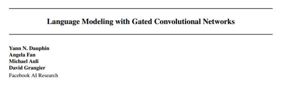
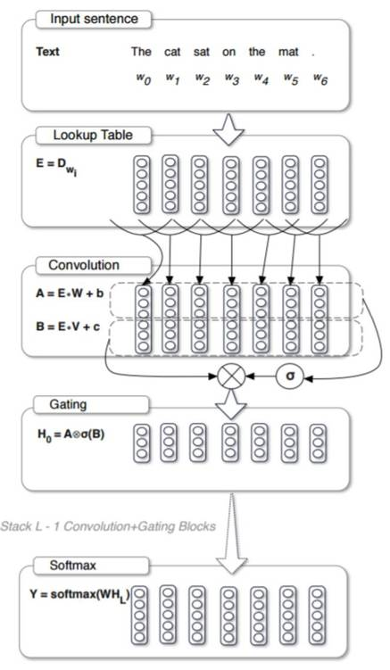
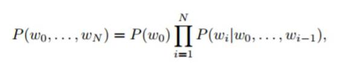

# 学界 | 并行运算，Facebook 提出门控卷积神经网络的语言建模

选自 arxiv.org

**机器之心编译**

**参与：李泽南**

**摘要**

目前语言建模的主要方法都是基于循环神经网络的。在本研究中，我们提出了一种使用卷积方式处理的语言建模方式。我们引入了一种新的门控机制，可以缓和梯度传播，它的表现比 LSTM 方式的门控（Oord 等人，2016）更加优秀。我们的方法在 WikiText-103 上创造了新的最高纪录，同时我们也在 Google Billion Word 基准上进行了单 GPU 测试，结果创造了新的最快记录。因为可以并行运算，在对延迟敏感的任务中，我们的模型的速度相较其他模型提升了一个数量级。目前为止，这是第一次出现非训话方式在此类任务中超越了循环方式。

*用于语言建模的门控卷积网络架构*

**引言：**

统计语言模型被用于估算词序列的概率分布。这相当于给定一个词，对下一个词的概率进行建模，例如：

 

其中 wi 是词汇表中的离散字索引。语言模型是语音识别系统（Yu&Deng，2014）以及机器翻译系统的关键组成部分（Koehn，2010）。

近年来，神经网络在此类任务的表现超过了 n 元语法模型（Kneser & Ney，1995；Chen & Goodman，1996）。经典的语言模型面临数据短缺的问题，无法准确表征长段语句，缺乏分析长范围从属关系的能力。神经语言模型通过在应用神经网络的连续空间中嵌入单词来解决这个问题。语言建模的当前技术水平基于长短期记忆网络（LSTM; Hochreiter 等人，1997），理论上可以建模任意长的从属关系。

在本文中，我们介绍了门控卷积网络（gated convolutional networks）并将其应用于语言建模。卷积网络可以被堆叠以表示大的上下文尺寸，并且在具有在更大的上下文范围内提取分层更抽象的特征（LeCun＆Bengio，1995）。这种特性允许我们通过在大小 N 和内核宽度 k 的上下文上应用 O（N / k）运算来建模长期从属关系。相反，循环网络将输入视为链结构，因此需要线性数目 O（N）的操作。

输入分层的分析与类似于经典语法形式的构造相似，其构建了间隔增大的句法树结构。例如，由包含复杂内部结构的名词短语和动词短语组成的句子（Manning＆Schutze¨，1999；Steedman，2002）。另外，分层结构也简化了学习，因为相较于链结构，给定上下文大小的非线性的数量减少，从而减轻了消失梯度问题（Glorot＆Bengio，2010）。

现代计算机硬件非常适合运行高度并行化的模型。在循环网络中，下一个输出取决于前一个的隐藏状态，它不启用对序列元素的并行化。卷积网络非常适合于此类计算，因为所有输入字的计算可以同时执行。

门控已经显示出超越循环神经网络最快表现的潜力（Jozefowicz 等人，2016）。我们的门控线性单元通过为梯度提供线性路径，同时保留非线性能力，减少了深层架构的消失梯度问题。

我们在单个 GPU 系统中进行了实验，证明了使用门控卷积网络的语言建模优于其他最近发布的语言模型，如在 Google Billion 上类似设置训练的 LSTM Word 基准（Chelba 等人，2013）。我们还评估了我们的模型分析 WikiText-103 基准中长距离从属关系的能力，其中该模型以整个段落而不是单个句子为条件进行处理，并且我们在此基础上实现了新的最快记录（Merity 等人，2016）。最后，我们展示了门控线性单元可以实现更高的精度和收敛，比 OST 等人的 LSTM 门控更快。

**点击阅读原文，下载此论文。**

***©本文由机器之心编译，***转载请联系本公众号获得授权***。***

✄------------------------------------------------

**加入机器之心（全职记者/实习生）：hr@almosthuman.cn**

**投稿或寻求报道：editor@almosthuman.cn**

**广告&商务合作：bd@almosthuman.cn**