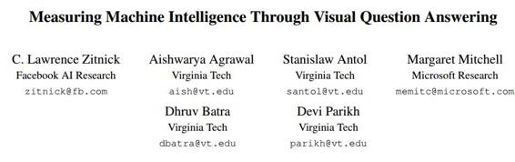

# 学界 | FAIR 实验室与微软研究院合著论文：通过虚拟问答衡量机器智能

选自 arXiv.org

**作者：C. Lawrence Zitnick、Aishwarya Agrawal、Stanislaw Antol、 Margaret Mitchell、Dhruv Batra、Devi Parikh**

**机器之心编译**

**参与：孙宇辰、李亚洲**

**摘要**

随着机器逐渐变得更加智能，社区内对衡量机器智能程度的方法再次产生了兴趣。一种常用的方法是使用人类可以处理的、但机器做起来困难的任务。然而，这样的一个理想任务应该容易进行评估，同时不那么容易蒙出来。我们从最近图片描述（image captioning）以及其局限性作为一个衡量机器智能的任务开始探索。另一个更有前途的任务就是虚拟问答，测试机器语言与视觉上思考的能力。我们为了这项任务搭建了前所未有的数据集，包含 76 万人们对图片内容生成的问题。使用一千万左右人类产生的回答，机器可能很容易被评估。 

***©本文由机器之心编译，***转载请联系本公众号获得授权***。***

✄------------------------------------------------

**加入机器之心（全职记者/实习生）：hr@almosthuman.cn**

**投稿或寻求报道：editor@almosthuman.cn**

**广告&商务合作：bd@almosthuman.cn**

**点击「阅读原文」，下载此论文↓↓↓**