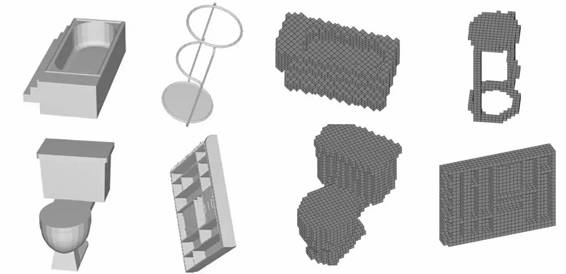
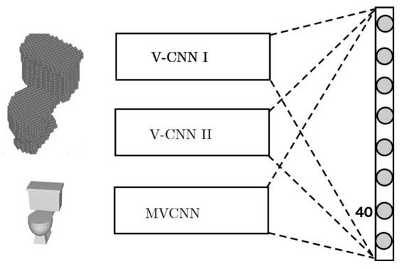
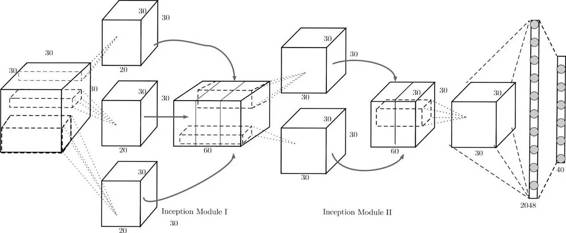
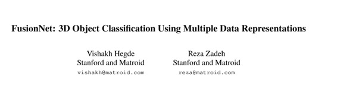

# 学界 | FusionNet 融合三个卷积网络：识别对象从二维升级到三维（附论文）

选自 Oreilly

**作者： Reza Zadeh**

**机器之心编译**

**参与：微胖、吴攀**

> *Matroid 论文 Matrix Computations and Optimization in Apache Spark 获得 2016  KDD  Applied Data Science Track 最佳论文（亚军）。 本文是 Matroid 的最新研究，主要介绍了 FusionNet ，其深度学习结构利用可以进行三维「思考」的基础架构，解决了三维物体的识别问题。该技术使得 Matroid 在普林斯顿 ModelNet 大赛上排名第一（目前）。*

随着增强现实和自动驾驶汽车的出现，3D 数据正在爆发。在不久的将来，处理 3D 数据的算法将被用于诸如机器人导航或基于增强现实的智能用户界面之类的应用。受此启发，来自 Matroid 的新近论文展示了 FusionNet，这款架构可在 Princeton ModelNet 标准数据集中分类 3D CAD 物体。

FusionNet 核心是一个用于 3D 物体的新型三维卷积神经网络（CNN）。在将其用于这里之前，我们不得不从几个方面修改传统的 CNN。为了便于解释，首先，让我们看一下用于图像识别的二维 CNN。想法是这样的：机器学习研究人员建构一个多层模型，每层以不同的方式处理前一层的连接。在第一层有一个视窗（window），它可以将一个片（patch ）滑过一张二维图像，这张图像集就变成那一层的输入。这就是一个卷积层，因为这个片是「缠绕的（convolve）」——上述的视窗移过图图像时会与自己重叠。接下来就是几个不同类型的层。最后一层的神经元被用于潜在输出；这些神经元的每一次激活（activation）都对应于能识别图像的不同标签。在 ModelNet40  挑战赛数据集中，有 40 个分类，因此最后一层有 40 个神经元。对于该训练数据中所包含的所有分类：第一类可能会是猫，第二类可能会是汽车等等。如果这 40 个神经元中的第一个放电最多，那么，输入就可被认定属于第一类，也就是猫。

在 ModelNet40 挑战赛数据集中，有 40 类，因此最后一层有 40 个神经元。第一类可能会是只猫，第二类可能会是汽车以及等等。如果第一个神经元正在对四十个神经元放电，那么，输入就被认定属于第一类，也就是猫。

这一切假定输入为一张图像，即二维。如何将之拓展用于三维输入？一个办法就是将物体当作图像一样处理，将其投影为二维，这和你的显示器显示三维物体的方式一样；然后，在上面运行一个标准二维的 CNN。实际上，普林斯顿 ModelNet 挑战赛中，领先参赛者在像素表征上使用了卷积神经网络，其将任何 3D 物体都处理为一个几个视角下的 2D 投影的集合。FusionNet 确实在像素表征上也使用了 CNN，但是，关键在于，其还混合了一种新型的三维 CNN。

我们没有在一张二维图像上滑动一个二维的片（patch），我们可以在一个物体上滑动一个三维的体（volume）！在这种表示方法中，我们就不需要投影的步骤了。这种处理物体的方式使用到了物体的体表示（volumetric representation）。

在我们的体表示中，3D 物体被离散化为 30 x 30 x 30 的体素网格。如果该物体的某一个部分被表示在了一个 1 x 1 x 1 的体素中，那么该体素就取值 1，否则就取 0。和之前的成果不一样，我们同时使用了像素表示和体素表示来学习物体的特征和对 3D CAD 物体进行分类，而且比单独使用这两种表示中的任何一种的效果都好。这里是一些例子：

 

*图 1，两种表示方法。左边：浴缸、凳子、马桶和衣柜 3D CAD 物体的 2D 投影；右边：体素化的浴缸、凳子、马桶和衣柜*

我们构建了两个卷积神经网络（V-CNN I 和 V-CNN II）来处理体素数据，还有另一个（MV-CNN）用来处理像素数据。下图表示了这些网络结合在一起然后给出物体标签的最终决策的方式。这和处理 2D 图像的、只能从图像中学习空间局部特征的标准 CNN 不同。

 

*图 2\. FusionNet 是 V-CNN I、V-CNN II 和 MV-CNN（其基于 AlexNet，并在 ImageNet 上进行过预训练） 三个不同网络的融合。这三个网络在评分层（scores layers）融合——评分层在找到类别预测前给出分数的线性组合。前两个网络使用了体素化的 CAD 模型，后一个网络使用了 2D 投影。*

作为 2D 网络 MV-CNN 的基础，我们在该 3D 物体的 2D 投影上使用了一个标准的预训练好的神经网络（AlexNet）并热启动了该网络。AlexNet 的预训练在大型 2D 像素图像数据库 ImageNet 上完成。因为有这个预训练，许多分类 2D 图像所需的特征都不需要再从头开始学习。下面的图示说明了我们的 Volumetric CNN 的一种架构（V-CNN I）。

 

*图 3*

V-CNN I 的灵感来自 GoogLeNet，其使用了 inception 模块。inception 模块是来自不同大小的核的输出的串联。它可帮助网络在不同的规模上学习特征，并把它们放在 inception 模块后下一个卷积层的同一个基础上。

综上所述，FusionNet 是三个卷积神经网络的融合：一个是在像素表示上训练的，另两个是在体素化的物体上训练的。它可利用每个组分网络的优势来提升分类表现。FusionNet 的每一个组分网络都会在分类之前考虑每个物体的多个视角或方向。从多个视角必然比从单一视角能获得更多信息，尽管这很直观，但将所有这些信息聚合起来用以提升准确度却并不常见。我们在预测物体的分类之前使用了来自像素表示的 20 个视角的信息和体素表示的 60 个 CAD 方向。在提交给普林斯顿 ModelNet 排行榜的所有设计中，FusionNet 在这个包含 40 个分类的数据集中实现了当前最优的表现，表现出了其辨别能力。

**论文：FusionNet：使用多数据表示的 3D 对象分类**

**** 

摘要：高质量 3D 物体识别是许多视觉系统和机器人系统的重要组件。我们使用两种数据表示（data representation）解决了物体识别的问题，从而在普林斯顿 ModelNet 挑战赛上得到了领先的结果。这两种数据表示方法为：

*   体表示（Volumetric representation）：3D 物体被空间离散为二进制体素（binary voxel）——如果该体素被占用就取 1，否则就取 0；

*   像素表示（Pixel representation）：3D 物体被表示为一组投影出来的 2D 像素图像。

当前提交到 ModelNet 挑战赛的领先设计使用了在像素表示上的卷积神经网络（CNN）。但是，我们扩展了这一趋势，并额外使用  Volumetric CNN（体卷积神经网络）弥合了上述两种表示方法之间的效率差异。我们结合了这两种表示方法，并使用它们来学习新特征，从而实现了比单独使用其中任何一种都更好的分类器。要实现这一点，我们引入了新的 Volumetric CNN (V-CNN) 架构。

***©本文由机器之心编译，***转载请联系本公众号获得授权***。***

✄------------------------------------------------

**加入机器之心（全职记者/实习生）：hr@almosthuman.cn**

**投稿或寻求报道：editor@almosthuman.cn**

**广告&商务合作：bd@almosthuman.cn**

**点击「阅读原文」，下载此论文↓↓↓**