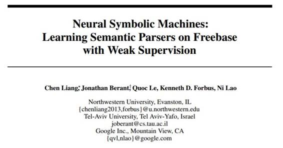
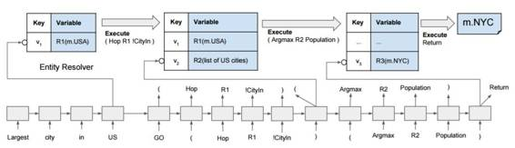
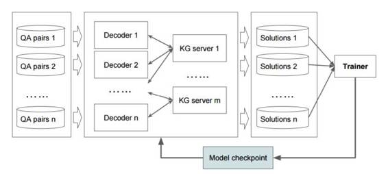

# 学界 | 谷歌新论文提出神经符号机：使用弱监督在 Freebase 上学习语义解析器

选自 arXiv.org

**机器之心编译**

**参与：吴攀**

**摘要**

将深度神经网络的成功扩展到自然语言理解和符号推理上需要复杂的运算和外部的记忆。最近的神经程序诱导方法（neural program induction approaches）已经在尝试解决这个问题了，但这种方法通常受限于可微分的记忆（differentiable memory），因此只能执行一些小型的合成任务，不能进一步扩展。在这项成果中，我们提出了 Manager-Programmer-Computer（管理器-编程器-计算机）框架，其整合了神经网络和不可微分记忆（non-differentiable memory）以支持通过一个友好的神经计算机接口执行抽象的、可扩展的和精准的运算。具体来说，我们引入了一种神经符号机（NSM：Neural Symbolic Machine），其包含了一个序列到序列（seq2seq）神经「编程器（programmer）」和一个不可微分的「计算机（computer）」——该计算机是一个带有代码协助（code assist）的 Lisp 解释器。为了成功将 REINFORCE 用于训练，我们通过使用一个迭代式的最大似然训练过程（iterative maximum likelihood training process）所找到的近似黄金程序（approximate gold programs）来增强它。NSM 可以通过弱监督（weak supervision）的方式在大型知识库上训练语义解析器（semantic parser）。其通过弱监督的方式在很有挑战性的语义解析数据集 WebQuestionsSP 上实现了新的当前最佳的表现。和之前的方法相比，NSM 是端到端的（end-to-end），因此无需依赖特征工程或特定领域的知识。

*图 3：使用 NSM 的语义解析。其密钥-变量记忆（key-variable memory）的密钥嵌入（key embedding）是该序列模型在特定编码或解码步骤的输出。为了说明，我们也在括号中显示了这些变量的值，但该序列模型永远不会看到这些值，而且只能通过变量名（如 R1）引用它们。特殊的 token「GO」表示解码的开始，而「RETURN」则表示解码的结束。*

*图 4：系统架构。100 个解码器、50 个 KG 服务器（KG server）和 1 个训练器（trainer）。*

*   **论文下载地址：https://arxiv.org/pdf/1611.00020v1.pdf**

******©本文由机器之心编译，***转载请联系本公众号获得授权******。***

✄------------------------------------------------

**加入机器之心（全职记者/实习生）：hr@almosthuman.cn**

**投稿或寻求报道：editor@almosthuman.cn**

**广告&商务合作：bd@almosthuman.cn**