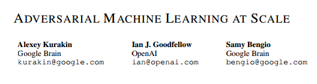

# 学界 | Google Brain 与 OpenAI 合作论文：规模化的对抗机器学习

选自 arXiv.org

**机器之心编译**

**参与：李亚洲、吴攀**

> *近日在 arXiv 上发表的论文中，Ian Goodfellow 等人对对抗机器学习进行了进一步的研究。点击阅读原文可下载此论文。*

**摘要**

对抗样本（adversarial examples）是被设计用来愚弄机器学习模型的恶意输入。它们总是从一种模型迁移到另一个，让 attackers 在不知道目标模型的参数的情况下进行黑箱攻击。对抗训练（adversarial training）是在对抗样本上明确地训练模型的过程，从而使它可在面临攻击时更稳健或可减少它在干净输入上的测试错误率。目前，对抗训练主要被用于一些小问题。在此研究中，我们将对抗训练应用到了 ImageNet。我们的贡献包括：（1）推荐如何将对抗训练成功地规模化到大型模型和数据集上。（2）观察对抗训练对单步 attack 方法的稳健性。（3）发现多步 attack 方法要比单步 attack 方法有较小的可迁移性，所以单步 attack 对进行黑箱 attack 更好。（4）分辨出是「lable leaking」效应造成对抗训练的模型在对抗样本上的表现比在干净样本上的表现更好，因为对抗样本构造流程使用真实标签（true label），所以该模型能学习利用构造流程中的规律。

******©本文为机器之心编译文章，***转载请联系本公众号获得授权******。***

✄------------------------------------------------

**加入机器之心（全职记者/实习生）：hr@almosthuman.cn**

**投稿或寻求报道：editor@almosthuman.cn**

**广告&商务合作：bd@almosthuman.cn**