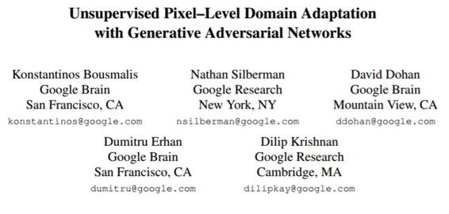

# 学界 | 谷歌新论文：使用生成对抗网络的无监督像素级域适应

选自 arXiv.org

**机器之心编译**

**参与：吴攀**

**论文标题：使用生成对抗网络的无监督像素级域适应（Unsupervised Pixel-Level Domain Adaptation with Generative Adversarial Networks）**

**** 

摘要：对于许多任务而言，收集标注良好的数据集去训练现代的机器学习算法是极其昂贵

的。渲染合成数据倒是一个吸引人的选择——其中的 ground-truth 标注是自动生成的。但不幸的是，完全基于渲染的图像而训练的模型往往无法泛化到真实的图像。为了解决这个短板，之前的工作包括：引入无监督域适应算法（unsupervised domain adaptation algorithm），这是为了在两个域之间对表征进行映射；或者学习提取域不变（domain-invariant）的特征。在本项成果中，我们提出了一种新方法，该方法能以无监督的方式学习一个像素空间中从一个域到另一个域的变换。我们的基于生成对抗网络（GAN）的方法能够使源域（source-domain）图像看起来就像是来自目标域（target domain）的一样。我们的模型不仅能生成看似可信的样本，而且表现还极大超越了许多当前最佳的无监督域适应情况。最后，我们还表明这种适应过程可以泛化到训练过程中从未见过的对象类上。

*图 1：我们的模型所生成的 RGBD 样本 vs 来自 Linemod 数据集 [22, 46] 的真实 RGBD 样本。上一行的每一张子图像是图像的 RGB 部分，下一行是对应的深度信道。每一列对应数据集中一个特定的物体。*

*图 2：模型架构概览。左边，我们按照 [34] 中的风格描绘了整体的模型架构。右边，我们扩展了生成器和判别器组分的细节。其中，生成器 G 在合成图像 *

** 

*和噪声向量 z 上调节而生成一张图像，判别器在真实和虚假图像之间进行判别。一个 stride 为 1 的且有 64 个信道的卷积在图中被表示为 n64s1。lrelu 表示 leaky ReLU nonlinearity。BN 表示一个批规范化层（batch normalization layer），FC 表示全连接层。注意我们没有展示 T 的细节，因为其对每个任务而言都是不同的，并且与域适应过程是分离的。*

*图 3：我们的模型的生成样本能力的可视化——训练将 MNIST 调整为 MNIST-M。(a) 来自 MNIST 的源图像；(b) 使用我们带有随机噪声 z 的模型 *

** 

*调整过的样本；(c) 生成样本的 MNIST-M 训练集中与中间一行最近邻的样本。中间一行和底部一行的差异说明该模型并不是在记忆其目标数据集。*

**点击阅读原文可查看论文**

***©本文由机器之心编译，***转载请联系本公众号获得授权***。***

✄------------------------------------------------

**加入机器之心（全职记者/实习生）：hr@almosthuman.cn**

**投稿或寻求报道：editor@almosthuman.cn**

**广告&商务合作：bd@almosthuman.cn**