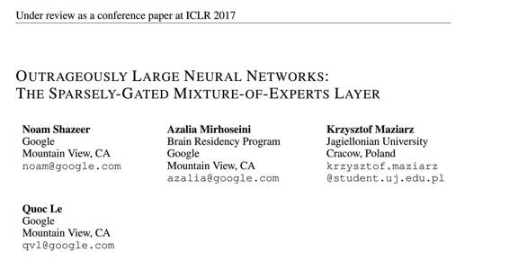
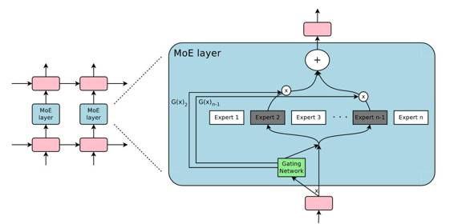

# 学界 | 谷歌 ICLR 2017 论文提出超大规模的神经网络：稀疏门控专家混合层（附论文）

选自 ICLR2017

**机器之心编译**

**参与：吴攀**

 

摘要：神经网络吸收信息的能力受限于其参数的数量。在这篇论文中，我们提出一种新类型的层——稀疏门控专家混合层（Sparsely-Gated Mixture-of-Experts(MoE)），它能够在仅需增加一点计算的基础上被用于有效提升模型的能力。这种层包含了多达数万个前向的子网络（feed-forward sub-networks，被称为专家（expert）），总共包含了多达数百亿个参数。一个可训练的门网络（gating network）可以确定这些专家的稀疏组合以用于每一个样本。我们将这种 MoE 应用到了语言建模任务上——在这种任务中，模型能力对吸收训练语料库中可用的大量世界知识而言是至关重要的。我们提出了将 MoE 层注入堆叠 LSTM（stacked LSTM）的新型语言模型架构，得到的模型的可用参数数量可比其它模型多几个数量级。在语言建模和机器翻译基准上，我们在更低的成本上实现了可与当前最佳表现媲美或更好的结果，其中包括在 1 Billion Word Language Modeling Benchmark 上测得的 29.9 的困惑度（perplexity），以及在 WMT』14 En to Fr（英法翻译）和 En to De（英德翻译）上分别得到了 40.56 和 26.03 的 BLEU 分数。  

 

*图 1：一个嵌入在语言模型中的专家混合（MoE/Mixture of Experts）层。在这里例子中，其稀疏门函数（sparse gating function）可以选择两个专家（expert）来执行计算。它们的输出由该门网络（gating network）的输出进行调制。*

******©本文由机器之心编译，***转载请联系本公众号获得授权******。***

✄------------------------------------------------

**加入机器之心（全职记者/实习生）：hr@almosthuman.cn**

**投稿或寻求报道：editor@almosthuman.cn**

**广告&商务合作：bd@almosthuman.cn**