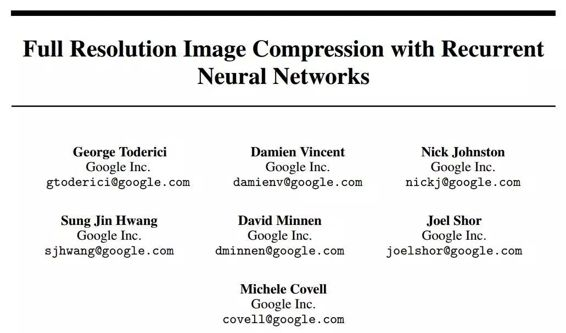
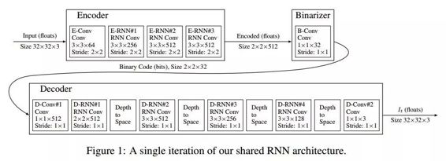

# 学界 | 谷歌最新论文：使用循环神经网络的全分辨率图像压缩

选自 arXiv.org

**作者：George Toderici、Damien Vincent 等人**

**机器之心编译**

**参与：吴攀**

**摘要**

本论文提出了一套基于神经网络的全分辨率有损图像压缩方法。这些我们所描述的每一种架构都可以在实施过程中提供可变的压缩率，而不需要对网络进行再训练（retraining）：每个网络只需要训练一次。我们所有的架构都由一个基于循环神经网络（RNN：recurrent neural network）的编码器和解码器、一个 binarizer 和一个用于熵编码（entropy coding）的神经网络构成。我们对 RNN 的类型（LSTM、关联 LSTM（associative LSTM）进行了比较，并引入了一种新的 GRU 和 ResNet 的混合结构。我们还研究了 one-shot 与附加重建架构（additive reconstruction architectures）的对比，并引入了一种新的扩展过的附加框架。对比之前的研究成果，我们的成果显示出了 4.3%-8.8% AUC（率失真曲线下的区域）提升，具体数字取决于所用的感知标准（perceptual metric）。就我们所知，在 Kodak 数据集图像的率失真曲线（rate-distortion curve ）的大部分比特率的图像压缩上，这是第一个表现优于 JPEG 的神经网络架构，不管有没有熵编码的辅助。

*图 1：我们共享的 RNN 架构的单次迭代*

***©本文由机器之心编译，***转载请联系本公众号获得授权***。***

✄------------------------------------------------

**加入机器之心（全职记者/实习生）：hr@almosthuman.cn**

**投稿或寻求报道：editor@almosthuman.cn**

**广告&商务合作：bd@almosthuman.cn**

**点击「阅读原文」，下载此论文↓↓↓**