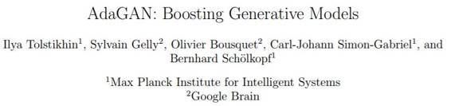
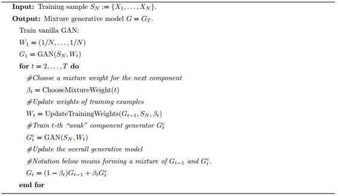
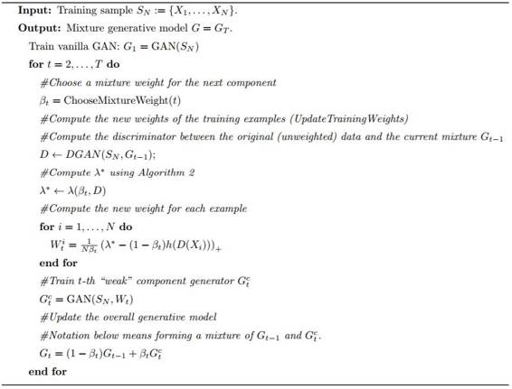

# 学界 | 谷歌新论文提出适应性生成对抗网络 AdaGAN：增强生成模型

选自 arXiv

**机器之心编译**

**参与：吴攀**

 

生成对抗网络（GAN, Goodfellow et al., 2014）是一种用于训练自然图像等复杂数据的生成模型的有效方法。但是它们的训练难度是众所周知的，而且还可能会遭受缺失模式（missing modes）问题——即模型无法产出在该空间的特定区域的样本。我们提出了一种叫做 AdaGAN（Adaptive GAN 的简写，类似 AdaBoost）的迭代过程，其中在每一个步骤我们都会通过在一个重新加权的样本上运行一个 GAN 算法来向混合模型中加入一个新的组分。这是受到了 boosting 算法的启发，其中许多潜在的弱单个预测器（predictor）会贪婪地（greedily）聚集形成一个强复合预测器。我们证明这样一种增量过程可以在有限数量的步骤中收敛到真实分布（如果每个步骤是最优的），否则就会以指数的速率收敛。我们还通过实验表明这一流程能够解决缺失模式问题。

算法 1：AdaGAN（一种用于构建 T 个单个 GAN 的「强」混合的元算法）按序列的方式进行训练。其混合权重计划 ChooseMixtureWeight 和其训练集重新加权计划 UpdateTrainingWeights 应当由用户提供。第 3 节给出了这个系列的一个完整案例。

算法 3：AdaGAN（一种用于构建 T 个单个 GAN 的「强」混合的元算法）按序列的方式进行训练。其混合权重计划 ChooseMixtureWeight 应当由用户提供（参见 3.2）。这是高级算法 1 的一个实例，实例化了 UpdateTrainingWeights。

*论文链接：https://arxiv.org/abs/1701.02386*

***©本文由机器之心编译，***转载请联系本公众号获得授权***。***

✄------------------------------------------------

**加入机器之心（全职记者/实习生）：hr@almosthuman.cn**

**投稿或寻求报道：editor@almosthuman.cn**

**广告&商务合作：bd@almosthuman.cn**