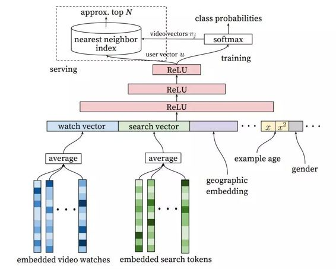

# 学界 | 谷歌技术论文：用于 YouTube 推荐的深度神经网络

选自 arxiv.org

**作者：Paul Covington, Jay Adams, Emre Sargin**

**机器之心编译**

**参与：孙宇辰、吴攀**

**摘要**

YouTube 所使用的推荐系统是现在最大规模的、最先进的业界的推荐系统之一。在这篇论文中，我们在较高层面上描述这个系统，并重点关注了深度学习所带来的巨大的性能提升。本论文根据典型的两阶段信息检索的二分法（two-stage information retrieval dichotomy）分为两部分：首先，我们详细描述了一种深度候选生成模型（deep candidate generation model），接着描述了一种分离的深度排名模型（deep ranking model）。通过设计、迭代、维护一个带有巨量面向用户的影响的巨型推荐系统，我们还提供了实用的经验教训和见解。

**系统概述**

我们的推荐系统的整体结构如图 2 所示。系统由两个神经网络组成：一个用于候选生成，一个用于排名。其中候选生成网络从用户的 YouTube 活动历史中提取事件作为输入，然后从一个大的视频库中检索出一个小数据集（上百个视频）。这些候选被认为通常与用户有很精准的相关性。这个候选生成网络仅通过协同过滤（collaborative filtering）提供广泛的个性化。用户之间的相似性可以通过粗粒度特征（例如视频观看的 ID、搜索查询单词以及人口特征统计）表达。

一个推荐列表中出现的一些「最好」的推荐需要一种良好的表征，以在具有高召回率（recall）的候选集中区分相对的重要性。排名网络通过使用一个描述视频与用户的特征集合的期望目标函数来给每个视频打分，从而完成排名的任务。根据它们的得分，然后将最高分的视频展现给用户。

两阶段的推荐方法允许我们从一个很大（数百万）的语料库中进行推荐，与此同时还仍有在设备上出现的少量视频是个性化的吸引用户的内容。此外，这个设计能够和其他源生成的候选进行混合，例如在这一项早期工作[3]中描述的。

在开发过程中，我们广泛地使用了非网络的指标（准确度、召回率、ranking loss）来引导我们的系统的迭代改进。然而，为了最终测定一个算法或模型的效果，我们依靠于通过实时实验进行 A/B 测试。在一个实时实验中，我们能度量在点击率、观看时间与许多度量用户参与度的指标中不易察觉的变化。这是非常重要的，因为实时 A/B 测试结果不总是与离线实验有相关性。

*图 2：推荐系统架构：候选视频通过「漏斗」状的流程从大量视频中被检索出来并进行排名，然后再将其中一小部分展示给用户。*

 

*图 3：深度候选生成模型架构：嵌入的稀疏特征是和稠密特征连结在一起的。在级联（concatenation）将可变大小的稀疏 ID 转换成适合隐藏层输入的固定宽度的向量之前，嵌入被取了平均。所有隐藏层是全连接的。在训练中，使用取样的 softmax 的输出之上的梯度下降对交叉熵损失进行最小化。在服务中，用一个近似最近邻（approximate nearest neighbor ）查询生成数以百计的候选视频推荐。*

 

*图 4：对于一个给定的视频，模型用样本年龄（example age）作为一个特征训练，能够精准表达出数据中的上传时间和依赖时间的受欢迎程度。如果没有这一特征，该模型会在训练窗口近似地预测平均似然（ average likelihood）。*

 

*图 5：给模型选择标签和输入上下文对离线评估来说很有挑战性，但是对实时性能有巨大的影响。如图，实心圆点•是网络的输入特征，空心圆点◦是被去除的。我们发现在 A/B 测试上预测未来观看（5b）的表现更好。如 5b 所示，样本年龄表示为 tmax − tN，其中 tmax 是训练数据中的最大观测时间。*

 

*图 7：描绘了嵌入的分类特征（包括一价特征和多价特征）的深度排名系统架构，这些特征带有共享的嵌入和规范化的连续特征的乘幂。所有层都是全连接的。在实践中，需要给网络馈送数百个特征。*

**结论**

我们描述了我们用于推荐 YouTube 视频的深度神经网络架构，划分为两个不同的问题：候选生成与排名。

我们的深度协同过滤模型能够吸收很多信号并使用深度的层对它们的交互进行建模，其性能优于 YouTube 原来使用的矩阵分解方法。比起科学，选择推荐的代理问题（surrogate problem）更像是一门艺术；而且我们发现通过获取不对称的联合观看行为（co-watch behavior ）和预防未来信息的泄露，对未来观看的分类可以在实时评估中表现良好。抑制来自分类器的判别信号也是获得好的结果的关键，否则模型将会对代理问题过拟合，不能很好地转换到主页。

我们发现使用训练样本的年龄作为输入特征，移除了相对于过去的固有偏差（bias），并允许模型表达受欢迎视频的时间依赖行为。这种改进的离线保持了精确率，同时在 A/B 测试中显著地增加了最近上传视频的观看时间。

排名是更经典的机器学习问题，但是我们深度学习方法在性能上超过了之前对观看时间预测的线性与基于树的方法。推荐系统尤其受益于用户过去和事物之间的行为这样专门的特征。深度神经网络需要对类别和连续特征的特殊表征，我们对其分别使用嵌入与分位数标准化（quantile normalization）进行变换。我们发现深度的层可以有效地对数百个特征的非线性交互建模。

逻辑回归（Logistic regression）根据给训练样本赋予权重进行修改，其中给观看时间正样本，没有观看的是负样本，从而让我们可以学习接近模型预期观看时间的几率。这种方式相比于直接预测点击率，可以在观看时间权重排名评估指标上表现得远远更好。

***©本文由机器之心编译，***转载请联系本公众号获得授权***。***

✄------------------------------------------------

**加入机器之心（全职记者/实习生）：hr@almosthuman.cn**

**投稿或寻求报道：editor@almosthuman.cn**

**广告&商务合作：bd@almosthuman.cn**

**点击「阅读原文」，下载此论文↓↓↓**