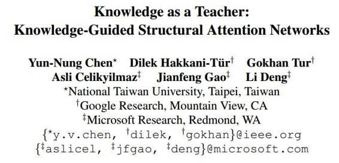

# 学界 | 谷歌、微软合著论文：由知识引导的结构化注意网络

选自 arXiv.org

**作者：Yun-Nung Chen, Dilek Hakkani-Tur, Gokhan Tur, Asli Celikyilmaz, Jianfeng Gao, Li Deng**

**机器之心编译**

**参与：吴攀**

**摘要**

自然语言理解（NLU）是口语对话系统的一个核心组成部分。最近的循环神经网络（RNN）凭借其随时间保存序列信息的强大能力在 NLU 上取得了很好的结果。传统而言，NLU 模块根据话语的扁平结构标记话语的语义槽（semantic slot），其基本 RNN 结构是一个线性链（linear chain）。但是，自然语言展现的语言属性能为更好的理解提供丰富的、结构化的信息。这篇论文介绍了一种全新的模型——由知识引导的结构化注意网络（K-SAN：knowledge-guided structural attention network），这是一种广义的 RNN，再加入了由先前的知识引导的非扁平的网络拓扑。其有两个特点：1）可以从小型训练数据集中获取重要的子结构，让模型可以泛化到之前从未见过的测试数据；2）该模型可以自动找出对预测给定句子的语义标签至关重要的显著子结构，从而可是实现理解性能的提升。在航空旅行信息系统（ATIS）数据基准上的实验表明我们提出的 K-SAN 架构可以使用注意机制（attention mechanism）有效地从子结构中提取出显著的知识，其表现超过了当前最佳的基于神经网络的框架。

******©本文由机器之心编译，***转载请联系本公众号获得授权******。***

✄------------------------------------------------

**加入机器之心（全职记者/实习生）：hr@almosthuman.cn**

**投稿或寻求报道：editor@almosthuman.cn**

**广告&商务合作：bd@almosthuman.cn**

**点击「阅读原文」，下载论文↓↓↓**