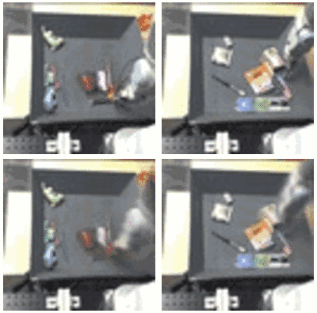

# 深度 | 谷歌深度解读：机器人可以如何通过共享经历学习新技能（附论文）

选自 Google Research

**作者：Sergey Levine、Timothy Lillicrap、Mrinal Kalakrishnan**

**机器之心编译**

**参与：吴攀**

> *本文的三位作者分别来自谷歌/Alphabet 的三大「黑科技」研究机构：Sergey Levine（来自 Google Brain）、Timothy Lillicrap（来自 Google DeepMind）和 Mrinal Kalakrishnan（来自 X）。（注：因为微信文章只支持三个视频显示，所以另外两个视频以链接的形式呈现。）*

从经历（experience）中进行学习的能力很可能是实现能执行复杂的真实世界任务的机器人的关键，这些任务包括：协助老年人做家务和日常活动、在办公室和医院帮助我们、做对人类来说过于危险或让人厌恶的工作。但是，如果每一个机器人都只能从其自己的经历中学习应对这些任务的全部技能，那么它可能会需要很长的时间才能掌握足够有用的技能集合。我们能不能通过共享机器人彼此的经历让机器人实现集体学习，从而解决这一问题呢？

尽管机器学习算法已经在自然语言理解和语音识别领域取得了重大的进展，但能让人类与机器人通过话语来沟通复杂概念的显著高水平的推理对机器来说还是遥不可及。但是，机器人可以立即将它们的经验通过网络传递给其它机器人——有时候这被称为「云机器人（cloud robotics」——而且正是这样的能力能让机器人向彼此学习。

这甚至可以适用于一些看似简单的技能。人类和动物都很擅长运动控制，这将它们的感官、反射和肌肉整合到了一个紧密协作的反馈回路中。真实世界的机器人在这些技能上仍然很吃力，因为真实世界环境的多样性和复杂性要求机器人具有经过了很好的磨砺的行为，并且不容易被外界干扰所愚弄。如果我们让机器人可以将它们的经历转递给彼此，它们能够在真实环境中通过传感的密切配合来学习运动技能吗？

我们之前写过多个机器人可以如何汇集它们的经历来学习抓取的技能。在这里，我们将讨论我们进行的一些新实验，这些实验是为了调查跨多个机器人的通用技能学习的三种可能方法：直接从经历中学习运动技能、学习内在的物理模型、以及在人类协助下学习技能。在所有这三种案例中，多个机器人都会共享它们的经历，从而构建出一个共同的技能模型。这些机器人所学习到的技能还相对很简单——推动物体或打开门——但机器人可以通过集体学习（collective learning）更快更高效地学习这些技能，所以它们在未来也可能依靠这种方法学会更丰富的行为技能，并最终让它们可以协助我们的日常生活。

**使用无模型强化学习（model-free reinforcement learning）从原始经历中学习**

也许机器人彼此学习的最简单的方式是将它们在世界中的成功和失败的信息汇集起来。人类和动物可以通过直接的试错学习（trial-and-error learning）获得很多技能。在这种类型的「无模型（model-free）」学习——这么说是因为并不会构建环境的确切模型——的过程中，它们在已有的行为上探索变化，然后强化和利用那些能够带来更大回报的变化。通过与深度神经网络的结合，无模型算法近来已经证明了其让人惊叹的有效性，并且也成为了 Atari 游戏系统和围棋系统上的成功的关键。使用多个机器人让我们可以通过共享经历来加速这种真实世界中的直接学习。

在这些实验中，我们给机器人的任务是尝试将它们的机器臂移动到目标位置，或移动到某个位置打开一扇门。每个机器人都配置了一个神经网络副本，这让它们可以评估在一个给定状态中采取一个给定动作的价值。通过查询这个网络，该机器人可以快速决定在这个世界中哪些行动可能是值得采用的。当一个机器人执行动作时，我们给其所选择的动作加入了噪声，从而使其得到的行为有时候可能会比之前所观察到的好一点，当然有时候也会差一点。这让每个机器人都可以探索完成一个任务的不同方法。这些机器人会记录下这些动作，然后它们的行为和最终的结果会被发送到中央服务器。该服务器会使用所有机器人的经历，并使用它们来迭代式地改进用于评估不同状态和动作值的神经网络。

我们部署的这个无模型算法会同时检查好的和坏的经历，并将它们提炼融入到一个新的网络中——这个网络更擅长理解动作和成功之间的关联方式。然后，每隔一段时间，每个机器人都会从该服务器获得一个更新网络的副本并开始使用新网络的信息执行动作。因为更新后的网络在评估世界中动作的价值上的表现会好一点，所以这些机器人会有更好的表现。然后不断重复这种周期以获得在该任务上持续提升。在下面的视频中，一个机器人正在探索开门的任务：https://www.youtube.com/watch?v=iiD3Klvm96s。

几个小时的练习之后，机器人共享了它们学习实现目标（接触把手然后拉动以打开门）的原始经历。在开门的这个案例中，机器人没有构建世界的确切模型就学会了处理拉钩和门把手之间接触的复杂物理作用，结果如视频所示：https://www.youtube.com/watch?v=R2kEi_KKSsA

**通过与物体互动学习世界的运作方式**

直接试错强化学习（direct trial-and-error reinforcement learning）是一种学习单独技能的很好的方式。但是人类和动物并不完全是通过试错进行学习的。我们也会构建关于环境的心智模型（mental models）以及想象世界可能会怎样改变以响应我们的行为。

我们可以从最简单的物理交互开始，让我们机器人学习从它们自己的经历中反映出来的因果基础。在这个实验中，我们让机器人在一个桌面仓中随机戳或推各种常见的家用物品。然后这些机器人又共享了它们的经历并共同构建了一个试图预测世界对它们的行为的可能反应的单一预测模型。这个预测模型可以根据其被提供的当前相机图像和该机器人可能执行的动作序列来做出未来相机图像的简单预测（可能有一点模糊）：

*上排：机器臂与常见家用物品互动*

*下排：根据给定的初始图像和动作序列所预测的未来相机图像*

一旦完成该模型的训练，机器人就可以使用它来执行有目的的操作，比如基于用户指令的任务。在我们的原型设计中，用户可以简单地通过点击一个物体然后点击要将其移动到的位置点来命令机器人移动该物体。

该实验中的机器人未被告知有关该物体的任何事情或物理作用方式：它们只看到了将一个特定像素移动到一个特定位置的命令。但是，因为它们已经在它们共享的过去经历中看过了许多物体的交互作用，所以它们可以预测特定的行为会如何影响特定的像素。为了使这种特定的物理理解涌现出来，机器人必须被提供足够广度的经历。这需要大量的时间或共享结合在一起的许多机器人的经历。关于该项目的更多视频可以查看：https://www.youtube.com/watch?v=CKRWJEVSXMI

**在人类的帮助下学习**

前面我们讨论了机器人可以如何完全靠自己学习。但是，人类的指导是非常重要的——不只是告诉机器人做什么，而且还要帮助机器人做到。我们对于各种操作技能的执行方式有很大的直觉；很显然，将这种直觉知识转递给机器人可以帮助它们更快很多地学习这些技能。在下一个实验中，我们为每一台机器人都提供了一扇不同的门，并通过人工的方式引导它们学习了这些门的打开方式。这些演示被编码成了用于所有机器人的单一组合方法——这被称为策略（policy）。该策略是一个深度神经网络，它可以将相机图像转换成机器人的动作，而且它被保持在中央服务器上。下面的视频是指导员向机器人演示开门技能：

接下来，这些机器人通过一个试错学习过程来整体改进这个策略。每个机器人都会尝试使用最新的可用策略（外加一点用于探索的噪声）打开自己的门。这些尝试让每个机器人可以为下一轮时间规划更好的开门策略，并相应地改善该策略：

毫不奇怪，我们发现如果机器人在难度逐渐递增的任务序列上训练，那么它们可以更加高效地学习。在我们的实验中，每个机器人开始时都是在指导员之前向其演示过的门位置和方向上练习开门技能。随着它在这项任务上做得更好后，指导员就开始只超出当前策略的能力一点点地改变门的位置和方向，而不会难到会让机器人完全失败。这让机器人可以随时间逐渐增加它们的技能水平和扩展它们所能应对的情况的范围。人类引导和试错学习的结合让机器人可以在短短几个小时内就集体学会开门技能。因为机器人是在看起来彼此不同的门上训练的，所以最后得到的策略成功打开了一扇没有任何机器人之前曾经见过的门：

在上面所描述过的三个实验中，通信和交换它们的经历的能力让机器人可以更快更高效地学习。这在将机器人学习和深度学习结合起来时变得尤其重要，正如上面所有实验的案例一样。我们之前已经见识过：当有充足的训练数据集时，深度学习能获得最好的表现。比如，流行的 ImageNet 基准使用了超过 150 万个有标签样本。然而单个机器人要想收集到这样的数据量可能需要很多年的时间，使用许多机器人用几周时间就能收集同样量的数据，这要高效得多。除了更快的学习时间，这种方法还可能受益于经历的更大多样性：真实世界的机器人部署可能涉及到不同位置和不同配置的许多机器人，共享异构的多样化的经历可以构建出单个高度泛化的表征。

当然，今天的机器人所能学习的行为种类还是很有限的。即使是抓取物品和开门这种基本运动技能也仍然是前沿的研究领域。在所有这些实验中，仍然需要人类工程师通过定义详细的目标函数来告诉机器人它们应该学习做什么。但是，随着算法的改进和更广泛的机器人应用，共享和汇集它们的经验将有助于让它们在我们的日常生活中给予我们协助。

试错学习的实验由来自 Google Brain 团队的 Shixiang (Shane) Gu 和 Ethan Holly，以及来自 DeepMind 的 Timothy Lillicrap 完成。在学习预测模型上的工作由来自 Google Brain 团队的 Chelsea Finn 完成。从演示中学习的研究由来自 X 的 Yevgen Chebotar、Ali Yahya、Adrian Li 和 Mrinal Kalakrishnan 完成。我们还要感谢 Peter Pastor、Gabriel Dulac-Arnold 和 Jon Scholz 的贡献。本文中所讨论的所有实验的细节可以查看以下论文（点击阅读原文下载）：

*   用于机器人操作的深度强化学习（Deep Reinforcement Learning for Robotic Manipulation）. Shixiang Gu, Ethan Holly, Timothy Lillicrap, Sergey Levine. 

*   Deep Visual Foresight for Planning Robot Motion. Chelsea Finn, Sergey Levine. 

*   使用分布式异构引导的策略搜索的集体机器人强化学习（Collective Robot Reinforcement Learning with Distributed Asynchronous Guided Policy Search）. Ali Yahya, Adrian Li, Mrinal Kalakrishnan, Yevgen Chebotar, Sergey Levine. 

*   路径积分引导的策略搜索（Path Integral Guided Policy Search）. Yevgen Chebotar, Mrinal Kalakrishnan, Ali Yahya, Adrian Li, Stefan Schaal, Sergey Levine

*文章来源：https://research.googleblog.com/2016/10/how-robots-can-acquire-new-skills-from.html*

******©本文由机器之心编译，***转载请联系本公众号获得授权******。***

✄------------------------------------------------

**加入机器之心（全职记者/实习生）：hr@almosthuman.cn**

**投稿或寻求报道：editor@almosthuman.cn**

**广告&商务合作：bd@almosthuman.cn**

