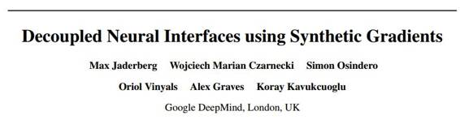

# 学界 | 谷歌 DeepMind 最新论文：使用合成梯度的解耦神经接口

选自 arXiv.org

**作者：Max Jaderberg、Wojciech Marian、Czarnecki、Simon Osindero、Oriol Vinyals、Alex Graves、Koray Kavukcuoglu**

**机器之心编译**

**参与：吴攀**

摘要

训练 directed neural networks 通常需要将数据前向传播通过一个计算图（computation graph），然后再反向传播误差信号，从而生成权重更新。因此，网络中所有层——或称为模块（module）——就会被锁定，在某种意义上，他们必须等待该网络的剩余部分前向执行，然后反向传播误差之后才能实现更新。在本研究成果中，我们通过引入网络图（network graph）的一个未来计算模型而对模块进行解耦，从而打破了这种限制。这些模型仅使用局部信息就能预测建模的子图（subgraph）将会产生的结果。我们尤其关注建模误差梯度（modelling error gradients）：通过使用建模的合成梯度来取代真正的反向传播误差梯度，我们可以解耦子图并独立和异步地对它们进行更新，即我们可以实现解耦神经接口。我们展示了三项实验结果，前向传播模型（其中每一层都是异步训练）、循环神经网络（RNN）（预测某个未来梯度可在 RNN 可以有效建模的时间上进行扩展）、和分层 RNN 系统(在不同时间尺度上执行的)。最后，我们证明：除了预测梯度，该框架还可被用于预测输入，得到可以以前向和反向通过的方式解耦的模型——从而发展成可以联合学习（co-learn）的独立网络，它们可通过这种方式被组合成一个单一的 functioning corporation。

***©本文由机器之心编译，***转载请联系本公众号获得授权***。***

✄------------------------------------------------

**加入机器之心（全职记者/实习生）：hr@almosthuman.cn**

**投稿或寻求报道：editor@almosthuman.cn**

**广告&商务合作：bd@almosthuman.cn**

**点击「阅读原文」，下载此论文↓↓↓**