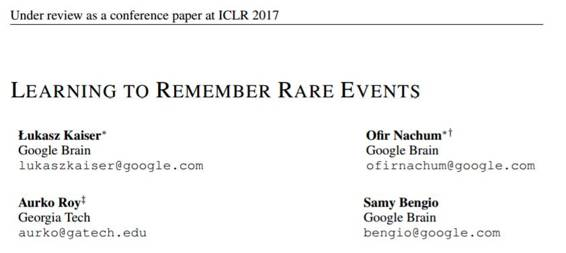
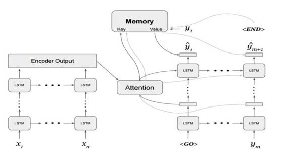
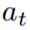
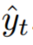
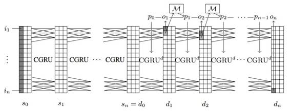

# 学界 | 谷歌提交 ICLR 2017 论文：学习记忆罕见事件

选自 Openreview

**作者：Łukasz Kaiser 等**

**机器之心编译**

**参与：吴攀**

**论文：学习记忆罕见事件（LEARNING TO REMEMBER RARE EVENTS）**

 

**摘要**

尽管近来已经取得了一些进步，但记忆增强的深度神经网络（memory-augmented deep neural network）在终身学习（life-long learning）和一次性学习（one-shot learning）上的能力还很有限，在记忆罕见事件（rare events）上的能力尤其如此。我们提出了一种用于深度学习的大规模终身记忆模块（large-scale life-long memory module）。这种模块利用了快速最近邻算法（fast nearest-neighbor algorithms）来提升效率，并且因此可以扩展到很大的记忆规模。除了最近邻查询（nearest-neighbor query），这种模块还是完全可微分的，并且可以进行无需任何监督的端到端训练。它是以一种终身方式（life-long manner）进行运作的，即在训练过程中无需重置（reset）。我们的记忆模块可以被轻松地添加到一个监督式神经网络的任何部分。为了显示其这种能力，我们将其添加到了多种网络中——从在图像分类上测试的简单卷积网络到深度序列到序列（deep sequence-to-sequence）和循环卷积（recurrent-convolutional）模型。在所有这些案例中，增强过的网络都获得了记忆能力并且可以进行终身一次性学习（life-long one-shot learning）。我们的模块能够记忆成千上万个步骤之前所见过的训练样本，并且可以成功地在它们的基础上进行泛化。我们在 Omniglot 数据集上实现了一次性学习的新的当前最佳表现，并且我们也首次在一个大规模机器翻译任务中的循环神经网络上演示了终身一次性学习。

图 2：添加了记忆模块的谷歌神经机器翻译（GNMT）模型。在每一个解码步骤 t，注意（attention）
的结果被用于查询该记忆。其结果值与最终 LSTM 层的输出结合得出预测出的 logits 

 

图 3：带有记忆模块的扩展神经 GPU（Extended Neural GPU）。记忆查询从当前输出 logit 下面 1 个的位置读取，而其嵌入的记忆值会被放置在输出磁带 p 的同一位置。这个网络会学习这些值，并在下一个步骤产生输出。

*原文链接：https://openreview.net/pdf?id=SJTQLdqlg*

***©本文由机器之心编译，***转载请联系本公众号获得授权***。***

✄------------------------------------------------

**加入机器之心（全职记者/实习生）：hr@almosthuman.cn**

**投稿或寻求报道：editor@almosthuman.cn**

**广告&商务合作：bd@almosthuman.cn**