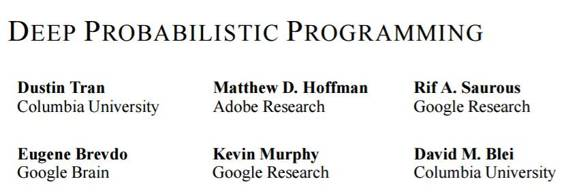
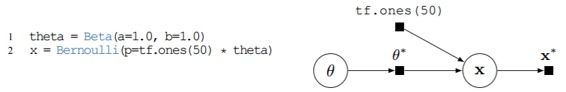
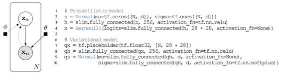
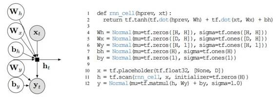
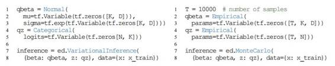
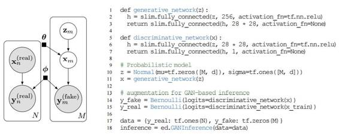
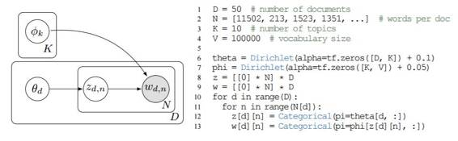
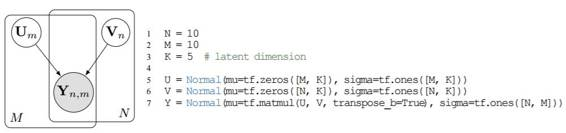

# 学界 | 谷歌提出深度概率编程语言 Edward：融合了贝叶斯、深度学习和概率编程

选自 arXiv

****机器之心编译****

**参与：吴攀**

> *近日，哥伦比亚大学、Adobe Research、Google Research 和 Google Brain 的研究者联合发表了一篇论文，介绍一种新的图灵完备的概率编程语言。该论文表示 Edward 集成到了 TensorFlow 中。以下是该论文及 Edward 的简单介绍，论文全文请点击文末「阅读原文」查看。*

https://arxiv.org/pdf/1701.03757v1.pdf

Edward 官网：http://edwardlib.org/

Edward 官网对这门新语言的描述是：Edward 是一个用于概率建模、推理和评估的 Python 库。它是一个用于快速实验和研究概率模型的测试平台，其涵盖的模型范围从在小数据集上的经典层次模型到在大数据集上的复杂深度概率模型。Edward 融合了以下三个领域：贝叶斯统计学和机器学习、深度学习、概率编程。

它支持以下方式的建模：

*   定向图模型

*   神经网络（通过 Keras 和 TensorFlow Slim 等库）

*   条件特定的无向模型

*   贝叶斯非参数和概率程序

它支持以下方式的推理

*   变分推理（Variational inference）

*   黑箱变分推理

*   随机变分推理

*   包容 KL 散度（Inclusive KL divergence）：\text{KL}(p\|q)KL(p∥q)

*   最大后验估计

*   蒙特卡洛（Monte Carlo）

*   哈密尔顿蒙特卡罗（Hamiltonian Monte Carlo）

*   随机梯度 Langevin 动态

*   Metropolis-Hastings

*   推理的组成

*   期望最大化（Expectation-Maximization）

*   伪边界和 ABC 方法（Pseudo-marginal and ABC methods）

*   消息传递算法（Message passing algorithms）

它支持以下的模型评估和推理

*   基于点的评估（Point-based evaluations）

*   后验预测检查（Posterior predictive checks）

Edward 构建于 TensorFlow 之上。它支持诸如计算图、分布式训练、CPU/GPU 集成、自动微分等功能，也可以用 TensorBoard 可视化。

以下是介绍论文的摘要介绍

论文标题：深度概率编程（DEEP PROBABILISTIC PROGRAMMING）

**摘要**

我们提出了一种图灵完备的概率编程语言 Edward。Edward 构建于两种组合式表示的基础上——随机变量和推理（random variables and inference）。通过将推理看作「第一类公民」，与建模（modeling）一样，我们表明概率编程可以做到和传统深度学习一样灵活和有计算效率。

对于灵活性，Edward 让我们可以使用从点估计（point estimation）到变分推理和 MCMC 等各种可组合的推理方法来拟合相同的模型。此外，Edward 还可以将建模表征复用作推理的一部分，这能促进丰富的变分模型和生成对抗网络的设计。

对于效率，Edward 集成到了 TensorFlow 之中，在已有的概率系统基础上提供了显著的加速。比如，在基准 logistic 回归任务上，Edward 至少比 Stan 和 PyMC3 快 35 倍。

**引言**

深度神经网络的本质是组合式的（compositional）。用户可以以创造性的方式来将层连接起来，而无需担忧如何去执行测试（前向传播）或推理（基于梯度的优化，通过反向传播和自动微分）。在这篇论文中，我们为概率变成设计组合式表示（compositional representations）。概率编程让用户可以将生成概率模型指定为程序（program），然后将这些模型「编译（compile）」为推理过程（inference procedures）。概率模型本质上也是组合式的，而之前的大部分工作都集中在通过组合随机变量来构建丰富的概率程序上（Goodman et al., 2012; Ghahramani, 2015; Lake et al., 2016）。

但很少有研究考虑过用于推理的类似的组合性。相反，现在大多数已有的概率编程语言都将推理引擎当作从模型中抽象出来的黑箱来处理。这些方法不能代表在复用模型表征的概率推理中的最新进展。比如，在变分推理（Kingma & Welling, 2014; Rezende & Mohamed, 2015; Tran et al., 2016b）和生成对抗网络（Goodfellow et al., 2014）上的进展已经变得非常重要了。

我们提出了一种图灵完备的概率编程语言 Edward。Edward 构建于两种组合表示的基础上——随机变量和推理（random variables and inference）。我们给出了如何将 Edward 集成到已有的计算图框架（如 TensorFlow）中的方法。TensorFlow 这样的框架能够「免费」提供分布式训练、并行性、向量化和 GPU 支持等计算优势。我们还表明 Edward 可以如何让我们轻松使用从点估计（point estimation）到变分推理和 MCMC 等各种可组合的推理方法来拟合相同的模型。通过将推理看作「第一类公民」，与建模（modeling）一样，我们表明概率编程可以做到和传统深度学习一样灵活和有计算效率。比如，我们的哈密尔顿蒙特卡罗（Hamiltonian Monte Carlo）实现比现有的软件快 35 倍。

*图 1：Beta-Bernoulli 程序（左）与其计算图（右）。从图中取 x 会生成一个有 50 个元素的二值向量*

*图 2：用于一个 28×28 像素图像的数据集的变自编码器：（左）图模型，其中虚线表示推理模型；（右）概率程序，带有 2 层神经网络*

*图 3：贝叶斯 RNN：（左）图模型；（右）概率程序。该程序的时间步骤未指定；其为循环使用了一个符号（tf.scan）*

*图 6：（左）变分推理；（右）蒙特卡洛*

*图 7： 生成式对抗网络：（左侧）概率图模型（右侧）概率程序。加入一些假数据以及训练其判别式模型，能不断强化该生成模型*

*图 13：LDA 文档主题生成模型，隐含狄利克雷分布 (Blei et al., 2003）*

*图 14： 高斯矩阵分解*

******©本文为机器之心编译，***转载请联系本公众号获得授权******。***

✄------------------------------------------------

**加入机器之心（全职记者/实习生）：hr@almosthuman.cn**

**投稿或寻求报道：editor@almosthuman.cn**

**广告&商务合作：bd@almosthuman.cn**