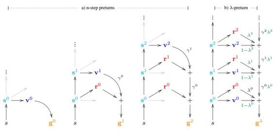

# 学界 | 谷歌新论文提出预测器架构：端到端的学习与规划

选自 arxiv.org

**机器之心编译**

**参与：Jane W**

**论文：预测器：端到端的学习和规划（The Predictron: End-To-End Learning and Planning）**

  

**摘要**

人工智能的主要挑战之一是在有规划的情况下有效地学习模型。在本文中，我们介绍了一种叫预测器（predictron）的架构。预测器包含一个完全抽象的模型，由带有奖励的马尔可夫过程（Markov reward process）表示，可以向前「想象」多个规划步骤。预测器的每个正向传递（forward pass）在多个规划深度上累积内部奖励（reward）和值。预测器由端对端的方式训练，以使这些累积值准确地近似于真实的价值函数（value function）。我们将预测器应用于程序生成的随机迷宫（maze）和模拟器游戏池（game of pool）。预测器产生比常规深度神经网络架构明显更准确的预测。

**导语**

基于模型的增强学习（reinforcement learning/RL）的核心思想是将 RL 问题分解为两个子问题：学习环境模型，然后用这个模型进行规划。该模型通常由带有奖励的马尔科夫过程（MRP）或决策过程（decision process/MDP）表示。规划步骤利用此模型来评估和选择可能的策略。这通常通过向前推演模型以构建估计累积奖励的价值函数来实现。之前的研究把模型的训练与使用在规划器的范围内基本上独立分开。因此，训练的模型与 agent 主体的总体目标并不匹配。先前的深度强化学习方法已经成功构建了可以实现接近像素级完美呈现（pixel-perfect）的重建模型（Oh 等人 2015；Chiappa 等人 2016）。但在充满挑战的 RL 领域，用原始数据时，尚未超越最先进的无模型（modelfree method）方法（例如，Mnih 等人 2015；2016；Lillicrap 等人 2016）。

在本文中，我们介绍一种新的架构，我们称之为预测器，它将学习和规划步骤集成到一个端到端的训练过程中。agent 每进行一步，模型会基于当前的内部状态（internal state）产生下一状态，估计奖励（reward）、折扣因子（discount）和该状态具有的价值（value）。这个模型是完全抽象的，其唯一的目标是构建准确的价值预测。例如，为了在游戏中有效地计划，agent 必须能够预测得分。如果我们的模型能够做出准确的预测，那么基于这个模型的最佳规划也将是全局最佳规划——即使该模型使用不同的状态空间（state space）（例如，抽象表示的敌人位置，忽略了形状和颜色）、行动空间（action space）（例如，向远离敌人方向移动的高级动作）、奖励（reward）（例如，单个抽象步骤可以具有比任何真实奖励更高的值）、甚至时间步长（timestep）（例如，单个抽象步骤可以让 agent「跳」到走廊的尽头）。我们的目的是通过抽象模型的轨迹产生的分数与通过真实环境的轨迹产生的分数一致。这通过端对端地训练预测器来实现，以使得其值估计尽可能准确。

理想模型可以推广到许多不同的预测任务，而不是过度拟合单个任务；并且可以从丰富多样的反馈信号（feedback signal）中学习，而不仅仅是外在奖励。因此，我们训练预测器来预测大量不同的价值函数，这些价值函数具有不同的拟奖励函数（pseudoreward function）和折扣因子（discount factor）。这些拟奖励可以用于估计 agent 可能碰到的任何事件或环境，例如，不休眠或进入下一个房间。该模型专注于预测任务：估计在动力不受控制的 MRP 环境中的价值函数。在这种情况下，预测器可以当作具有 MRP 循环核（recurrent core）的深度神经网络。预测器将该循环核展开为多个步骤，并累积所有奖励的值作为价值的总体估计。

我们将预测器应用于程序生成的随机迷宫和模拟器游泳池并直接传入像素级的输入数据（pixel input）。在这两种情况下，预测器显著优于传统深度神经网络架构的无模型算法（model-free algorithm）；并且在诸如深度（depth）等架构参数的选择上更加鲁棒。

 

*图 1：a) 预测器架构。前 3 列图分别展现了 0、1、2 步的预测器的路径。0 步的 preturn 退化为标准无模型的价值函数的近似形式；其它 preturn 通过一个内部模型「想象」额外的步骤。每个路径输出 k 步的 preturn（g_k）, 这个 preturn 包含了累积折扣奖励（discounted reward）和最终价值函数的估计值。在实践中，所有 k 步的 preturn 都只在向前路径中计算。b) 第 4 列显示了λ-预测器的架构。不同的λ参数阈值对应不同的 preturn。输出是λ-preturn 记为 g_λ，它是 k 步 preturn 的组合值。例如，如果λ_0=I，λ_1=I，λ_2=0，那么我们将 2 步的 preturn 修正为 g_λ=g_2。折扣因子γ_k 和λ参数λ_k 取决于状态 s_k；这种相关性在图中未示出。*

***©本文由机器之心编译，***转载请联系本公众号获得授权***。***

✄------------------------------------------------

**加入机器之心（全职记者/实习生）：hr@almosthuman.cn**

**投稿或寻求报道：editor@almosthuman.cn**

**广告&商务合作：bd@almosthuman.cn**