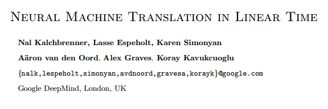

# 学界 | DeepMind 最新论文：线性时间的神经机器翻译

选自 arXiv.org

**机器之心编译**

**参与：李亚洲**

**** 

**摘要**

我们提出了一种用于序列处理（sequence processing）的神经架构。ByteNet 是一种两个扩张的卷积神经网络（dilated convolutional neural networks）的堆叠；其中一个网络用于编码源序列（source sequence），另一个网络用于解码目标序列（target sequence）——这个过程中目标网络动态展开从而生成可变长度输出。ByteNet 有两个核心特性：它在与序列长度成线性的时间上运行；它能保留序列的时间分辨率（temporal resolution）。ByteNet 解码器在字符级的语言建模上获得了顶尖水平，并超越了之前循环神经网络取得的最好结果。ByteNet 也在原始的字符级机器翻译（raw character-level machine translation）上获得了接近最好的神经翻译模型（运行在二次时间（quadratic time）中）所能取得的顶尖表现。由 ByteNet 学习到的隐含架构能反映出序列之间的预期对应。

*   **论文下载：https://arxiv.org/pdf/1610.10099v1.pdf**

******©本文由机器之心编译，***转载请联系本公众号获得授权******。***

✄------------------------------------------------

**加入机器之心（全职记者/实习生）：hr@almosthuman.cn**

**投稿或寻求报道：editor@almosthuman.cn**

**广告&商务合作：bd@almosthuman.cn**