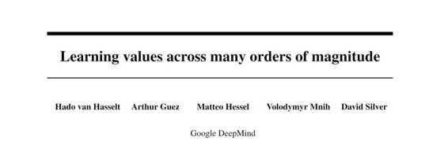

# 学界 | DeepMind David Silver 最新论文：学习跨多个数量级的值

选自 arXiv.org

**作者：Hado van Hasselt, Arthur Guez, Matteo Hessel, Volodymyr Mnih, David Silver**

**机器之心编译**

**参与：吴攀**

**** 

**摘要**

大多数学习算法相对于正被逼近的函数是不变的。我们在这里提出对学习中所使用的这些目标进行自适应的规范化。这在基于值的强化学习（value-based reinforcement learning）上很有用处——在基于值的强化学习中，当我们更新行为策略时，合适的值近似（value approximation）的量级可能会随时间改变。我们的主要动力是在学习玩 Atari 游戏上的前期成果，其中的奖励（ reward）被限定在了一个预先确定的范围内。这种截取（clipping）有利于使用单一的学习算法学习许多不同的游戏，但被截取过的奖励函数可能会导致不同性质的行为。使用这种自适应规范化（adaptive normalization），我们可以在不降低整体表现的情况下移除这种特定域的启发法（domain-specific heuristic）。

***©本文由机器之心经授权发布，***转载请联系作者获得授权***。***

✄------------------------------------------------

**加入机器之心（全职记者/实习生）：hr@almosthuman.cn**

**投稿或寻求报道：editor@almosthuman.cn**

**广告&商务合作：bd@almosthuman.cn**

****点击「阅读原文」，下载此论文↓↓↓****