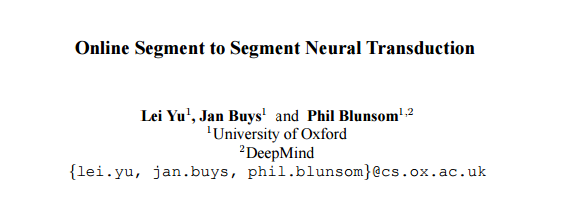

# 学界 | DeepMind 最新论文：在线 Segment to Segment 神经传导

选自 ArXiv

**作者：Lei Yu, Jan Buys, Phil Blunsom**

**机器之心编译**

**参与：吴攀**

**摘要**

我们在这里介绍一种在线神经序列到序列模型（online neural sequence to sequence model），其可以从其读取到的输入的编码和解码片段（segment）中交替地学习。通过独立地追踪编码和解码的表征，我们的算法可以在训练过程中实现潜在分割（latent segmentation）的准确的多项式边缘化（polynomial marginalization），而在解码过程中，我们使用了波束搜索（beam search）来寻找最好的对准路径（alignment path）以及预测出的输出序列。我们的模型解决了 vanilla 编码器-解码器的瓶颈，其在产生任何输出前必须在其固定长度的隐藏状态中读取和记忆整个输入序列。这不同于之前的注意模型（attentive model）：我们的模型并不将注意权重（attention weights）看作是一个确定函数的输出，而是将注意权重分配给一个序列隐变量（sequential latent variable），其可以被边缘化而且允许在线生成。在抽象句子总结和形态曲折（morphological inflection）上的实验表明我们的模型在基准编码器-解码器（baseline encoder-decoders）之上实现了显著的性能提升。

******©本文由机器之心编译，***转载请联系本公众号授权******。***

✄------------------------------------------------

**加入机器之心（全职记者/实习生）：hr@almosthuman.cn**

**投稿或寻求报道：editor@almosthuman.cn**

**广告&商务合作：bd@almosthuman.cn**

**点击阅读原文，下载论文↓↓↓**