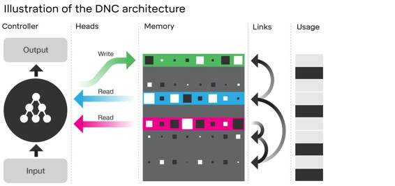
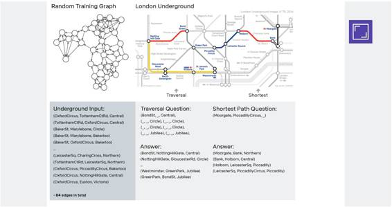
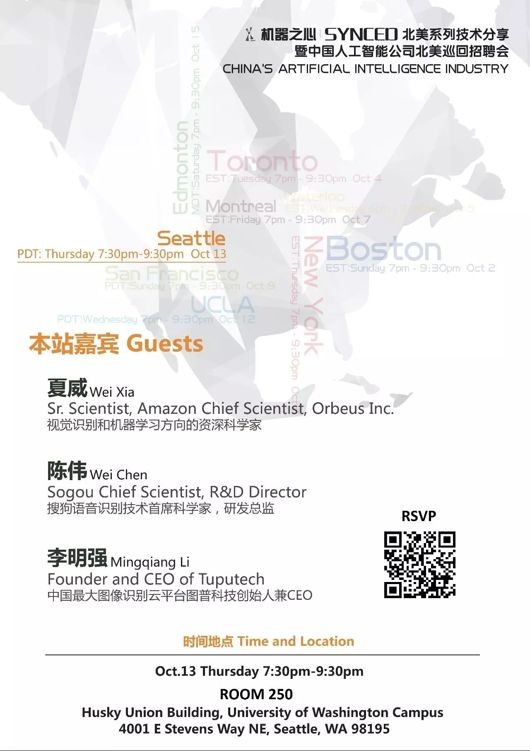

# 业界 | DeepMind 深度解读 Nature 论文：可微神经计算机

选自 DeepMind

**机器之心编译**

**参与：吴攀**

> *DeepMind 最近发表于 Nature 的一篇论文《Hybrid computing using a neural network with dynamic external memory》介绍了一种记忆增强式的神经网络（memory-augmented neural network）形式，其被称为可微神经计算机（differentiable neural computer），研究表明其可以学习使用它的记忆来回答有关复杂的结构化数据的问题，其中包括人工生成的故事、家族树、甚至伦敦地铁的地图。研究还表明它还能使用强化学习解决块拼图游戏（block puzzle game）问题。本文是 Google DeepMind 对这项新公开的成果的官方解读。*

柏拉图将记忆（memory）比作是一块蜡片——一旦在其上留下了一个印象（impression），那个印象就会凝固下来。他的这个比喻表达了现代的可塑性（plasticity）的概念，即我们的心智可以被经历所塑造和重塑。但我们的记忆之蜡不仅能够塑造印象，还能塑造一个记忆到另一个记忆的连接（connection）。John Locke（注：知识论上英国经验主义的三位代表人物之一）这样的哲学家认为当记忆在临近的时间和空间被塑造时，它们就会连接起来。表达这一观点的最有效的比喻不再是蜡片，而是 Marcel Proust（注：20 世纪法国最伟大的小说家之一，意识流文学的先驱与大师）的马德琳蛋糕（madeleine cake）；在 Proust 看来，这是一种在他成年之后释放童年记忆的甜品的味道。我们现在已经知道这些情景记忆（也叫事件记忆）依赖于人脑之中的海马体。

今天，我们对记忆的比喻已经得到了更精细的锤炼。我们不再将记忆看作是蜡片了，而看作是一个重新构建的过程（reconstructive process），其中经验可以使用其组成部件进行重组。而且也已经不再是刺激（stimuli）和行为响应（behavioural responses）之间的简单关联，记忆和行为之间的关系可以根据背景和优先级的状况而发生改变。一个简单的记忆中的知识，比如对伦敦地铁布局的记忆，可以被用于回答「从 Piccadilly Circus 到 Moorgate 该怎么走？」以及「那条线可以直达 Moorgate，坐 Northern Line 向北走？」这样的问题。这完全依赖于问题是什么；记忆的内容和记忆的使用可以分开。另一种观点认为记忆可以被组织起来以执行计算。比起蜡片，这更类似于乐高积木——记忆可以根据当前的问题而重新组合。

神经网络擅长模式识别和快速反应的决策，但我们现在才刚刚开始造出只能缓慢思考——即用知识进行权衡或推理——的神经网络。比如说，神经网络可以如何存储有关事实的记忆（比如一个交通网中的连接），然后使用其知识片段进行合乎逻辑的推理以回答问题？在最近的一篇论文（doi:10.1038/nature20101）中，我们展示了神经网络和记忆系统（memory system）可以如何结合起来以得到可以快速存储知识并用其灵活进行推理的学习机器。我们将这些模型称为可微神经计算机（DNC: differentiable neural computer），它们可以和神经网络一样从样本中学习，但它们也能和计算机一样存储复杂的数据。

在普通的计算机中，处理器可以从随机存取存储器（RAM）中读写信息。RAM 为处理器提供了远远更多的空间来组织计算的中间结果。用于信息的临时占位符被称为变量（variable），它们被存储在内存（memory，注：和「记忆」的英语词一样）中。在计算机中，构建一个保存数值的变量是很简单的操作。构建数据结构（data structure）同样也很简单——数据结构是指可以跟随内存中包含链接（link）的变量获取其它变量的结构。一种最简单的数据结构被称为表单（list）——可以逐项读取的变量序列。比如：可以存储一个运动员团队的运动员名字列表然后逐一读取每个名字。树（tree）是一种更复杂的数据结构。比如，在一个家族树中，可以根据子代和亲代之间的链接读取出祖系情况。而图（graph）是一种最复杂又最常见的数据结构，比如伦敦地铁网络。

当我们设计 DNC 时，我们想要机器能够学习自己构建和引导复杂的数据结构。DNC 的核心是一个被称为控制器（controller）的神经网络，其类似于计算机中的处理器。控制器的作用是获取输入、读取和写入记忆、以及生成可以被解读为答案的输出。而其记忆（memory）则是一个位置（location）的集合，其中每个位置都存储了一个信息向量。

控制器可以在记忆上执行多种操作。在每一个时钟，它都会选择是否写入记忆。如果它选择写入记忆，它可以选择将信息存储在一个新的、未经使用过的位置或已经包含了该控制器正在搜索的信息的位置。这让控制器可以更新一个位置所存储的内容。如果记忆中所有的位置都用尽了，该存储器可以决定释放一些位置，这就像计算机可以重新分配不再需要的存储空间一样。当该控制器执行写入时，它会发送一个信息向量到记忆中被选中的位置。每一次写入信息时，这些位置都会被关联链接（links of association）连接起来，这代表了信息被存储的顺序。

除了写入，控制器也可以从记忆中的多个位置读取信息。它可以基于每个位置的内容对记忆进行搜索，即可以通过关联时间链接（associative temporal links）向前和向后回调以顺序或反序写入的信息。其读取出的信息可被用于生成问题的答案或在某个环境中要采取的行动。总的来说，这些操作让 DNC 可以选择如何重新分配记忆、在记忆中存储信息、以及轻松地找到存储在记忆中的信息。

 

*DNC 架构的图示。其神经网络控制器可接收外部输入，并基于这些输入通过读取和写入操作（这些操作被称为 head）与记忆进行交互。为了帮助控制器引导记忆，DNC 会存储「时间链接（temporal links）」以追踪内容被写入的顺序，DNC 还会记录每个记忆位置的当前「使用（usage）」水平。*

没有技术背景的读者可能对我们不断重复使用的「该控制器可以……」或「可微神经计算机……做出选择」这些短语会感到一些奇怪。我们这样表述是因为可微神经计算机可以完全从头开始学习如何使用记忆和如何得出答案。它们使用优化（optimisation）的魔力学习做到了这一点：当一个 DNC 生成一个答案时，我们会将这个答案与我们想要的正确答案进行比较。随着时间的推移，该控制器可以学会生成越来越接近正确答案的答案。在这个过程中，它会搞清楚如何使用它的记忆。

我们想在涉及构建数据结构的问题上测试 DNC 以及使用这些数据结果来回答问题。在表征任意连接的构成路径和循环的数据项方面，图（graph）数据结构是非常重要的。在这篇论文中，我们的研究表明 DNC 可以自己学习写出关于任意一个图的描述并回答有关的问题。当我们描述伦敦地铁的站点和线路时，我们可以问 DNC 这样的问题：「从 Bond 街出发，乘坐 Central 线往一个方向走一个站，再乘坐 Circle 线往一个方向走四个站，然后再乘坐 Jubilee 线往一个方向走两个站，你会到达哪个站？」或者，该 DNC 可以为「从 Moorgate 到 Piccadilly Circus 该怎么走？」这样的问题规划路径。

 

*使用随机生成的图（graph）训练 DNC（左图）。训练之后对其进行测试，看其能否导航伦敦地铁（右图）。其三元组（出发、路径、到达）被用于定义下面所示网络的图，另外还带有两类任务的样本：「遍历」（其被要求从一个站点开始并沿一定的路线序列规划）和「最短路径」（其被要求找到两个站点之间的最快路径）。*

我们的研究表明，DNC 可在一个家族树中回答需要复杂推演的问题。比如，即使我们仅给该网络描述了亲代、子代和兄弟姐妹关系，我们仍然可以提出「谁是 Freya 的大舅舅？」这样的问题。我们还发现可能能够通过可视化控制器读取了记忆中的哪些位置以生成答案来分析 DNC 使用它们的记忆的方式。我们用作对比的卷积神经网络要么不能存储信息，要么就不能以一种可以泛化到新样本的方式学习推理。

  *DNC 回答一个有关家族树的问题*

我们还能通过强化学习训练 DNC。在这个框架中，我们让 DNC 生成行为但绝不向其展示答案。而是当其生成了一个良好的动作序列后给其打分（类似于小孩子的游戏 hot or cold）。我们将一个 DNC 连接到了一个带有以堆积形式排列的彩色块的简单环境中。我们给了它要实现的目标的指令：「将淡蓝色块放到绿色块下面；橙色块放到红色块左边；紫色放到橙色下面；淡蓝色在深蓝色右边；绿色在红色下面；紫色在绿色左边」。

*DNC 解决一个移动块问题*

我们可以设立大量类似的可能的目标，然后让该网络执行行动，这些行动能够依据命令产生一个或另一个目标状态。在这个案例中，还是和计算机类似，该 DNC 可以在记忆中存储多个子路径，一个可能的目标存储一个，然后执行一个或另一个。

人类记忆的工作方式的问题由来已久，而我们的理解仍在发展之中。我们希望 DNC 既能为计算机科学提供一种新工具，也能为认知科学和神经科学提供一个新的比喻：这是一个不需要预先编程就能将信息组织成互连的事实并能使用这些事实解决问题的学习机器。

**论文：使用带有动态外部记忆的神经网络的混合计算（Hybrid computing using a neural network with dynamic external memory）**

摘要：人工神经网络非常擅长感官信号处理、序列学习和强化学习，但由于缺乏外部记忆（external memory），它们在表征变量和数据结构以及长时间存储数据上的能力却很有限。这里我们介绍一种名叫可微神经计算机（DNC: differentiable neural computer）的机器学习模型，该模型由一个可以读写外部记忆矩阵（external memory matrix）的神经网络构成，这类似于传统计算机中的随机存取存储器（RAM）。它既可以和传统计算机一样使用它的记忆（memory，注：对应于传统计算机的「内存」）表征和操作复杂的数据结构，也能和神经网络一样从数据中学习这么做的方法。当使用监督学习进行训练时，我们发现 DNC 可以成功回答设计用来模仿自然语言中的推理和推断问题的合成问题。我们表明 DNC 可以学习寻找特定点之间的最短路径和推断随机生成的图中所缺少的链接等任务，然后还能将这些任务泛化到交通网和家族树等特定的图上。当使用强化学习进行训练时，DNC 可以完成移动块拼图任务，其中变化的目标又符号的序列指定。总而言之，我们的结果表明 DNC 有能力解决对没有外部读写记忆的神经网络而言难以解决的复杂的结构化任务。

******©本文由机器之心编译，***转载请联系本公众号获得授权******。***

✄------------------------------------------------

**加入机器之心（全职记者/实习生）：hr@almosthuman.cn**

**投稿或寻求报道：editor@almosthuman.cn**

**广告&商务合作：bd@almosthuman.cn**

**

*点击**「阅读原文」**报名机器之心西雅图分享活动**。*