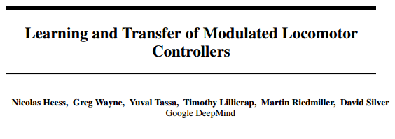

# 学界 | DeepMind 最新论文：调控运动控制器的学习和迁移（附下载）

选自 Arxiv.org

**机器之心编译**

**参与：武竞**

**** 

**摘要：**

针对运动型任务，我们研究了一种新型的架构和训练过程。这是一种具有本体感应的高频传感器和低级「脊椎（spinal）」结构的网络，它通过对简单任务的训练来学习感觉运动的原理（primitives）。它有固定的预训练模块，并连接到一个低频、高级的「大脑皮层」网络，这个网络连接了所有的传感器，通过调控传输到「脊柱」网络的信息来控制行为。在单个端到端的架构完全失败的场景下，我们使用预先训练的「脊柱」模块能在多个高级任务中取得成功，并且使得在稀疏奖励空间（sparse reward）中能够进行有效探索。我们在 3 个模拟物体上进行了测试：游泳的 16 维的蛇，20 维的四脚生物，以及 54 维的人。最后，我们将结果展示成视频显示在此网址 https://youtu.be/sboPYvhpraQ 中。

******©本文由机器之心编译，***转载请联系本公众号获得授权******。***

✄------------------------------------------------

**加入机器之心（全职记者/实习生）：hr@almosthuman.cn**

**投稿或寻求报道：editor@almosthuman.cn**

**广告&商务合作：bd@almosthuman.cn**

