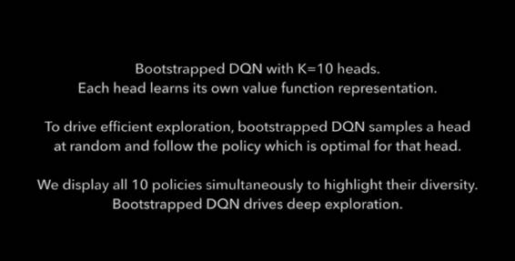

# 学界 | DeepMind NIPS 2016 论文盘点（Part1）：强化学习正大步向前

选自 DeepMind

**机器之心编译**

**参与：吴攀、杜夏德、李泽南、微胖**

> *几个小时前，DeepMind 在其博客上更新了文章《DeepMind Papers @ NIPS (Part 1)》，介绍了谷歌旗下这家领先的人工智能研究机构在 NIPS 2016 上发表的一部分论文。该博客表示将分三次将其在 NIPS 上发表的论文全部公开，本文是第一部分，相关论文可点击文末「阅读原文」下载。*

 

**1\. 论文：用于学习物体、关系和物理学的交互网络（Interaction Networks for Learning about Objects, Relations and Physics）**

**** 

作者：Peter Battaglia, Razvan Pascanu, Matthew Lai, Danilo Rezende, Koray Kavukcuoglu

摘要：对物体、关系和物理学的推理是人类智能的中心，也是人工智能的关键目标。但是，现代的许多机器学习方法仍然需要在有表现力的结构和高效的性能之间做出权衡。

我们在此介绍「交互网络（interaction networks）」，该网络可以推理复杂系统中物体的交互，支持动态预测，以及推理该系统的抽象属性。交互网络兼具表现力和高效率，因为它们结合了三种强大的方法：结构化模型（structured model）、模拟（simulation）和深度学习。它们能够输入图结构化的数据（graph-structured data），以一种类似于模拟的方式执行以物体或关系为中心的推理，并且可以通过使用深度神经网络来实现。它们不会根据这些实体和关系的排列而改变，这让它们可以自动泛化到与它们训练时的大小规模和结构不同的系统中。

在本实验中，我们使用交互网络实现了世界上第一个通用目的的可学习物理学的引擎（general-purpose learnable physics engine）。在仅仅经过单个步骤预测的训练之后，我们的模型可以准确地模拟出多体、弹性球和非刚性弦系统的物理轨迹，且只需要几千个时间步骤。这一架构还能够推理基本的物理性质，例如势能。

除了物理学的推理之外，交互网络还可能为可用于实现场景理解、社会感知、分层规划和类比推理的人工智能方法提供一个的强大框架。

如果你想了解交互网络在场景理解和基于想象的决策（imagination-based decision-making）上的应用，请查看我们提交于 ICLR 2017 的论文《Discovering objects and their relations from entangled scene representations》和《Metacontrol for Adaptive Imagination-Based Optimization》

**2\. 用于学习宏动作的 Strategic Attentive Writer（STRAW）模型（Strategic Attentive Writer for Learning Macro-Actions）**

作者：Alexander (Sasha) Vezhnevets, Volodymyr Mnih, Simon Osindero, Alex Graves, Oriol Vinyals, John Agapiou, Koray Kavukcuoglu

摘要：学习时间上延展的动作和一般时间抽象是强化学习领域中一个长期存在的问题。它们能通过实现结构化的探索和经济的计算来促进学习。在本篇论文中，我们提出了一个全新的深度循环神经网络架构，它能在一个强化学习场景中，通过与某个环境互动来以端到端的方式学习构建隐含的规划。该网络构建了一个内部规划，它会根据对来自环境中的下一个输入的观察进行持续地更新。它也可以通过学习根据规划实现所要的时间长度来将这个内部表征分区成连续的子序列，也就是它不需要重新做计划。结合这些特性，我们把我们提出的模型称为 STRategic Attentive Writer（STRAW），它能学习不同长度的、高水平的、时间上抽象的宏行为（macro-actions），而且这些行为仅仅是从数据中学习的，没有任何先验信息。

**3\. 用于 One Shot 学习的 Matching Network （Matching Networks for One Shot Learning）**

 

作者：Oriol Vinyals, Charles Blundell, Timothy Lillicrap, Koray Kavukcuoglu, Daan Wierstra

摘要：给定一个样本很少甚至只有一个样本的看不见分类中，可以使用 Matching Networks 在 ImageNet 上达到较高的分类精度。该核心架构训练起来简单方便，而且其在一系列图像和文本分类任务上的表现极好。

Matching Network 可按照其测试的方式训练：呈现一系列瞬时性的 one shot 学习训练任务，其中训练集的每一个实例都要并行地投入该网络中。然后训练 Matching Network 来正确对很多不同输入训练集进行分类。效果是要训练一个网络，它可以跳过梯度下降的步骤，在一个全新的数据集上分类。

**4\. 安全有效的离策略强化学习（Safe and efficient off-policy reinforcement learning）**

作者：Remi Munos, Tom Stepleton, Anna Harutyunyan, Marc G. Bellemare

我们的目标是设计出带有两个所需特性的强化学习算法。首先，要使用离策略数据（off-policy data），当我们使用记忆再现（memory replay，即观察日志数据）时它对探索很重要。其次，要使用多步骤返回（multi-steps returns）以便更快地传递反馈和避免近似/估计误差（approximation/estimation errors）的积累。这两个属性在深度强化学习中是至关重要的。

我们介绍了 Retrace 算法，其使用了多步骤返回并且可以安全高效地利用任何离策略数据。我们的实验表明这种算法在策略评估和最优控制环境中是可以收敛的。

作为推论，我们证明了 Watkin』s Q(λ) 到 Q* 的收敛（自 1989 年以来，这一直都是一个悬而未决的问题）。

最后我们报告了在 Atari 域上的数值结果，证明了 Retrace 在竞争算法（competitive algorithms）上的巨大优势。

**5\. 在出征之前先开辟道路：样本高效的蒙特卡洛规划（Blazing the trails before beating the path: Sample efficient Monte-Carlo planning）**

作者：Jean-Bastien Grill (INRIA), Michal Valko (INRIA), Remi Munos

假如有一台依照马尔科夫决策过程（MDP）运转的机器人，它有有限或无限次数的状态-动作到下一个状态的转换。机器人需要在执行任务前进行一系列规划。现在，为了进行计划，机器人配备了一个生成模型来进行蒙特卡洛规划。为了感知世界，机器人需要进行高效的规划，也就是说要样本高效（sample-efficient）——通过仅探索可使用的一个状态子集来利用 MDP 的可能结构，这些探索遵循近最优策略（near-optimal policies）。你需要保证样本复杂性，这取决于接近最优状态数量的度量。你想要的是对问题的蒙特卡洛采样（用于估计期望）的扩展，该采样可以交替最大化（在动作上）和期望（在下一个状态上）。你需要一个简单的实现和足够的计算效率。我们提出了 TrailBlazer 来解决此类需求。

**6\. 通过 Bootstrapped DQN 的深度探索（Deep Exploration via Bootstrapped DQN）**

作者：Ian Osband, Charles Blundell, Alex Pritzel and Benjamin Van Roy

在复杂环境中进行有效的探索对强化学习（RL）来说仍然是一个巨大的挑战。最近我们看到在强化学习领域出现了很多突破，但这些算法中很多都需要巨量的数据（数百万次博弈），之后才能学会做出好的决策。在许多真实世界环境中，我们是无法获得这样大量的数据的。

这些算法学习如此之慢的原因之一是它们并没有收集到用于学习该问题的「正确（right）」数据。这些算法使用抖动（dithering）（采取随机动作）来探索他们的环境——这种方法比起在多个时间步骤上对信息策略进行优先级排序的深度探索（deep exploration），效率指数级地更差。对于使用深度探索进行统计学上高效的强化学习已经有很多文献了，但问题是这些算法中没有一个是可以通过深度学习解决的……而现在我们有了。

这篇论文的关键突破如下：

*   我们提出了第一个结合了深度学习与深度探索的实用强化学习算法：Bootstrapped DQN。

*   我们表明这个算法可以给学习速度带来指数级的提升。

*   我们展示了在 Atari 2600 上的当前最佳的结果。

了解更多细节请参阅我们的论文和我们的相关视频列表：https://www.youtube.com/playlist?list=PLdy8eRAW78uLDPNo1jRv8jdTx7aup1ujM

*原文链接：https://deepmind.com/blog/deepmind-papers-nips-part-1/*

******©本文为机器之心编译文章，***转载请联系本公众号获得授权******。***

✄------------------------------------------------

**加入机器之心（全职记者/实习生）：hr@almosthuman.cn**

**投稿或寻求报道：editor@almosthuman.cn**

**广告&商务合作：bd@almosthuman.cn**