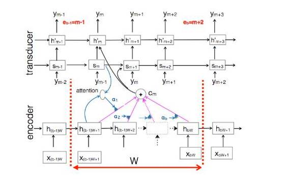
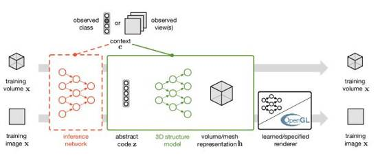

# 学界 | DeepMind NIPS 2016 论文盘点（Part2）：无监督学习的新进展

选自 DeepMind

**机器之心编译**

**参与：杨旋、Terrence、吴攀、李亚洲**

> *几天前，机器之心介绍了 [DeepMind 在 NIPS 2016 发表的部分论文（part1）](http://mp.weixin.qq.com/s?__biz=MzA3MzI4MjgzMw==&mid=2650720969&idx=2&sn=d1fae404486906125e01b5def7e26d94&chksm=871b0eb7b06c87a1d3e7d0b29e8c8f9e4c86f4949d04b0485df1b45823555a6c88a25ccf4dc4&scene=21#wechat_redirect)。昨日，DeepMind 更新 Part2，介绍了另外 6 篇论文。*

**1\. 带有随机层数的序贯神经模型（Sequential Neural Models with Stochastic Layers）**

*   作者：Marco Fraccaro, Søren Kaae Sønderby, Ulrich Paquet, Ole Winther

*   论文链接：https://arxiv.org/abs/1605.07571

摘要：我们对这个世界的大多数事物的推理都是按顺序进行的 sequential）：从开始聆听到声音和音乐，到想象我们到达目的地的路线，到随着时间去观察一个网球的运动轨迹。所有这些序列中都具有一定量的潜在随机结构。有两个强大且互补的模型（循环神经网络（recurrent neural networks（RNN）和随机状态空间模型（stochastic state space models（SSM））被广泛用于对这样的序列数据进行建模。RNN 在捕获数据中的长期依赖性方面表现优异，而 SSM 可以对序列中的潜在随机结构中的不确定性进行建模，并且善于跟踪和控制。

有没有可能将这两者的最好一面都集中到一起呢？在本论文中，我们将告诉你如何通过分层确定的（RNN）层和随机的（SSM）层去实现这个目标。我们将展示如何通过给定一个序列的过去（过滤）、以及它的过去和未来（平滑）的信息来有效地推理它当前的隐含结构。

**2.通过梯度下降去学习通过梯度下降的学习（Learning to learn by gradient descent by gradient descent）**

*   作者：Marcin Andrychowicz, Misha Denil, Sergio Gomez, Matthew Hoffman, David Pfau, Tom Schaul, Nando De Freitas

*   论文链接：https://arxiv.org/abs/1606.0447 (https://arxiv.org/abs/1606.04474)

摘要：当今的优化算法通常是人工设计的；算法设计者们在仔细思考了每个问题之后，设计出能探索到可以精确地表征结构的算法。这个过程即是 2000 年代早期，计算机领域根据人工设计的特征采用人工的方式来特征化和定位图像中边缘和角等特征。现代计算机视觉的最大突破是直接从数据中学习这些特征，把人工设计从这个过程中移除了。本论文展示了我们可以如何将这些技术扩展到算法设计中——不仅学习特征，而且也学习整个学习的过程。

我们展示了如何将优化算法的设计作为一个学习问题，允许算法学习以一种自动的方式在相关问题中探索结构。我们学习到的算法在已经被训练过的任务上的表现胜过了标准的人工设计的算法，并且也可以很好地推广到具有类似结构的新任务中。我们在一些任务上演示了这种方法，包括神经网络训练和使用神经艺术为图像赋予风格。

**3\. 一个使用部分调节的在线序列到序列的模型（An Online Sequence-to-Sequence Model Using Partial Conditioning）**

*   作者：Navdeep Jaitly, Quoc V. Le, Oriol Vinyals, Ilya Sutskever, David Sussillo, Samy Bengio

*   论文链接：http://papers.nips.cc/paper/6594-an-online-sequence-to-sequence-model-using-partial-conditioning.pdf

摘要：由于从一个序列到另一个序列（序列到序列（seq2seq））的映射的模型的通用性比较优异，所以它们在过去两年变得非常流行，在翻译、字幕或者解析等一系列任务中达到了顶尖水准。这些模型的主要缺点是它们在开始产生结果输出序列「y」之前需要读取整个输入序列「x」。在我们的论文中，我们通过允许模型在整个输入序列被读取之前发出输出符号来规避这些限制。虽然这引入了一些独立假设，但也在语音识别或机器翻译等特定领域的在线决策中使得这些模型更加理想。

**4\. 通过时间的记忆有效的反向传播（Memory-Efficient Backpropagation through time）**

*   作者：Audrunas Gruslys, Remi Munos, Ivo Danihelka, Marc Lanctot, Alex Graves

*   论文链接：https://papers.nips.cc/paper/6220-memory-efficient-backpropagation-through-time.pdf

摘要：许多顶尖的结果都是通过在很长的输入数据序列上训练大量的循环模型来实现的。由于许多原因，训练循环网络不是一件容易的任务。最大的问题之一就是标准的随时间的反向传播（BPTT）算法的大量内存消耗，因为它需要记住所有或者几乎过去所有的神经元激活。当训练卷积 RNN 时，特别容易耗尽昂贵的 GPU 储存器，并且储存器的限制经常导致网络大小的折损。用于缓解这个方法的常见方案之一是仅记忆一些中间神经元的激活，并且根据需要重新计算其他的激活。虽然存在许多的启发式方法来折中储存器和计算，但是它们中的大多数仅适用于某些边缘情况并且是次优的。我们将该问题视为一个动态规划问题，它允许我们找到一类收到内存限制的可证明最优策略。对于长度为 1000 的序列，我们的算法节省了 95% 的储存器使用，而每个学习步骤仅使用了比标准的 BPTT 多三分之一的时间。

**5\. 实现概念压缩（Towards Conceptual Compression）**

*   作者：Karol Gregor, Frederic Besse, Danilo Rezende, Ivo Danihelka, Daan Wierstra

*   论文连接：http://papers.nips.cc/paper/6542-towards-conceptual-compression.pdf

摘要：发现高层面的抽象表征（high level abstract representations）是无监督学习的主要目标之一。我们设计了一种架构来解决这个问题，该架构可以将存储在像素中的信息转换为携带表征的有序信息序列。训练根据顺序的紧急程度产生，其中早期表征携带了更多关于图像的全局和概念方面的信息，而后期的表征则对应于细节。该模型是一个完全卷积、序列的变分自动编码器，其设计灵感来自 DRAW。该架构简单且均匀，因此不需要许多的设计选择。

所得到的信息变换可以用于有损压缩，通过仅传输早期表征的集和（其数量由期望的压缩级别给出）并且使用生成模型生成剩余的表征以及图像。如果模型发现的信息的排序与人类所判断的重要性的信息排序密切相关，则算法将传送人类认为是最重要的部分。如果剩余变量的生成导致了高质量图像，则该方法就应该可以得到高质量的有损压缩。因为人类和无监督算法试图理解数据，并且因为两者都使用深度网络来实现，所以有一个很好的理由相信这种方法将有效。我们证明当前的模型确实实现了性能与 JPEG 和 JPEG 2000 相当的压缩。随着生成模型逐渐变得越来越好，这些结果证明了该方法用于构建未来压缩算法的潜力。

**6\. 图像 3D 结构的无监督学习（Unsupervised Learning of 3D Structure from Images）**

*   作者: Danilo Rezende, Ali Eslami, Shakir Mohamed, Peter Battaglia, Max Jaderberg, Nicolas Heess

*   论文地址：https://arxiv.org/abs/1607.00662

摘要：想象你正在盯着一张椅子的照片。你看到的图像是相机属性和位置、光以及椅子的形状的复杂函数。重要的是，由于自我遮挡你无法看到椅子的全部，所以会有一堆类似于椅子的物体符合你所看到的。但是，如果从不同的视角想象椅子的形状，你就能够准确地识别出这是椅子。做到这一点的关键不仅是要明确了解透视图（perspective）、遮挡和图像信息处理，更重要的是要有「椅子该是什么样」这样的先验知识，这能让你「填充」图像中丢失的部分。

在此论文中，我们研究了能够完成类似上述推理的模型。我们尤其制定了能够学习 3 维物体统计规律的生成式模型。结果显示形状的先验知识能够产生高质量的样本，能让我们明确表达像是概率推断这样具有挑战性的艰辛问题，比如给定 2D 图像还原 3D 结构、准确捕捉 posterior 的多模态。使用神经网络中的单次前向通过（forward-pass）就能快速地做出推论，而且我们也展示了如何在不使用 ground-truth 3D 标签的情况下就直接从 2D 图像端到端训练模型和推断网络，因此首次证明了以完全无监督的形式学习推论 3D 表征的可行性。

******©本文为机器之心编译文章，***转载请联系本公众号获得授权******。***

✄------------------------------------------------

**加入机器之心（全职记者/实习生）：hr@almosthuman.cn**

**投稿或寻求报道：editor@almosthuman.cn**

**广告&商务合作：bd@almosthuman.cn**