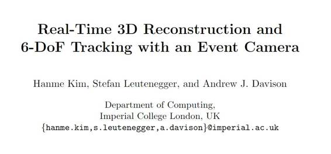

# 学界 | ECCV 2016 公布最佳论文奖、最佳荣誉提名和最佳学生论文奖（附论文）

选自 ECCV

**机器之心编译**

**参与：杜夏德、吴攀**

> *本周机器视觉顶级大会计算机视觉欧洲大会（European Conference on Computer Vision（ECCV））在阿姆斯特丹召开，大会最佳论文，最佳荣誉提名论文以及最佳学生论文现已公开，机器之心第一时间编译并与大家分享，点击「*阅读原文*」下载论文。*

**最佳论文：使用单个事件摄像机实现实时 3D 重建和 6-DoF 追踪（Real-Time 3D Reconstruction and 6-DoF Tracking with an Event Camera）**

摘要：我们提出了一种能够对不带传感的单个手持事件摄像机（event camera）拍摄的图像进行实时三维重建的方法，可以在某个陌生的非结构情境中使用。它以三个被解耦的概率过滤器为基础，每个都可以估算六个自由度（6-DoF）摄像机运动、场景对数（log）的亮度梯度（intensity gradient ），以及相对于一个关键帧的场景反转深度（scene inverse depth），并对这些场景建立了一个实时图来跟踪和对扩展的本地工作区建模。我们也升级了每一个进入灰度图像（intensity image）的关键帧的梯度估算，能从以低比特率输入的事件流（event stream）中恢复一个实时的类似视频的带有时空超分辨率的灰度序列。据我们所知，这很可能是第一个能够随着包含其灰度的任意结构的重建以及只依赖于事件摄像机数据的灰度视频的重建来跟踪一个通用的 6D 运动的算法。

**最佳荣誉提名论文：快速双边求解器（The Fast Bilateral Solver）**

.png")

摘要：我们提出双边求解器，一个用于平滑边缘感知（ edge-aware smoothing）的算法，结合了简单过滤方法的灵活性和速度，还带有特定领域优化算法的精确度。我们的技术在几种不同的视觉任务上（立体化、深度分辨率，彩色化，语义分割）能够比肩甚至对当下最好的结果进行改进。与基准技术相比，在同样精确的情况下，要快上 10-1000 倍，而在同样的运行时间里输出错误率更低。该双边求解器快速、强劲、便捷，能够推广到新的领域，可以容易地整合进深度学习通道中。 

**最佳学生论文奖：使用散焦和差分运动测量距离和速度（Measuring Distance and Velocity with Defocus and Differential Motion）**

摘要 ：我们提出了焦流传感器（focal flow sensor）。这是一种无致动能力的单目相机，它可以同时利用散焦的和差分的运动来测量深度图和 3D 场景的速度场。它使用光流状的（optical-flow-like）、按像素的线性约束来实现这一点——它们可以将图像导数（image derivatives）与深度和速度关联起来。我们推导出了这种约束，证明了其相对场景纹理的不变性，还证明了只有当该传感器的模糊内核（blur kernel）是高斯的（Gaussian）的时候它才能完全满足。我们分析了理想的焦流传感器的固有灵敏度（inherent sensitivity），我们还构建了一个原型并对其进行了测试。实验得到了可用于更宽泛的孔径配置（aperture configurations）的深度和速度信息，其中包括带有一个小孔径（pillbox aperture）的简单透镜。

******©本文由机器之心编译，***转载请联系本公众号获得授权******。***

✄------------------------------------------------

**加入机器之心（全职记者/实习生）：hr@almosthuman.cn**

**投稿或寻求报道：editor@almosthuman.cn**

**广告&商务合作：bd@almosthuman.cn**

