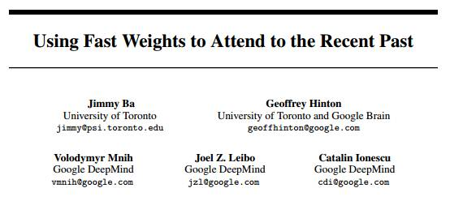
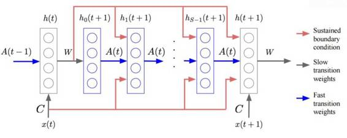

# 学界 | Geoffrey Hinton 最新论文：使用快速权重处理最近的过去

选自 ArXiv.org

**机器之心编译**

**参与：吴攀**

**摘要：**

直到最近，对人工神经网络的研究在很大程度上还局限于仅有两种类型的变量的系统：代表当前或最近输入的神经活动以及学习获取输入、输出和收益（payoff）之间规律的权重。这种限制并没有什么好的存在理由。突触拥有在许多不同时间尺度上的动态，这表明人工神经网络可能能够受益于变化速度比行为（activity）慢但比标准权重远远更快的变量。这些「快速权重（fast weights）」可以被用于存储最近过去的临时记忆（temporary memories），它们能为过去（past）提供一种在神经角度上可行的实现这种类型的注意（attention）的方式，而且最近研究已经证明过去（past）在序列到序列（seq2seq）模型中非常有用。通过使用快速权重，我们可以避免存储神经活动模式的副本的需求。

*图 1：快速关联记忆模型（fast associative memory model）；其中，红色线：持续边界条件，灰色线：慢速过渡权重，蓝色线：快速过渡权重*

*图 3：多层快速关联记忆模型（multi-level fast associative memory model）；其中，灰色虚线：更新快速权重和清空隐藏状态，红色线：持续边界条件，灰色实线：慢速过渡权重，蓝色线：快速过渡权重*

******©本文由机器之心编译，***转载请联系本公众号获得授权******。***

✄------------------------------------------------

**加入机器之心（全职记者/实习生）：hr@almosthuman.cn**

**投稿或寻求报道：editor@almosthuman.cn**

**广告&商务合作：bd@almosthuman.cn**

