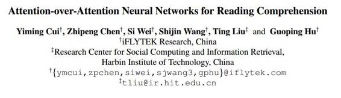
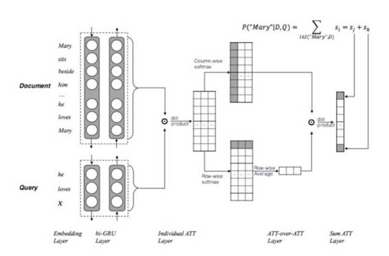
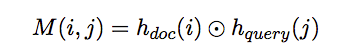
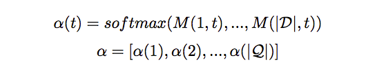
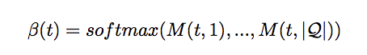
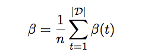
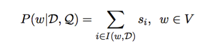
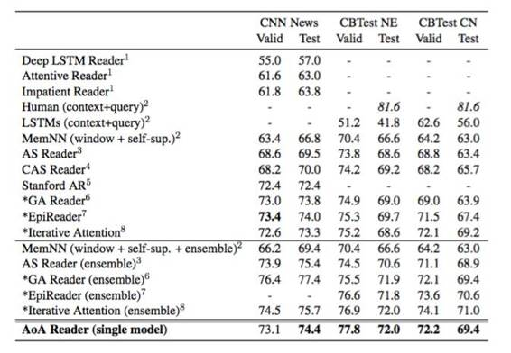

# 学界 | 哈工大讯飞联合实验室最新论文，用 attention-over-attention 神经网络刷新机器阅读理解纪录

选自 arXiv.org

**机器之心编译**

**参与：**张俊**、吴攀、李亚洲**

> *本文分享的是 arXiv 新鲜出炉的 paper，来自哈工大讯飞联合实验室。前不久，他们构建了一个大型阅读理解语料，今天也发布出来了。Cloze-style Reading Comprehension 这个领域竞争太过激烈了，半年时间把 benchmark 刷了一遍又一遍，今天的这篇 paper 又一次刷新了记录。*

**摘要**

完形填空式的查询（Cloze-style queries）是阅读理解中的代表性问题。在过去的几个月里，我们已经见到了许多使用神经网络方法解决完形填空式问题的进展。在本项成果中，我们提出了一种用于完形填空式阅读理解任务的全新模型，这被称为 attention-over-attention（注意之上的注意）阅读器。我们模型的目标是在文档级的注意之上放置另一种注意机制（attention mechanism），并诱导出「attended attention（集中注意）」以用于最后的预测。和之前的成果不同的是：我们的神经网络模型只需要更少预定义的超参数，并且可以使用一种简洁的架构进行建模。实验结果表明我们提出的 attention-over-attention 模型在大量公共数据集中都显著优于当前许多最佳的系统，例如 CNN 和「（Children’s Book Test）儿童图书测试」数据集。

**导语 **

阅读和理解人类语言对机器来说是一项极具挑战性的任务，这需要对自然语言的理解以及根据多种线索推理的能力。阅读理解是现实世界中的一个普通问题，其目的是阅读和理解给定的文章或语境，并基于此回答问题。在多种类型的阅读理解问题中，完形填空式的查询是基础的一类，并且也已经变成了解决机器理解问题的起点。与普通的阅读理解问题类似，完形填空式的查询（Taylor, 1953）是基于文档的本质提出的，尽管其答案是文档内部的单个词。

为了教会机器完成完形填空式的阅读理解，需要学习给定文档和查询之间的关系，因此必须要大规模的训练数据集。通过采用基于注意（attention）的神经网络方法（Bahdanau et al.,2014），机器可以学习大规模训练数据中的这些模式。为了创造大规模训练数据，Hermann et al. (2015) 发布了用于完形填空式的阅读理解的 CNN/Daily Mail 新闻语料库，其中的内容由新闻文章及其摘要构成。之后 Hill et al.（2015）发布了 Children’s Book Test （CBT：儿童图书测试）数据集，其中的训练样本是通过自动化的方式生成的。此外，Cui et al.（2016）也发布了用于未来研究的汉语阅读理解数据集。正如我们所见，自动生成用于神经网络的大规模训练数据对阅读理解来说是至关重要的。此外，语境的推理和总结等更复杂的问题需要远远更多的数据才能学会更高水平的交互。

在本论文中，我们提出了一种全新且简洁的神经网络架构 attention-over-attention（注意之上的注意）模型。正如我们可以从字面上理解的一样，我们模型的目标是在已有的文档级的注意之上放置另一种注意机制 。和之前的使用启发式融合函数（heuristic merging functions）（Cui et al., 2016）或设置多个超参数（Trischler et al., 2016）的成果不同的是，我们的模型可以在多个文档级注意之上自动生成一个「attended attention（集中注意）」，并进行双向的查找——不只从「查询到文档」也「从文档到查询」——这可以从这样的交互信息中受益。

总结来看，我们的成果的主要贡献如下：

*   就我们所知，这是第一次引入 attention-over-attention 机制。

*   和之前的向模型中引入复杂架构或许多非可训练的超参数不同，我们的模型很简单，在超参数调整上没有任何负担，而且在大量公共数据集中的表现都显著优于许多当前最佳的系统。

*   因为我们的模型具有普遍性，我们相信该 attention-over-attention 机制也可用于其它任务。

本论文的剩余部分的安排如下。在第 2 节中，我们给出了对完形填空式阅读理解任务的介绍，并讨论了相关的数据集。然后我们在第 3 节中详细阐述了我们提出的 attention-over-attention 阅读器。第 4 节给出了实验结果。第 5 节则探讨了相关的成果；在论文最后，我们做出了一个我们成果的简要总结。

**模型 **

本文的模型被称作 Attention over Attention （AoA），和之前的工作不同，不仅仅考虑 query-to-document attention，而且考虑了 document-to-query attention。模型架构示意图如下：

**Contextual Embedding** 将 query 和 document 都 embedding 化，用 Bi-GRU 将 query 和 document 分别 encode，将两个方向的 hidden state 拼接起来作为该词的 state，此时 document 和 query 可以分别用一个 Dxd 和 Qxd 的矩阵来表示，这里 D 是 document 的词数，Q 是 query 的词数，d 是 embedding 的维度。

**Pair-wise Matching Score**

 

这一步是本质上就是对两个矩阵做矩阵乘法，得到所谓的 Matching Score 矩阵 M，这里的 M 矩阵的维度是 DxQ，矩阵中的每个元素表示对应 document 和 query 中的词之间的 matching score。

**Individual Attentions** 对 M 矩阵中的每一列做 softmax 归一化，得到所谓的 query-to-document attention，即给定一个 query 词，对 document 中每个词的 attention，本文用下式进行表示：

 

**Attention-over-Attention** 前三个步骤都是很多模型采用的通用做法，这一步是本文的亮点。首先，第三步是对 M 矩阵的每一列做了 softmax 归一化，这里对 M 矩阵的每一行做 softmax 归一化，即得到所谓的 document-to-query attention，用下式来表示：

 

然后，将 document-to-query attention 作平均得到最终的 query-level attention，如下式：

最后，用每个 query-to-document attention 和刚刚得到的 query-level attention 做点乘，得到 document 中每个词的 score。

**Final Predictions** 将相同词的 score 合并，得到每个词的 score，如下式：

 

从而得到最终的答案。

实验部分用了英文语料 CNN 和 CBT，在没用 pre-trained embedding 情况下，单模型得到了 state-of-the-art 结果。

 

本文模型最大的特点就是不仅仅考虑 query 到 document 的 attention，而且考虑了 document 到 query 的 attention，即所谓的 attention over attention，在 Cloze-style 阅读理解任务中取得了更好的结果。同时，作者在未来的工作中，准备将该模型拓展到其他任务中。

attention 是一个非常好的机制，将很多任务的 benchmark 都提高到了很高的水平，是一个革命性的模型。围绕 attention 的变种做工作，提出各种各样的 attention，虽然可以刷新各种任务，但终究不再能够将研究水平提升一个 level，需要一个新的机制、新的思想来推动 NLP 的发展。

***©本文由机器之心编译，***转载请联系本公众号获得授权***。***

✄------------------------------------------------

**加入机器之心（全职记者/实习生）：hr@almosthuman.cn**

**投稿或寻求报道：editor@almosthuman.cn**

**广告&商务合作：bd@almosthuman.cn**

**点击「阅读理解」，下载此论文↓↓↓**