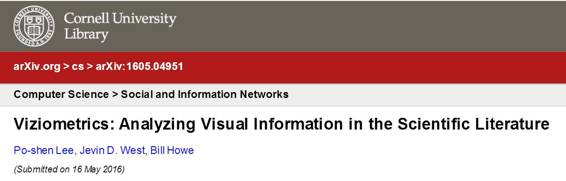

# 学界 | 华盛顿大学论文：使用机器学习分析科学文献中的视觉信息

选自 arxiv.org

**作者：Po-shen Lee、Jevin D. West、Bill Howe**

**机器之心编译**

****参与：吴攀、孙睿****

> 
> 
> **摘要**
> 
> 一般的科学文献，往往通过图表、可视化和照片的形式来解释研究结果。与引文和文本不同，在文献计量学和科学计量学研究中，这些信息密集的对象很大程度上会被忽视。在本论文中，我们使用了来自计算机视觉和机器学习的技术，将来自 PubMed 的 800 多万张图表分成了 5 种图表类型，并研究了相关的视觉信息所产生的不同影响。我们发现文献中的图表分布和图表类型随时间保持着相对的恒定，但根据领域和主题的不同存在着很大的差异。值得注意的是，我们发现科学影响和视觉信息的使用存在明显的关联：影响力更高的论文往往包含了更多图表，图形和照片的影响则相对更少。为了探索这些结果和提取视觉信息的其它方式，我们开发了一个视觉浏览器来阐释 viziometric（视觉计量学）的概念，并寻找能够支持 viziometric 分析，并组织视觉信息的设计方案。我们使用这些结果解释了一个新的研究议题——viziometric（视觉计量学）——来研究科学文献中视觉信息的组织和表现。
> 
> **导语**
> 
> 科学文献中很多信息是通过视觉的图形、照片、插图、图表和表格传递的。和它们周围的文本不一样，这些信息是直接为人类理解制作的，机器并不能直接读取。这种程序的缺乏促使一些研究开始探索，在不同领域中这些视觉符号传递科学信息的方式，以及他们的使用模式如何改变文章的影响力。
> 
> 视觉皮层是进入大脑的带宽最高的信息通道，而且目前已知，人类能更好地保留视觉呈现的信息。因此，科学文献中的图表在科学交流中扮演着关键的角色。DNA 结构的发现，很大程度上就是基于 X 射线晶体学所产生的视觉证据；事实上，Gibbons 认为，当我们能同图像表达结构时，我们就发现了结构本身。第一张太阳系外行星的光学图像助力了行星搜索这一天文学新兴子领域的发展；传统光学方法无法探测到的生物过程的医疗图像，为大脑功能提供了新的见解。在所有领域内，关键的实验结果会被总结成图表、复杂的科学概念会通过图表的形式阐述、照片会被用来展示人眼看不到的地方。
> 
> 在 1950 年代，Eugene Garfield 和 De Solla Price 等研究者认识到了引文在组织和搜索科学文献中的重要性，但将这一信息大规模推广使用的过程却很艰辛。我们在当今视觉文献所扮演的角色上看到了类似的情况。提取和分析这种信息并了解其在科学交流和科学影响上的作用显然是很有价值的，就如同分析引文网络显然存在价值一样。引文网络让我们了解想法是如何关联的；视觉表示可以告诉我们想法是如何交流的。来自相关研究团队、作者和领域的图表共享的「DNA」能揭示出信息的传递方式。
> 
> 我们使用 viziometric（视觉计量学）这一术语来形容这方面的研究，以传达其与文献计量学和科学计量学具有共同的目标。在本论文中，我们将通过分析来自 PubMed 的论文语料库，对视觉计量学进行初步探索，以将视觉信息的使用和分布与其影响力关联起来，并思考这些模式是如何随时间和跨领域而发生改变的。具体来说我们思考了以下三个问题：
> 
> *   不同领域的文献组织视觉信息的模式有何不同？
>     
>     
> *   视觉信息的组织在历史上是如何演变的？
>     
>     
> *   组织视觉信息的方式与文献的科学影响力是否有关联？
>     
>     
> 
> 为了回答这些问题，我们为探索可视化文献构建了一个名叫 VizioMetrix 的平台。VizioMetrix 包含了用来处理论文语料库的组件、用来管理提取出的元数据的数据库、用于拆分多图表图像的分析例程、一个识别图像类型的分类器、以及一个公共的、面向图像的搜索和浏览界面——这些搜索和浏览界面，能够从视觉结果和概念的角度，阐明组织科学文献的全新方法，而不是从含有它们的论文出发。
> 
> 我们的关键结果是科学图像（原理图、插图）的使用和论文的影响力之间的关系，结果发现影响力高的科学想法，往往是通过视觉信息的方式传递的。我们为这种联系推测出了两种可能的解释：视觉信息提升了论文的清晰程度，从而能让更多人引用并带来更高的影响力；或高影响力的论文自然往往包含了新而复杂的想法，所以需要更多视觉信息的解释。从更广泛的情况上看，跨语料库的计算实验证明，视觉模式的定义和描述，可以帮助理解科学信息的最佳传递方式、视觉信息的组织与科学影响的关联方式、将科学信息呈现给更广泛的受众的方式、以及也许最直接的——如何为组织、浏览和搜索「视觉文献」构建更好的服务。
> 
> ***©本文由机器之心编译，***转载请联系本公众号获得授权***。***
> 
> ✄------------------------------------------------
> 
> **加入机器之心（全职记者/实习生）：hr@almosthuman.cn**
> 
> **投稿或寻求报道：editor@almosthuman.cn**
> 
> **广告&商务合作：bd@almosthuman.cn**
> 
> 点击「阅读原文」，查看论文下载地址↓↓↓