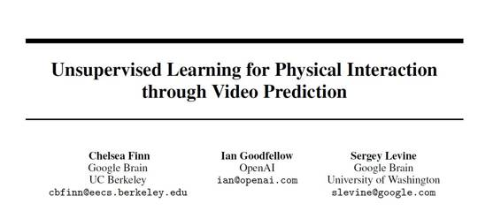

# 学界 | Ian Goodfellow 论文更新：通过视频预测的用于物理交互的无监督学习（附论文）

选自 arxiv.org

**作者： Chelsea Finn、Ian Goodfellow、Sergey Levine**

**机器之心编译**

**参与：杜夏德、吴攀**

**** 

**摘要：**

代理（agent）学习与世界交互的一个核心挑战是预测行动如何影响环境中的物体。现有的学习物理交互中的动力学的很多方法需要有标注的对象信息。然而，要将真实世界的交互学习的扩展到多种场景和对象中，获取有标注的数据变得越来越不切实际。为了在无标注的情况下学习物理对象的运动，我们通过从前面的帧来预测像素运动分布的方法，开发出一种以行动为条件的视频预测模型（action-conditioned video prediction model），其能明确地对像素运动建模。因为我们的模型可以明确地预测运动，所以它相对于对象外观是部分不变的，这使它可以归纳之前没看到过的对象。为了探索用于真实世界交互代理的视频预测，我们还引进了一个包含 50,000 次机器人交互的涉及推这个动作的数据集，包括一个带有全新对象的测试集。在这个数据集中，对以机器人未来动作为参照条件的精确视频预测达到了学习在不同行动过程基础上对未来进行「视觉想象（visual imagination）」的程度。试验发现，与之前的方法相比，我们提出的方法不仅产生了更精确的视频预测，还更精确地预测到了对象运动。

******©本文由机器之心编译，***转载请联系本公众号获得授权******。***

✄------------------------------------------------

**加入机器之心（全职记者/实习生）：hr@almosthuman.cn**

**投稿或寻求报道：editor@almosthuman.cn**

**广告&商务合作：bd@almosthuman.cn**