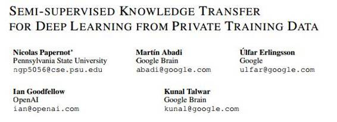

# 学界 | Ian Goodfellow 最新论文：用于隐私训练数据的深度学习的半监督知识迁移

选自 Arxiv.org

**机器之心编译**

**参与：武竞**

 

**摘要**

有些机器学习应用涉及敏感的训练数据，例如临床试验中患者的医疗史。一个模型可能无意中隐含地存储一些训练数据的信息；因此仔细分析模型可能会揭示其敏感信息。

为了解决这个问题，我们展示了一个普遍适用的方法，为训练数据提供了强大的隐私保证。该方法以黑盒的方式结合了用不相交数据集训练的多个模型，例如来自不同用户子集的记录。由于他们直接依赖敏感数据，因此这些模型不会公开，而是作为学生模型（student model）的教师（teacher）。学生模型的预测结果由所有教师模型的投票结果产生，学生模型不能直接访问单个教师模型或底层数据或参数。在差分隐私（differential privacy）方面，学生模型的隐私属性可以直观地（由于不知道单独的教师模型，因此学生模型无法反映单个数据集）和正式地被理解。即使敌手不仅可以查询学生模型，而且可以检查内部运作，这些隐私属性仍然成立。

与以前的工作相比，这种方法只加强了教师模型如何被训练的弱假设：它适用于任何模型，包括如 DNN 的非凸（non-convex）模型。由于使用了改进的隐私分析和半监督学习，我们在 MNIST 和 SVHN 上实现了最先进的隐私与实用的权衡。

******©本文由机器之心编译，***转载请联系本公众号获得授权******。***

✄------------------------------------------------

**加入机器之心（全职记者/实习生）：hr@almosthuman.cn**

**投稿或寻求报道：editor@almosthuman.cn**

**广告&商务合作：bd@almosthuman.cn**

