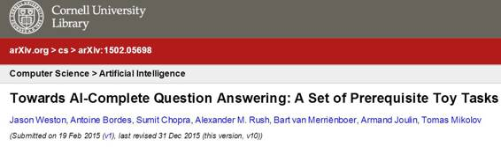
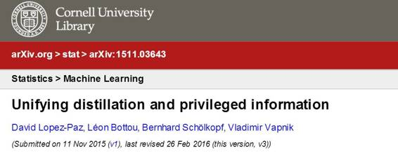
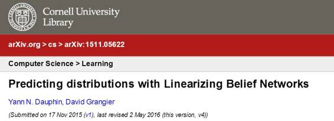
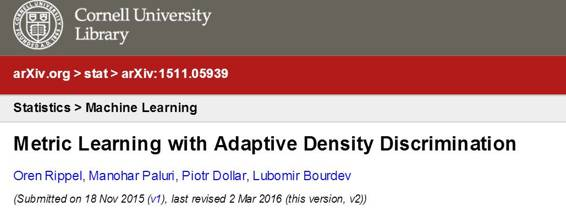

# 学界｜ICLR 2016 会议，不可错过 Facebook 提交的七篇论文

选自 research. facebook

**作者：****Ari Entin**

**机器之心编译**

**参与：亚洲** 

> *ICLR 2016 机器学习会议于 5 月 2 日至 4 日召开，以 LeCun 为首的 Facebook 人工智能研究室提交了以下研究成果。*

2016 年 ICLR（the International Conference on Learning Representations）会议于 5 月 2 日至 4 日在波多黎各首都圣胡安举行。此时，人工智能和机器学习社区聚集于此，讨论如何更好的学习有意义、有价值的数据，从而应用于视觉、音频和自然语言处理等领域。本次大会讨论的话题包括深度学习、特征学习、度量学习、核学习、组合模型、非线性结构预测以及非凸优化的有关问题。

在为期三天的 ICLR 大会上，Facebook 人工智能研究室（FAIR）提交了数篇论文，同时也将出席、举办研讨会。以下就是 Facebook 在 ICLR 2016 大会上展现的它们的人工智能研究成果。

概述：研究机器学习的一个长期目标是产生能够应用于推理和自然语言的方法，特别是建立一个智能对话系统。为了对这一目标的发展进程进行测量，我们论证了一套代理任务（proxy tasks）的有效性。这套代理任务能够通过回答问题评估阅读理解能力。我们任务以以下数种方式测量理解能力：系统是否能够通过链接事实、简单归纳、演绎或者更强的能力回答问题。这些设计的任务对任何系统而言，都应该是为了达到与人类对话目的的先决条件。而且我们希望这些任务能够激励新的方法的产生。

概述：从视频中学习预测未来图片涉及到准确模拟图片演变的内部表征的构建，因此在某种程度上也就是它的内容和动态变化。在这一研究中，我们训练了一个卷积网络生成给定输入序列的未来帧数（future frames)。为了解决从标准的均方误差损失函数中获得的模糊预测问题，我们提议了三种不同的、互补的特征学习策略：一个多尺度结构、一个对抗训练方法、一个图像梯度差损失函数。

概述：人类的学习速度比机器快的多。我们的工作从这一问题着手，通过让机器不仅从数据学习，也从其他有智能的机器身上学习从而获得更快的学习能力。在结束时，我们的工作统一了两种启发性的想法：Hinton 的 distillation 想法和 Vapnik 提出的使用 privileged information 的想法。而且在我们的想法中补充了一些内容，包括：数值模拟，关于半监督学习的未来研究方向，多项任务学习，Universum 学习和课程学习。

概述：在神经网络中，有条件的信念网络采用随机二值变量。与传统的神经网络相反，在给定输入 X 情况下，一个信念网络能超出期望的预测输出 Y 的更多价值。当一个输入值能容纳多种输出值，而且其平均值不是有效的答案时，这个信念网络能够预测输出 $Y$ 的分布。这样的网络在图像预测去噪、文本转语音、这样的反问题（inverse problem）上特别的有意义。然而，传统的 sigmoid 信念网络特别难以训练而且在连续问题上不适应。这一研究介绍了一种针对连续问题的新网络类型：linearizing belief nets 或缩写为 LBNs。这一模型训练效率高、改善了目前在图片去噪和基于多伦多表情数据集的面部表情生成的水平。

概述：这一论文展现了一种新的训练文本生成模型的算法，在机器翻译和自动摘要等应用上非常有帮助。如今的算法只是针对在给定序列中预测下一个单词，我们的方法能预测整个句子，并且优化了在测试时间上使用的度量。我们的实验显示这种算法在三种不同的任务上有着一致改进：机器翻译、摘要和图像描述。

概述：塑造视觉表征是一个具有挑战性的问题。在这一论文中，我们提出了一种新的损失函数 Magnet loss，使用距离度量学习局部塑造视觉空间。结果显示使用 Magnet loss 不仅训练速度快，而且在很多标准基准上改善了分类准确性。更重要的是，这一视觉空间能显示出数据除了标记内容之外的隐藏属性。

概述：当递归神经网络应用于字符级别，而非单词级别时，为了成功建立长期的依赖关系，需要足够大隐藏表征。这也就意味着需要更高的计算成本，在实际运用中可能受限。为了应对这个问题，我们在论文中提议了两种对传统 RNN 模型进行结构修改的备用选择。

***©本文由机器之心编译，***转载请联系本公众号获得授权***。***

✄------------------------------------------------

**加入机器之心（全职记者/实习生）：hr@almosthuman.cn**

**投稿或寻求报道：editor@almosthuman.cn**

**广告&商务合作：bd@almosthuman.cn**