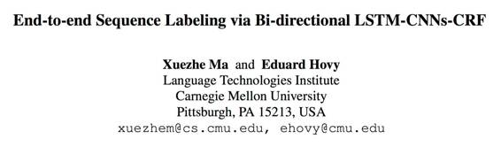
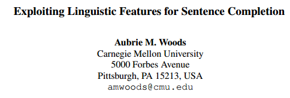

# 深度 | 计算机科学领导者：卡内基梅隆大学 ACL2016 论文汇总

选自 ACL 2016

**机器之心编译**

**参与：吴攀、无我、黄清纬、**杜夏德、赵巍****

**感谢卡内基梅隆大学的学者为机器之心提供了 ACL 参会论文的有关信息**

> *今年 8 月 7 日到 12 日，自然语言处理（ NLP ）和计算语言学领域的顶级会议国际计算语言协会（ ACL ）年度会议在德国柏林洪堡大学召开。作为计算机科学综合排名和人工智能领域排名均列第一的机构，卡内基梅隆大学（CMU）今年共被接受了 20 篇论文，占 ACL 2016 论文总数 328 篇的 6.1%，其中《Harnessing Deep Neural Networks With Logic Rules》被评选为本年度的十大优秀论文（详情参阅《深度 | 自然语言处理顶级会议 ACL2016 即将召开，10 大优秀论文先睹为快》 ）之一，该论文的作者包括卡内基梅隆大学机器学习系的博士生 Zhiting Hu、语言技术研究所的 Xuezhe Ma 和 Zhengzhong Liu 及研究教授  Eduard Hovy、以及机器学习系和语言技术研究所教授邢波。在这篇文章中，机器之心对卡内基梅隆大学的 20 篇论文做了摘要介绍，所有论文全文请点击「阅读全文」下载。*

卡内基梅隆大学是计算机科学综合排名第一的研究机构，在统计推理、自然语言技术和机器学习等许多研究领域有举足轻重的地位，也曾在 ACL 历次大会中获得过多次值得关注的大奖，其中包括 ACL 2015 的荣誉奖（Honorable Mentioning）论文《Learning Answer-Entailing Structures for Machine Comprehension》（M. Sachan, A. Dubey, M.Richardson，邢波）和 ACL 2015 最佳论文奖（BEST PAPER Award）《Concise Integer Linear Programming Formulations for Dependency Parsing（A. Martins, N. Smith, 邢波）等。

*注：计算机科学综合排名（Computer Science Rankings，http://csrankings.org）是以计算机科学各领域顶级会议发文数量及参会次数为标准对该领域内的学校和学者进行的排名。因为在顶级大会上发表论文比较困难，所以这一评价方法不同于以引用次数为度量的方法，更不容易被人为操纵，所以该评价方法得出的结果也更为公正，得到了领域内专家学者的广泛认可。*

 

作为计算机科学综合排名上卡内基梅隆大学最近十年来排名最高的学者，邢波教授领导的研究组贡献了本年度卡内基梅隆大学被接受的 20 篇论文中的 5 篇（其中一篇入选本年度十大优秀论文）。邢波是卡内基梅隆大学计算机科学学院教授、匹兹堡大学医学院兼职教授、卡耐基梅隆大学机器学习和医疗中心主任，其研究领域包括统计学习、分布式系统、生物统计、以及基于统计机器学习的用于自然语言、计算机视觉和数据挖掘的人工智能系统。他所领导的卡内基梅隆大学计算机科学学院统计人工智能和综合基因组学实验室（SAILING Lab）在人工智能领域创造了很多重要的研究，其中论文《 Language Modeling with Power Low Rank Ensembles》曾获得自然语言处理顶级会议 EMNLP 2014 的最佳论文亚军；该组已经累积在 ACL 上发表了多篇论文，其中《Concise Integer Linear Programming Formulations for Dependency Parsing 》获 ACL 2009 最佳论文奖。除了人工智能领域之外，该研究组还在数据库和系统研究领域的顶级学术会议上非常活跃，这种研究视野和跨度在目前学术界是罕见的。

机器之心之前已经对 ACL 2016 的 [优秀论文](http://mp.weixin.qq.com/s?__biz=MzA3MzI4MjgzMw==&mid=2650717202&idx=1&sn=56d10fceea3211e325d85a3aecb0a7e2&scene=21#wechat_redirect)、[最佳论文](http://mp.weixin.qq.com/s?__biz=MzA3MzI4MjgzMw==&mid=2650718160&idx=2&sn=9e3e0dd83103ce15ecabc0a9cae58d0a&scene=21#wechat_redirect)、[谷歌论文](http://mp.weixin.qq.com/s?__biz=MzA3MzI4MjgzMw==&mid=2650718072&idx=2&sn=dc0f5e9ac4ca943afe91ea8d4e08f78c&scene=21#wechat_redirect) 和 [微软论文](http://mp.weixin.qq.com/s?__biz=MzA3MzI4MjgzMw==&mid=2650718106&idx=2&sn=93aceb9b6e4a0772bbaf9257a4def3d2&scene=21#wechat_redirect)分别做了介绍（点击相应链接查看），下面是对本届 ACL 2016 上卡内基梅隆大学被接受的 20 篇论文的摘要介绍：

**1.论文标题：利用带逻辑规则的深度神经网络**

作者：Zhiting Hu; Xuezhe Ma; Zhengzhong Liu; Eduard Hovy; 邢波

摘要：将深度神经网络和结构化逻辑规则结合起来有望实现灵活性并减少神经模型的不可解读性（uninterpretability）。我们提出一个能用陈述式一阶逻辑规则增强不同类型的神经网络（比如 CNN 和 RNN ）的框架。具体来说，我们开发出了一种将逻辑规则的结构化信息转移融入神经网络权重的迭代蒸馏法（iterative distillation method）。我们在 CNN 上部署了这一框架进行情绪分析，在 RNN 上使用这一框架进行了命名实体识别。使用了一些高度直觉式的规则，我们获得实质性进展，并取得最先进的或者比得上之前表现最好的系统的成果。

 

**2.论文标题：使用贝叶斯优化学习课程，用于特定任务词表征学习**

作者：Yulia Tsvetkov, Manaal Faruqui,Wang Ling (Google DeepMind), Chris Dyer (Google DeepMind)

摘要：我们使用贝叶斯优化来学习用于词表征学习的课程（curricula），优化了依赖于所学到的表征作为特征的下游任务（downstream task）的表现。这个课程是使用线性排序函数（linear ranking function）建模得到的，该函数是一个所学到的权重向量和一个设计出的特征向量的标量积——其中的特征向量描述了训练语料中每个实例的复杂度的不同方面的特征。我们的结果表明：相比于自然语料的顺序，学习这样的课程可以提升随机顺序的各种下游任务的表现。

 

**3.论文标题：使用语境中的话题转变、情绪和认知进行隐喻检测**  

作者：Hyeju Jang; Yohan Jo; Qinlan Shen; Michael Miller; Seungwhan Moon; Carolyn Rose

摘要：隐喻（metaphor）是交流中一种共同的语言工具，在话语中检测隐喻对自然语言理解来说是一项至关重要的任务。解决这一难题的一个流行的方法是抓取一个隐喻及其周围文本的主导话题之间的语义无衔接性（semantic incohesion）。尽管这些方法是有效的，但它们往往会在词偏离了其语境中的含义时过度地将词归类为隐喻类别。我们提出了一种新方法，它可以（1）通过检查句子级的话题转变来区分目标词的字面含义和非字面含义的用法，（2）获取说话者的动机以表达情绪和对概念进行隐喻性的抽象。我们在一个网络乳腺癌讨论论坛数据集中进行了实验，结果在当前最佳的隐喻检测（metaphor detection）水平上有了显著的提升。这些实验结果也揭示了个人对话和特定情绪的语境中使用隐喻的倾向。

**4.论文标题：简单问题优先？一个关于问答的课程学习的案例研究**

作者：Mrinmaya Sachan，邢波

摘要：认知科学研究者已经强调了为复杂任务按难易程度排序的重要性。与传统的学习相比，这个排序为学习提供了一个更为简单的路径，并加快了解决任务的速度。最近一些名叫自我加速学习（self-paced learning）的机器学习研究已经探讨了一种课程学习（curriculum learning）方法，它能将数据样本按照容易程度排序，以便于简单的样本能优先被引入学习算法，继而才引入较难的样本。我们提出了一些可以改进自我加速学习的启发式算法。然后我们强调要结合容易但多样的样本集，这样才能进一步提升学习。我们在问答（QA）的四个非凸模型的背景下比较了这些课程学习方案，并发现它们确实能够带来提升。

**5.论文标题：用于问答的半结构化知识表**

作者：Sujay Kumar Jauhar; Peter Turney（艾伦人工智能研究所）; Eduard Hovy

摘要：问答需要一个知识库来检查事实和推理信息。自然语言文本形式的知识学习起来比较简单，但是自动推理很难。高度结构化的知识库能让推理变得容易一些，但是学习起来又难了。本论文中，我们探讨了半结构形式主义（semi-structured formalism ）的表，它能平衡这两种情况。我们首先通过简单有效的众包方式，用这些表的结构来引导建构一个超过 9000 个带有丰富对齐注释的多选问题的数据集。之后我们使用这个注释过的数据训练了一个半结构化特征驱动的模型用于问答，该问答系统使用了该表作为知识库。在基准评估中，我们大幅超过一个强大的非结构化检索基线和一个高度结构化的马尔科夫逻辑网络模型。

**6.论文标题：从新闻读者评论中检测跨文化的共同讨论主题**

作者：Bei Shi; Wai Lam; Lidong Bing; Yinqing Xu

摘要：许多在线新闻网站通常有大量的新闻读者评论。我们研究了被称为文化共同主题检测（CTD：Cultural-common Topic Detection）的任务，该任务的目标是从用不同语言写成的新闻读者评论中发现共同的讨论主题。我们提出了一种名叫 MCTA 的新的概率图模型（probabilistic graphical model），它可以跨越语言的鸿沟，获取不同语言中的共同语义。我们也开发了一个部分坍缩的吉布斯取样器（partially collapsed Gibbs sampler），其可以将术语翻译关系（term translation relationship）整合进文化共同主题的检测中，从而进行模型的参数学习。实验结果在当前最优的模型上有所提升。

 

**7.论文标题：CFO：带有大规模知识库的条件集中的神经问答**

作者：Zihang Dai; [李磊（今日头条）](http://mp.weixin.qq.com/s?__biz=MzA3MzI4MjgzMw==&mid=2650718173&idx=2&sn=7afb370ac67b7879f165bda12e4357d9&scene=21#wechat_redirect); Wei Xu（百度）

摘要：我们可以怎样让计算机自动回答「谁创造了哈利·波特这个角色？」这样的问题？精心构建的知识库能提供丰富的事实来源。但是，由于一个问题可以有众多不同的表述方式，在自然语言中回答类事实问题（factoid question）仍旧是一项挑战。特别说明一下，我们关注的是最常见问题——可以用知识库中的单个事实回答的问题。我们提出了 CFO，一种条件集中的（Conditional Focused）基于神经网络的方法，该方法可以使用知识库回答类事实问题。我们的方法一开始会深入到问题中寻找最有可能的候选主语提及（candidate subject mention），然后使用一种统一的条件概率框架来推理最终的答案。我们提出的方法由循环神经网络和神经嵌入（neural embeddings）驱动，在包含 10.8 万个问题（到目前为止最大的公共数据集）的数据集中实现了 75.7% 的准确度，以绝对优势超过了当前最佳的方法 11.8%。

 

**8.论文标题：通过双向 LSTM-CNNs-CRF 的端到端序列标注**  

作者：Xuezhe Ma; Eduard Hovy 

摘要：最先进的序列标注系统通常要求大量以人工设定的特征为形式的特定任务知识和数据预处理。本论文中，我们介绍了一个新颖的神经网路构架，它能通过使用双向 LSTM、CNN 和 CRF 的组合，自动从词级和字符级的表征中获益。我们的系统是真正地端到端的，不需要特征工程或数据预处理，因此适用于大范围的序列标注任务。我们基于两个序列标注任务的数据集——Penn Treebank WSJ 词性（POS）标注语料库和 CoNLL 2003 命名实体识别（NER）语料库——评估了我们的系统。在两个数据集中，我们都得到了目前最好的表现—— POS 标注中 97.55% 的精确度，NER 中 91.21% 的 F1。

 

**9.论文标题：合成用于机器翻译的合成词**

作者：Austin Matthews; Eva Schlinger; Alon Lavie; Chris Dyer 

摘要：大多数机器翻译系统是从一个目标词形的封闭词汇集中组织翻译的，这在翻译成具有高度合成过程的语言中会出现问题。我们提出了一个简单且高效的方法将这个问题分成了两个阶段来处理。第一，我们构建了一个分类器来标识能被翻译成一个目标语言的简单合成词的输入文本的跨度（span）。然后，对于每个已标识的跨度，我们生成一个可被加入到翻译模型中用作「合成（synthetic）」短语翻译的复合词池。实验显示（i）我们能高效预测哪些跨度能被复合；（ii）我们的合成生成模型生成了好的合成词；并且（iii）在端到端的英语-德语和英语-法语翻译任务中，适度的改进是可能的。我们额外介绍了 KomposEval，一种新型的英语短语和它们德语合成词翻译的多引用数据集。

 

**10.论文标题：网站隐私政策语料库的创造和分析**  

作者：Shomir Wilson; Florian Schaub; Aswarth Abhilash Dara; Frederick Liu; Sushain Cherivirala; Pedro Giovanni Leon; Mads Schaarup Andersen; Sebastian Zimmeck; Kanthashree Mysore Sathyendra; N. Cameron Russell; Thomas B. Norton; Eduard Hovy; Joel Reidenberg

摘要：网站隐私政策（website privacy policy）常常被互联网用户所忽略，因为这些文档往往很长而且难以理解。但是隐私政策的重要性极大超过它们所得到的关注度：这些文档是约束网站运营者和它们的用户的法律协议。目前的一种建议的方法是使用众包（crowdsourcing）、自然语言处理和机器学习的方法自动化或半自动化地从隐私政策文本提取突出的细节。但是，适合用来识别隐私政策中数据实例的数据集一直以来都相对较为缺乏。为了解决这个问题，我们推出了一个包含有 115 份隐私政策的语料库（26.7 万词），其中人工标注了 2.3 万个细粒度的（fine-grained）数据实例。我们描述了使用有经验的标注者和一种专用的标注工具来生成数据的过程。我们提供了基于标注统计的发现，并展示了对标注流程进行自动化的结果。最后，我们描述了使用这个语料库所带来的挑战和机遇，从而能够进一步推动隐私和语言技术的研究。

 

**11.论文标题：从多模数据中学习概念分类法**  

作者：Hao Zhang; Zhiting Hu; Yuntian Deng; Mrinmaya Sachan; Zhicheng Yan; 邢波

摘要：我们研究了自动从文本数据及可视数据中构建上位词（hypernym ）分类标准的问题。以往的分类标准归纳（ taxonomy induction ）工作通常忽略了日益突出的，编码了重要感知语义（perceptual semantics）的可视数据。与之不同，我们提出了一个通过综合利用了文本和图象的优势以归纳分类标准的概率模型。为了避免人工设定的特征工程，我们设计了基于图像和词的分布表征的端到端特征。给定一个小型现有本体集，该模型能有区别的训练，能够从带有相关图像的不可见概念标签项集中构建完整的分类标准。我们在 WordNet 的层级中评估了我们的模型和特征，我们的系统的表现大大超出了以往的方法。

 

**12.论文标题：使用压缩和待消解项约束的基于学习的单文档总结**  

作者：Greg Durrett; Taylor Berg-Kirkpatrick; Dan Klein

摘要：我们提出一个针对完整结合压缩和待消解项约束（anaphoricity constraints）的单文档总结（single-document summarization）的辨别模型。这个模型可以基于大量的稀疏特征选择要包含在总结中的文本单元，这些稀疏特征的权重是在大型语料库中学到的。当删除符合压缩规则时，我们允许删除句子里的内容；在我们的框架里，这些是作为文本的子语句（ subsentential ）单元之间的依赖性（dependency）来实现的。然后待消解项约束通过保证这一点来改善句子之间的连贯性——对于包括在总结中的每个代词，代词的先行词也被包括在内或者代词被重写为一个完全的提及词（ mention ）。当我们最后的系统受到端对端地训练时，它表现得比之前的 ROUGE 以及人类对语言质量的判断更好。

 

**13.论文标题：词嵌入的跨语言模型：一种实证比较**  

作者：Shyam Upadhyay; Manaal Faruqui; Chris Dyer; Dan Roth

摘要：尽管人们对使用跨语言知识学习不同任务的词嵌入（ word embeddings ）感兴趣，但是对可能的方法进行系统性的比较还是缺少文献研究。我们在四种不同结构的语言对（ language pairs ）上对引导跨语言嵌入的四种流行的方法实现了广泛的评估，其中每种方法都需要不同形式的监督。我们的评估设定贯穿了四种不同任务，包括单语言和跨语言的相似性的内在评估，以及下游语义（downstream semantic）和句法应用的外在评估。我们揭示了需要丰富的跨语言知识的模型绝大多数时候表现得更好，但是知识贫乏的监督式模型经常在某些任务上被证明是有竞争力的。

 

**14.论文标题：在美国手语语法的面部表情合成中的连续轮廓模型** 

作者：Hernisa Kacorri; Matt Huenerfauth

摘要：为了给耳聋用户创建可用的内容，我们调查了自动化合成美国手语（ ASL ）的动画，包括手语语法上重要的面部表情和头部运动。基于记录人们表现出来的不同面部表情和头部运动（包括特殊变化），我们评估了持续轮廓模型（ Continuous Profile Model）在识别关键的表演的「隐含线索（ latent trace ）」上的有效性，以用于生成美国手语动画。基于度量的评估和对耳聋用户的研究表明：这种方法比以前制作动画的方法更加有效。

 

**15.论文标题：生成关于图像的自然问题** 

作者：Nasrin Mostafazadeh; Ishan Misra; Jacob Devlin; Margaret Mitchell; Xiaodong He; Lucy Vanderwende

摘要：过去几年研究界在视觉和语言上的成果已经出现了爆炸式的增长，涵盖了从图像描述到视频转述以及回答关于图像的问题等领域。这些任务已经关注了对图像的文字描述。为了超越文字的层面，我们选择探索了根据一张图像中的物体进行常识推理和得出抽象事件的方法，以及进一步引导得出关于该图像的问题的方式。在本论文中，我们介绍了视觉问题生成（VQG：Visual Question Generation）这种全新的任务。在该任务中，系统的任务是在检查一张图像之后提出一个自然的且相关的问题。我们提供了三个包含了从以物体对中心（object-centric）到以事件为中心（event-centric）等不同类型图像的数据集，这些数据集带有比目前提供给最好的描述系统（captioning systems）的数据集更多的抽象训练数据。我们训练和测试了多个生成和检索模型以解决 VQG 的任务。评估结果发现尽管这些模型能够提出关于不同图像的合理问题，但与人类表现还有较大的差距，这将激励对在图像和常识知识与语用学之间的联系的进一步研究。我们提出的任务为研究界带来了一个新挑战，我们希望该挑战能加强对探索视觉和语言之间更深度的连接的兴趣。

 

**16.论文标题：Tweet2Vec：用于社交网络的基于字符的分布式表征**  

作者：Bhuwan Dhingra, Zhong Zhou, Dylan Fitzpatrick, Michael Muehl and William W. Cohen

摘要：来自社交网络的文本带来了一系列可能导致传统 NLP 方法失败的难题。在社交网络帖子中非常常见的非正式语言、拼写错误、缩写和特殊字符让词水平的方法需要使用到让人望而却步的大量词汇。我们提出了一种字符组合模型 tweet2vec，它可以通过学习字符序列中复杂的非局部依赖（non-local dependency）发现整条推文的向量空间表征。在预测用户标注的与帖子相关的标签（hashtag）上，我们提出的模型要优于词水平的基准；而当输入包含很多例外词汇或非常见字符序列时，效果还显著更好。我们公开发布了 tweet2vec 编码器。

 

**17.论文标题：利用语言特征进行句子完成**

作者：Aubrie M. Woods 

摘要：本文提出了一种在点互信息（PMI：point wise mutual information）的基础上自动完成句子的全新方法。特征集是通过融合提供给其他语言模型类别的各种类型的输入来创建的，最终可以让多个来源的局部和远处的信息都能得到考量。此外，还发现融合高阶 N-gram 的特征集能够获得额外的精确度。试验结果证明 PMI 模型超过了之前所有的模型，并在微软研究院句子完成挑战赛（Microsoft Research Sentence Completion Challenge）上获得新的最佳成绩。

 

**18.论文标题：使用教材的科学问答**

作者：Mrinmaya Sachan， Avinava Dubey，邢波

摘要：我们使用教材为小学科学测试提供了一个解决方案。我们假定有一个隐藏的结构可以解释给定问题的答案与教材之间的正确关系，并提出一个统一的最大边缘框架（max-margin framework ）来学习去发现这些隐藏的结构（给定一个问答对（question-answer pairs）语料库和教学材料），并使用它来学习回答新的小学科学问题。我们的评估发现我们的框架超过了几个强大的基线。

 

**19.论文标题：用丰富的语义表征来实现机器理解**

作者：Mrinmaya Sachan，邢波

摘要；机器理解（machine comprehension）能用一个阅读理解任务来测试系统理解一段文本的能力。对于这个任务，我们提出一个方法，这个方法使用了抽象意义表征（AMR：Abstract Meaning Representation）形式主义（formalism）。我们通过用如指代和修辞结构这种跨句现象来合并组成句子的 AMR，从而为给出的文本和每个问答对建构意义表征图（meaning representation graph）。然后，我们将机器理解降格成为了一个图包含问题（graph containment problem）。我们假定问答含义表征图（question-answer meaning representation graph ）和文本含义表征图（text meaning representation graph ）之间存在一个隐含的映射，该映射能够解释该答案。我们提出了一个统一的最大边缘框架，它能学习发现这个映射（给定一个文本语料库和问答对），并使用它学到的来回答关于新文本的问题。我们发现这个方法是目前完成这类任务的最好方法。

 

**20.论文标题：用子空间正则化将相关知识结合进词表征中** 

作者：Abhishek Kumar（IBM 研究院）， Jun Araki  

摘要：从语义资源（如 WordNet）中融合词汇知识已经表明了能提升分布式词表征的质量。这个知识常常以三胞胎关系（x,r,y）的形式出现，其中的词 x 和 y 以 r 的类型关系连接起来。已有的方法不是忽视了关系类型，把每对词都看成是一种通用关系，就是采用较严格的假设来建模关系知识。我们提出了一个全新的建模关系知识的方法，该方法基于低秩子空间正则化（ low-rank subspace regularization），可以在标准任务上进行实验来评估它的有效性。

***©本文由机器之心编译，***转载请联系本公众号获得授权***。***

✄------------------------------------------------

**加入机器之心（全职记者/实习生）：hr@almosthuman.cn**

**投稿或寻求报道：editor@almosthuman.cn**

**广告&商务合作：bd@almosthuman.cn**

**点击阅读原文，下载论文↓↓↓**