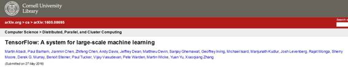

# 学界 | Google Brain 论文：TensorFlow，一个大规模机器学习系统

选自 arxiv.org

**作者：Martín Abadi、Jeff Dean 等人**

**机器之心编译**

**参与：微胖、李亚洲**

**摘要**

TensorFlow 是一个机器学习系统，可以在大规模状态下运行，也可以在异构环境中运行。它使用数据流图表来表征计算、共享状态以及改变那种状态的操作。既能绘制跨越一个集群中多台机器的数据流图节点，也能绘制在一台机器中跨越多种计算设备的节点，包括多核 CPUs，通用 GPUs 和定制设计的 ASICs，也就是所知的 TPUs（ Tensor Processing Units）。这一架构为应用开发者提供了灵活性：鉴于先前「参数服务器」设计的共享状态管理是建立进系统中，TensorFlow 使开发者能够在新的优化和训练算法上进行实验。 TensorFlow 支持多种多样的应用，尤其是对深度神经网络训练和推断的强有力支持。数个谷歌设备在生产过程中使用 TensorFlow，我们已经将其作为开源项目发布，它也普遍应用于机器学习研究。在此论文中，我们将 TensorFlow 数据流模型与现有的系统做了对比，展现了 TensorFlow 在数个现实应用中取得的引人注目的性能。

***©本文由机器之心编译，***转载请联系本公众号获得授权***。***

✄------------------------------------------------

**加入机器之心（全职记者/实习生）：hr@almosthuman.cn**

**投稿或寻求报道：editor@almosthuman.cn**

**广告&商务合作：bd@almosthuman.cn**

点击「阅读原文」，查看论文 PDF 下载地址↓↓↓