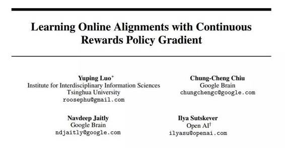

# 学界 | 清华大学、Google Brain、OpenAI 合著论文：通过连续奖励策略梯度学习在线比对

选自 arXiv.org

**作者： Yuping Luo、Chung-Cheng Chiu、Navdeep Jaitly、Ilya Sutskever**

**机器之心编译**

**参与：吴攀、李亚洲**

**** 

**摘要**

带有软注意（soft attention ）的序列到序列（sequence-to-sequence）模型在机器翻译、语音识别和问答系统上已经取得了显著的成功。尽管其能力很好且易于使用，但它们需要在推理的一开始就获取到整个输入序列，这不适用于即时翻译和语音识别。为了解决这个问题，我们提出了一种使用硬在线比对（hard online alignment）而非软在线比对（soft offline alignment）的用来解决序列到序列问题的新方法。该在线比对模型可以在无需事先处理整个输入序列的条件下就开始产生输出。一种高精度的在线序列到序列模型会有很大的用处，因为它可被用于构建精确的基于语音的即时翻译器。我们的模型使用了硬二元随机决策（hard binary stochastic decision）来选择每一个会产生输出的时间步骤。该模型被训练使用一种标准的策略梯度方法来产生这些随机决策。在我们的实验中，我们发现这个模型在 TIMIT 和华尔街日报（WSJ）语音识别数据集上实现了令人鼓舞的性能表现。

***©本文由机器之心编译，***转载请联系本公众号获得授权***。***

✄------------------------------------------------

**加入机器之心（全职记者/实习生）：hr@almosthuman.cn**

**投稿或寻求报道：editor@almosthuman.cn**

**广告&商务合作：bd@almosthuman.cn**

  **点击「阅读原文」，下载此论文↓↓↓**