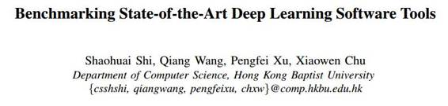
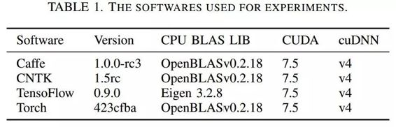
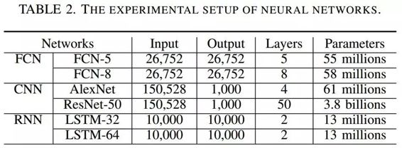
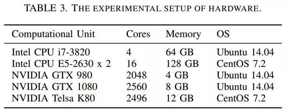
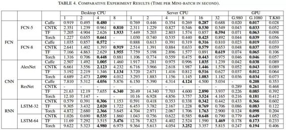

# 学界 | 重磅论文：基准评测当前最先进的深度学习软件工具

选自 arXiv.org

**作者：Shaohuai Shi、Qiang Wang、Pengfei Xu、Xiaowen Chu**

**机器之心编译**

**参与：吴攀**

**摘要**

深度学习已被证明是一种可成功用于许多任务的机器学习方法，而且它的广泛流行也将很多开源的深度学习软件工具开放给了公众。训练一个深度网络往往是一个非常耗时的过程。为了解决深度学习中巨大的计算难题，许多工具利用了多核 CPU 和超多核 GPU 这样的硬件特性来缩短训练时间。但是，在不同的硬件平台上训练不同类型的深度网络时，不同的工具会有不同的特性和运行性能，这让终端用户难以选择出合适的软件和硬件搭配。在这篇论文中，我们的目标是对当前最先进的 GPU 加速的深度学习软件工具（包括：Caffe, CNTK, TensorFlow 和 Torch ）进行比较研究。我们在两种 CPU 平台和三种 GPU 平台上使用三种流行的神经网络来评测了这些工具的运行性能。我们做出了两方面的贡献。第一，对于深度学习终端用户，我们的基准评测结果可用于指导合适的软件工具和硬件平台的选择。第二，对于深度学习软件开发者，我们的深度分析为进一步优化训练的性能指出了可能的方向。

**实验数据**

 

*表 1：用于实验的软件*

 

*表 2：本实验的神经网络设置*

*表 3：本实验的硬件设置*

*表 4：对比结果（每个 mini-batch 的时间/秒；其中加粗的为最优）*

**结论**

这是使用不同的硬件平台、在三种不同类型的流行深度学习方法上对 GPU 加速工具的评估。根据基准评测结果，当存在 GPU 时，我们发现 Caffe 平台在全连接网络上表现更好，而 TensorFlow 在卷积神经网络和循环神经网络上都表现突出。GPU 内存是在 Caffe 等许多工具上运行大型网络的关键指标之一，CNTK 和 Torch 不能在 GTX 980（其有 4GB 内存）上运行 32 或更多个 mini-batch 大小的 ResNet-50，而 TensorFlow 在管理 GPU 内存上表现更好，并且其基本上可以在所有的配置情况下运行。cuBLAS 是一个高性能的 BLAS 库，但其 API 参数对实现好的结果来说是很重要的。在计算一些情况下的卷积运算时，FFT 是一个更好的选择。

在仅使用 CPU 的机器上，Caffe 在 CPU 并行上表现更好，TensorFlow 也在 CPU 资源利用上有很好的表现。在 CPU 并行机制上，使分配的线程等于 CPU 的核数可以得到更好的表现。

GTX 1080 有更高的基础时钟（1733 MHz）和更多 CUDA 内核，在大部分案例中也都获得了更好的结果。但是，Tesla K80 有更大的内存（12 GB），可以支持应用运行更大型的网络和更大的 mini-batch。此外，每一个 K80 卡还配备了 2 个 GPU 芯片，这可能能让其在运行并行程序时获得更好的表现，但在我们的基准评测中，它并没有得到充分的使用。

局限：我们没有测试跨多个 GPU 和多台机器的可扩展性，因为这种方法可能无法增强一些工具的主要特性。比如虽然 CNTK 支持跨多 GPU 和机器运行，但其它工具却不行。 

***©本文由机器之心编译，***转载请联系本公众号获得授权***。***

✄------------------------------------------------

**加入机器之心（全职记者/实习生）：hr@almosthuman.cn**

**投稿或寻求报道：editor@almosthuman.cn**

**广告&商务合作：bd@almosthuman.cn**

**点击「阅读原文」，下载此论文↓↓↓**