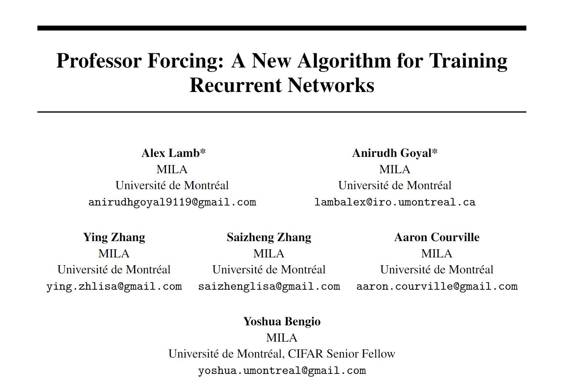
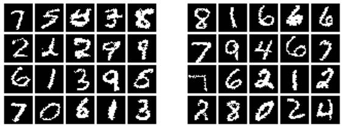

# 学界 | Yoshua Bengio 最新论文：一种用于训练循环网络的新算法 Professor Forcing（附论文）

选自 arXiv

**机器之心编译**

**参与：吴攀**

 

摘要：Teacher Forcing 算法通过将被观察到的序列值作为训练过程中的输入和使用该网络自己的提前一步的预测（one-step-ahead predictions）来进行多步采样（multi-step sampling）。我们在这里介绍 Professor Forcing 算法，其使用了对抗域适应（adversarial domain adaptation）来促进训练网络的动态（dynamics）在训练网络时和从网络中进行多个时间步骤的采样时一样。我们将 Professor Forcing 应用到了语言建模、在原始波形的声音合成、手写生成和图像生成上。我们的实验表明 Professor Forcing 可用作正则化器（regularizer），其能提升在字符级 Penn Treebank 和序列的 MNIST 上的测试似然（test likelihood）。我们还发现该模型可以定性地改进样本，尤其是当要进行大量时间步骤的采样时。这也得到了人类对样本质量的评估的支持。我们讨论了 Professor Forcing 和 Scheduled Sampling 之间的权衡。我们产生了 T-SNE，表明 Professor Forcing 能成功使训练过程和采样过程中的网络动态更为相似。

*图 ：Teacher Forcing（左）和 Professor Forcing（右）的样本*

******©本文由机器之心编译，***转载请联系本公众号获得授权******。***

✄------------------------------------------------

**加入机器之心（全职记者/实习生）：hr@almosthuman.cn**

**投稿或寻求报道：editor@almosthuman.cn**

**广告&商务合作：bd@almosthuman.cn**

