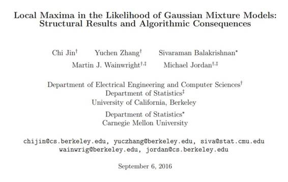

# 学界 | Michael Jordan 最新论文：高斯混合模型的似然方法中的局部极大值：结构结果和算法结果（附论文）

选自 arxiv.org

**机器之心编译**

**参与：武竞**

 

摘要

对于混合模型 M≥3 的高斯混合模型，这篇论文提供了无限样本集合的似然函数（population ( infinite-sample ) likelihood function）的两个基本结论。第一个结论揭示了，即使在相同权重、区分度很大的混合球形高斯分布中，集合的似然函数依然产生坏局部最大值（bad local maxima）。我们证明了，这些坏局部最大值的 Log 似然值可能比任何一个全局最优更糟糕，从而也解决了 Srebro 提出的问题（2007）。第二个结论揭示了，随机初始化的 EM 算法（这里用的是它的一个一阶变种（first-order variant））会以大于等于 1−e−Ω(M) 的概率收敛到坏关键点（bad critical points）。更进一步，我们建立了一个 EM 的一阶变种（first-order variant），使它几乎肯定不会收敛到极值鞍点（strict saddle points），这表明一阶方法的差表现可以被归咎于坏局部最大值而不是坏鞍点。总之，我们的结论强调了，使用 EM 算法时（即使该算法被用在非常有利的设定下）谨慎的初始化的必要性。

******©本文由机器之心编译，***转载请联系本公众号获得授权******。***

✄------------------------------------------------

**加入机器之心（全职记者/实习生）：hr@almosthuman.cn**

**投稿或寻求报道：editor@almosthuman.cn**

**广告&商务合作：bd@almosthuman.cn**

**点击「阅读原文」，下载论文↓↓↓**