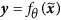
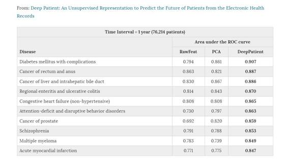

# 深度 | Nature 论文：无监督表征学习，用电子健康病历增强临床决策

选自 Nature

**作者：Riccardo Miotto, Li Li, Brian A. Kidd & Joel T. Dudley**

**机器之心编译**

**参与：吴攀、亚洲、孙睿、微胖**

> *引言：英国科学新闻杂志《新科学家》公开了谷歌与皇家慈济 NHS 信托会之间的一份数据共享协议。根据该协议，伦敦近 160 万病人的医疗数据将共享给谷歌旗下人工智能公司 DeepMind ，用于其研究。 在数据共享协议中，谷歌的人工智能部门 DeepMind 将会获得病人数据库。这些病人来自伦敦的伦敦巴内特、蔡斯医院和伦敦皇家免费医院，数据可追溯到 5 年前，持续到 2017 年。*谷歌表示，他将利用这些数据开发一个针对急性肾损伤高风险人群的预警系统 APP——Streams，这个 APP 在有人面临急性肾损伤的时候会给医生发出警报。NHS 表示，急性肾损伤占医院紧急病例的 20%，而这里面大约有四分之一是可以预防的。* （[深度 | 新科学家披露 DeepMind 重要合作协议，谷歌已获英国 160 万病患数据](http://mp.weixin.qq.com/s?__biz=MzA3MzI4MjgzMw==&mid=2650715087&idx=1&sn=6b529981559d4fa8ca8429f6fc37f680&scene=21#wechat_redirect) ）*
> 
> *这篇研究文章，正好在上述人工智能与医疗健康结合的核心应用场景进行了重要探索。点击阅读原文，进入网页下载原文 PDF。*

**摘要**

电子健康病历（electronic health record ,EHR）的二次使用，有望推进临床研究，改善临床决策。总结、表征患者数据所面临的难题，妨碍了电子健康病历预测性建模实践的广泛展开。在这份研究中，研究人员提供了一种新的无监督深度特征学习方法，它可以从电子健康病历数据中获取一个通用的病人表征，从而让临床预测性建模更加方便。特别是，研究人员使用了三层堆叠的降噪自动解码器（ a three-layer stack of denoising autoencoders），用于捕捉西奈山数据仓库（Mount Sinai data warehouse）中 70 万患者聚合电子健康病历中的层次规律性（ hierarchical regularities ）及依存关系。结果，我们得到了一个表征，我们将之称呼为「深度患者（deep patient）」。通过评估患者患上各种疾病的可能性，我们认为「深度患者」可以广泛预测健康状态。来自不同临床领域及时间窗口（temporal windows）的 76，214 位测试病患（身患 78 种疾病）帮助我们完成了这项评估。结果显著优于其他使用了基于原始电子健康档案数据表征的研究方法，以及其他特征学习策略。在对严重糖尿病、精神分裂症以及各种癌症的预测表现上，「深度患者」遥遥领先。这些发现表明，将深度学习应用到电子健康病历中，可以得到病人表征，这些表征可以帮助我们改善临床预测，研究也为增强临床决策系统提供了深度学习框架。

**介绍**

精准医学的一个首要目标就是为病患开发出定量模型，这种模型可被用于预测患者健康状态以及预防疾病或残疾。在这一背景中，电子健康病历为加快临床研究和预测性分析提供了巨大保证。近期研究已经表明，电子健康病历数据的二次使用可以实现数据驱动下的药物效果以及相互作用情况的预测，识别亚组 2 型糖尿病，发现孤独症谱系障碍的共患病簇群，改善临床测试的病患招募。然而，这些建立在现代机器学习技术上的预测模型和工具尚未被广泛采用，也没有可靠地被用于临床决策支持系统或者工作流程中。 

电子健康病历数据很难表征和建模，因为这种数据维度高、有噪音、异构性、稀疏、不完备、随机错误还有系统性偏见。而且，同样的临床表型可以用不同的代码和术语来表达。比如，一位被诊断为 2 型糖尿病的患者，也可以说是血红蛋白 A1C 化验值大于 7.0， 诊断代码 250.00 ICD-9，2 型糖尿病不过是临床便笺中的提法。这些问题让机器学习方法很难识别模式，这些模式可以生成应用于真实世界的预测性临床模型。

预测性算法的成功，很大程度上依赖特征提取和数据表征。一个使用电子健康病历的普通方法就是请一位领域里的专家标出要找的模式（比如，学习任务和目标），并以一种特殊的方式说明临床变量。尽管在某些情况下是合适的，但是，对特征空间尺度（ feature space scales）的不充分监督定义， 不宜泛化，也错失了发现新的模式和特征的良机。为了解决这些不足，有研究人员提出了数据驱动下的研究方法，用来提取电子健康病历中的特征提取。这些方法的一个局限性在于，病人经常被表征为一个二维的向量，由临床数据仓库里的所有数据描述符组成。这种表征不仅稀疏、嘈杂而且重复，不适合为内嵌于或潜伏在电子健康病历里的层次信息建模。

无监督表征学习，通过自动识别数据中的模式和依存关系，试着克服监督式特征空间定义的局限性（supervised feature space definition），学会一种简洁又通用的表征，让自动提取有用信息更简单（当建立分类器或其他预测器时）。尽管文本、多媒体以及营销中的特征学习取得成功，深度学习也越来越受欢迎，但是，这些技术尚未被广泛用于电子健康病历数据中。在这篇研究中，我们展示了，将无监督深度特征学习用于患者水平（patient-level ）的聚合电子健康病历数据的预处理，其结果是：获取的表征更易于机器理解，也显著改善了针对各种不同临床条件的预测性临床模型。

这篇研究提供了一个新的「深度患者」框架，通过一套通用特征来表征病患，这些通用特征是利用深度学习从大规模电子健康病历数据库中推导出的。特别是，利用一个由一层降噪自动解码器组成的深度神经网络，以无监督方式处理电子健康病历数据，以获取数据中的稳定结构和规律模式，这些组合在一起就构成了「深度病患」表征。「深度患者」独立于任何一个领域，不需任何额外的人类努力就很容易地应用到各种不同的预测性应用中，可以是监督方式，也可以无监督方式。为了证实这一表征的有效性，我们用深度患者来预测患者以后可能罹患的病症，并表明，「深度患者」的表现始终优于原初电子健康病历表征，以及大规模真实世界数据实验中的普通（浅的）特征学习模型。

**材料和方法**

这一部分主要是介绍深度患者方法，并描述了在预测未来疾病这一任务中，评估这一表征好处的实现方法。

**深度患者表征**

 *展示了用来得到深度患者表征的高度概念性框架。*

我们通过一个深度学习架构（比如，深度患者）中的一个多层神经网络来获取患者表征。训练网络每一层，让它根据来自前一层的输入，通过优化一个本地无监督标准，生成更高水平的有关被观察模式的表征。每个水平所生成的关于输入模式的表征，都比前一层的更为抽象，因为，它是通过组合更多的非线性操作获得的。这一过程类似认知神经科学模型。

*训练神经网络的每一层，从前一层的结果中生成一个更高水平的表征。*

**降噪自编码器（Denoising Autoencoder）**

我们通过使用一种降噪自编码器（SDA）实现了我们的框架，其是逐层独立训练的；该架构中所有的自编码器具有同样的结构和功能。简而言之，一个自编码器首先获得一个输入

 

（使用编码器）通过一个确定性映射将其转换一个隐藏的表征

将其转换一个隐藏的表征 

其中参数 θ 通过 θ={ W, b} 参数化；其中 s(·) 被称为激活函数，其是一个非线性转换（如，S 型函数、正切函数）；W 是权重系数矩阵，b 是偏置向量。然后潜在的表征 y（通过解码器）被映射回一个重构向量

 

如

其中

W 即捆绑权重（tied weight）。我们希望代码 y 是一个分布式表征，其依据数据中变化的主要因素获取坐标。当训练该模型时，算法会搜索能最小化 x 和 z 之间差异的参数，该差异即重构误差

自编码器常被训练用于重构来自初始数据有噪声版本的输入（即：降噪）以防止过拟合。这一过程首先是通过一个随机映射

破坏初始输入 x 以得到一个部分被破坏的版本

 

然后这个被破坏的输入再通过基本自编码器被映射为一个隐藏的代码

然后再映射成解码的表征 z （见补充附录 A ，在线查看图像表示）。我们使用掩蔽噪声算法（masking noise algorithm ）实施对输入的破坏，其中随机选择的 x 元素的一小部分 y 被调为 0。这可以被看作是模拟 EHR 中缺失组件的存在（如，未被记录在 患者病历中的药物或诊断），从而假设输入的临床数据是实际临床状况的降级或「噪声」版本。然后所有关于这些被遮掩的组件的信息将被从输入模式中移除，而去噪自编码器就可以被看作是为填补这些人工引入的空白而训练的。

模型 θ 和 θ’ 的参数通过训练数据优化以最小化平均重构误差：

其中 L(·) 是一个损失函数，N 是训练集中患者的数量。我们用作损失函数的是重构交叉熵函数，即：

 

优化是通过微型批量的随机梯度下降进行的，它遍历训练病历的小型子集，并在损失函数梯度的相反方向上对参数进行修改，以最小化重构误差。然后学习到的编码函数 fθ(·) 被应用到没有噪声的清洁输入 x 上，其结果编码 y 是分布式表征（即 SDA 架构中以后的自编码器的输入或最终的深度患者表征）。

**评估设计**

特征学习算法通常在监督式应用中进行评估，以利用可用的手动标注的标签。在这里我们使用了西奈山医院数据仓库来学习深度特征，然后我们通过它们对患者未来疾病的预测而对它们进行评估。西奈山医疗系统从其医疗保健和临床手术中生成了大量结构化、半结构化和非结构化数据，其中包括住院、门诊和急诊。该系统中的患者可以受到长达 12 年的跟随调查，除非他们搬家或改变保险。从 2003 年开始，电子记录已被我们的医疗系统逐步完全采用。2003 年之前与到该医院就诊的患者相关的数据也迁移到了电子格式，但我们可能会缺乏医院访问的具体细节（即一些诊断和用药可能未被记录或迁移）。整个 EHR 数据库包含大约 420 万份去除了身份标识的 2015 年 3 月之前的病历，其使用遵循 HIPAA 法案的 IRB 许可。我们保留了 1980 年到 2014 年之间所有被诊断出了至少一种 ICD-9 类疾病的患者的数据。最终得到了一个包含大约 120 万患者数据的数据集，其中每个患者平均拥有 88.9 个记录。然后我们将 2013 年 12 月 31 日（即分割点）之前的数据用作训练数据（即 34 年的训练信息），2014 年的所有诊断则被用作测试数据。

**EHR 处理**

对于数据集中的每个患者来说，我们保留了一些一般的人口学信息（即年龄、性别和种族），并以一种结构化的格式描述了可用的常见临床描述，比如诊断（ICD-9 代码）、用药、手术和实验室测试、以及分割点之前记录的自由文本的临床笔记。所有的临床记录都通过 Open Biomedical Annotator（开放生物医学标注）进行了预处理，以获得手术和实验室测试的统一代码、基于品牌名称和剂量的标准化后的用药、从自由文本笔记中提取的临床概念。尤其是，开放生物医学标注及其 RESTful API 使用了美国国家生物医学本体中心（NCBO）的 BioPortal 入口，其提供了一个大型的本体数据集，其中包括 SNOMED-CT、UMLS 和 RxNorm；可以用来从文本中提取生物医学概念和提供它们的规范化的标准版本。

对记录标准化的处理因数据类型而有不同。对于诊断、用药、手术和实验室测试，我们只需计数患者 EHR 中每一个标准化代码的存在，以便于相关临床事件的建模。自由文本临床笔记需要更复杂的处理。我们使用了 LePendu 等人描述过的工具，其可以帮助识别否定标签和与家族病史相关的标签。这些笔记中出现的否定标签被认为是不相关和不可用的[5]。否定标签使用 NegEx 识别，这是一个使用了几种表示否定的词组的正则表达式算法，能够过滤包含了看起来被误认为是否定词组的词组的句子和确定否定词组的限制范围。与家族病史相关的标签只是标记了相关病史，而没有与病人直接相关的标签区分。然后我们分析了时间连续的笔记中表达的相似性，移出了重复的信息（如，被错误地记录了两次的信息）。

被解析的笔记然后被进行了进一步的处理以减少表征的稀疏度（提取了大约 200 万个规划化的标签）和获得嵌入的临床信息的语义抽象。为了这一目标，我们使用主题建模为了解析后的笔记建模——主题建模（topic modeling）是一种无监督推理过程，可以获取文档中词共现的模式以定义主题和将文档用主题的多项式进行表示。主题建模已在很多研究中被用来归纳临床笔记和改善患者数据的自动归纳。我们的主题建模的实现使用了隐含狄利克雷分布（latent Dirichlet allocation），我们通过 100 万份随机笔记的困惑度分析（perplexity analysis）估计了主题的数量。我们发现有 300 个主题获得了最好的数学归纳；因此，每份笔记最终都被总结成包含 300 个主题可能的多项式中的一个。对于每一位患者，我们最终保留了一个在分割点前所有可用笔记上平均化的基于主题的表征。

**数据集**

为了评估的目的，所有带有至少一个记录的 ICD 代码的患者被分割在了三个独立的数据集中（即，每个患者只在一个数据集中出现）。首先，我们保留了 81,214 个在 2014 年至少有一个新 ICD-9 诊断且之前至少有十条记录的患者。这些患者组成了验证集（即 5,000 个患者）和测试集（即 76,214 个患者）以用于监督式评估（即：未来疾病预测）。尤其上，2014 年所有的诊断都被用于评估使用分割点前的患者数据计算出的预测（即：根据患者的临床状况做出的预测）。每位患者至少拥有十个记录的要求是为了确保每个测试案例都有一定最小量的临床历史，这样才能得出合理的预测。然后我们随机取样了 200,000 个在分割点前至少有五个记录的不同患者的子集，以用作疾病预测实验的训练集。

我们使用 ICD-9 代码表示一项患者的疾病诊断。然而，由于不同的代码可以表示同样的疾病，所以我们将这些代码映射到了西奈山医院所使用的疾病分类结构，其将 ICD-9 代码归入了包含 231 种一般疾病的词表[30]。这份列表中只包含至少有十位患者的训练数据的疾病，并且还经过执业医师的手动修饰，移出了所有不能仅用 EHR 标签就能预测的疾病——有的疾病涉及社会行为（如 HIV）和外部生活事件（如受伤、中毒），或太过笼统的疾病（如：「其它形式的癌症」）。最终得到的词表包含 78 种疾病，具体可在线查阅补充附录 B。

最后，我们使用剩下的在 2013 年 12 月之前至少有五项记录的患者的数据创造了用于特征学习算法的训练集。选择每位患者至少五项记录的原因是移出一些信息不足的案例和减少训练集大小，以及最终减少训练时间。然后我们得到了包含了 704,587 位病人和 60,238 项临床描述的数据集。再后，我们又移出了描述多于 80% 的患者或描述的出现次数少于 5 的患者的数据，以避免在学习过程中出现的偏差和噪声；最终我们得到了包含 41,072 项描述的词表。总体而言，用于特征学习的原始患者数据集由 2 亿条非零项组成（即大约为患者描述矩阵中所有项的 1%）。

**患者表征学习**

我们在 704,857 位患者的数据集上应用了 SDA 以提取深度患者表征。该数据集中的所有特征值第一次得到了规范化，落到了 0 到 1 之间，以在保留零项的同时减少数据的变化。我们在这种深度架构的所有自编码器中都使用了相同的参数（而不管是那层），因为这样的配置和每层参数不同的情况往往具有相似的表现，而且相同的配置也更易评估。特别地，我们发现当使用验证数据集调整模型时，每层使用 500 个隐藏单元和一个噪声破坏因子（noise corruption factor） v=5% 可以得到良好的泛化误差和一致的预测。我们使用了一种由三层自编码器和 S 型激活函数组成的深度架构（即：「DeepPatient（深度患者）」）。使用不同层数的疾病预测的初步结果可见于补充附录 C 。然后再将训练集和测试集应用于该深度特征模型以进行监督式评估；因此这些数据集中的每一位患者都是用具有 500 个特征的密度向量表示的。

我们将深度患者表征和医学等多种领域中已被证明有效的知名的特征学习算法进行了比较。所有这些算法也都被应用了这个规模经过调整的数据集上，并只对原始数据进行了一次转换（即浅度特征学习）。特别要提到，我们考虑了主成分分析（即 100 个主成分的 PCA）、K-均值聚类（即 500 个聚类的 K-均值）、高斯混合模型（即 200 个混合和全协方差矩阵的 GMM）和独立成分分析（即 100 个主成分的 ICA）。特别地，主成分分析（PCA）使用了一种正交变换将可能相关变量的观察集转换成了被称为主成分（principal component）线性不相关变量集，其变量数量少于或等于原始变量的数量。第一主成分占据数据中最大可能的可变性，而且在与前面的成分正交的限制下，每个后续成分依次具有最高可能的方差。K-均值将无标签数据分组成 k 个聚类，每一个数据点都属于均值与其最接近的聚类。在特征学习中，每一个聚类的矩心（centroid）都被用于产生特征，即：每一个特征值是数据点与每一个聚类矩心的距离。高斯混合模型（GMM）是一种概率模型，其假设所有数据点都是从具有未知参数的高斯分布的有限数量混合中生成的。独立成分分析（ICA）表示使用了独立的非高斯成分加权求和的数据，其是通过信号分离算法（signal separation algorithm）从数据中学习到的。随着 DeepPatient 的完成，每个模型隐变量的数量在初步实验中通过优化学习错误或期望以及在验证集中获得的预测结果进行了确定。我们也将基于移除了频繁和罕见的变量后的原始描述的患者表征的比较包含了进去（即有 41,072 项的「RawFeat」）。

**未来疾病预测**

我们使用 200,000 个患者的含有不同疾病的数据库，来训练一个随机森林分类器（one - vs. all learning），并用它通过病人的当前临床表征，来预测之后发展出某种疾病的可能性。我们使用随机森林的原因是，它的表现通常比其它标准分类器要好很多，易于调节，并且对过度拟合的适应性更强。在对于校验数据库的初步测试中，我们将每一项疾病的分类器调节为含有 100 个树的结构。对于测试集中的每一位患者（以及所有不同表征），我们会计算词汇表中每一个疾病发生的概率（例如，每一位患者都以发病概率的向量来表示）。

**结果**

我们将这种疾病预测方法，测试于两种可应用的临床任务：疾病分类（如，评估疾病）和疾病诊断（如，评估患者状况）。对于每个患者，我们只考虑新出现的疾病，而忽略二次诊断的疾病。除了另外说明的情况，实验使用的矩阵上限均为一。

**疾病评估**

为了测量深度患者在预测某位病人是否身患新疾病方面，表现如何，我们评估了分类器在判定患者是否可能被诊断出某种疾病（时隔一年）方面的能力。每种疾病，我们都记录下了测试组（76214 位患者）所有病人的值（scores），测量了处在接受者操作特征曲线下的区域（比如，AUC-ROC)，准确性以及 F 值。所有不同数据表征的结果，都在表格 1 中。

 

**患者评估**

这个测试中，我们检验了「深度患者」在具体患者水平上的表现成绩。如图。

 

**讨论**

我们提出了一种新的深度学习应用，从电子健康病历中导出患者描述符，这就是「深度患者」。这个方法捕捉到了数据中的层次规律性以及依存关系，创造了一个简洁、通用的病患特征组，可以有效用于预测性临床应用。事实上，从未来可能罹患疾病的预测中，我们得到结果始终优于其他学习模型的结果，也优于仅使用原始电子健康病历数据。这也表明，使用深度非线性变换序列（ a deep sequence of non-linear transformations ）对病患数据进行预处理，有助于医学更好理解电子健康病例中的信息，有效做出推断。这也为临床预测性模型，开启了新可能性，因为，用深度学习预处理电子健康病历数据可以改善之前文献中提出的特别框架，取得更加有效的预测效果。另外，「深度患者」也能获取比原始电子健康病历更简洁、更低维的表征，允许临床分析引擎随着医院数据仓库不断增多而更好地实现规模化。

**背景与意义**

近期，深度学习被应用于了医药和基因组学中：重建大脑回路，预测潜在药物分子的活动，在基因表达中非编码 DNA 上突变的影响，以及 DNA 和 RNA 结合蛋白质的序列特异性。据我们所知，深度特征学习还未应用于从汇总患者电子健康病历数据中生成一种通用的表征。深度信念网络近期应用于了中国病人的小量临床数据集。推荐针灸治疗，有着对特定任务监督最优化的特征。不同的是，我们应用深度学习从大规模数据集中取得病人表征，这种数据集并非为特定任务而最优化过，能匹配不同的临床应用。

我们使用堆叠降噪自动编码算法（SDAs）处理 EHR 数据，学习深度的病人表征。SDAs 是三层神经网络序列，有一个中心层重建高维输入向量。就我们所知，SDAs 在临床领域还未应用过。一个两层的叠加自动编码算法（没有降噪组件）被应用于 EHR 建立血尿酸测定的纵向次序模型。这是为了显示不同种群的亚型，区分急性白血病和通风症中的尿酸特征，虽然这个任务中也未进行特定任务最优化。在论文中，我们应用 SDAs 和特征学习取得病人的通用表征，并不专注于特定的临床描述或领域。

这一深度患者表征通过预测病人未来疾病——在临床决策中建立实际任务模型进行评估。先前的研究调查了数个特定领域的疾病预测，包括心血管疾病、心力衰竭、慢性肾病、以及诊断代码任务。然而，先前的工作一般开发的方法都高度针对特定的疾病或表型。相反的，我们专注于我们方法在不同疾病上的评估，从而表明深度病人表征框架学习非特定领域的描述信息。

**潜在应用**

深度病人表征改善了对不同类型疾病的预测。这证实了，学习到的特征是以这样一种方式描绘病人，这种方式在不同领域，都能以自动的方法得到一般且高效地处理。我们相信，从 EHR 推论出的这个深度病人表征也能惠及其他任务，比如个人药方、治疗建议和临床试验招募。相比于特定任务的监督最优化表征，一个完全的非监督向量定向表征也可应用于其他非监督任务，比如病人的聚类和相似性。这一研究代表了迈向下一代临床预测系统的第一步，它扩展至包含百万级、数十亿级的的病人记录，并使用单一的、分布的病人表征在日常活动中高效支持临床医师，而非多种系统表现不同的病人表征。在这种场景中，这一深度学习框架能部署到 EHR 系统，其中的模型会随着病人数量的变化得到不断的升级。然而，在难以解释神经网络学到的特征的情况下，这一框架将搭配一个特征选择工具，帮助临床医师理解什么导致不同的预测。

从大规模的病人数据库中获得的高水准描述符，也能加强医院间信息的共享。事实上，深度特征能将病人数据概括到一个更高的、难以重建的层次，这能促进机构间的数据安全交流，从而基于不同人群的分布获得额外的表征（考虑到 EHR 潜在同样的表征）。举个例子，一个病人的临床状态可能在他居住的地方不常见，从而可以使用从其他医院数据库（在这里病人的情况可能会更加常见一点）学习到的特征。另外，医院合作学习共同的特征可能得到一个更加好的深度表征，它可能会改善大量医疗健康分析平台的设计和性能。

在本论文中评估过的疾病预测应用，可被用于个体化用药的多种临床任务，比如对病人个体风险的数据驱动评估。事实上，临床医师可能受益于一个从病人数据中学习优化护理的平台，而这正是深度病人方法的自然延伸。例如，内科医生能对病人进行监测，检查在这种临床状态下近期内是否会发生疾病，并且还能通过数据驱动预防方法的选择抢占先机。相似的，这一平台能够自动侦测医院可能发展成特定疾病的病人，并提醒护理提供人员。

我们记下了一些如今的研究存在的限制，突出了增强未来方法的机会。就像已经提到的一样，一些疾病未能显示出高度预测能力。这有一部分是因为几个事实：我们只囊括了实验室测试的频率，还有我们依赖于测试同现测定病人模式，而没有考虑到测试结果。如今，在如此大的规模上处理实验室测试结果还不是很轻松，因为它们是文本标志，因不同的测量单元和范围有不同的价值，等等。然而，我们发现一些有着低性能标准的疾病（比如，无并发症糖尿病，高血压）总是在常规体检中被实验室测试给屏蔽掉，使得这种疾病的测试频率不足以成为有效的判别因子。

未来的工作，将会探索如何将实验室测试值包括在内，改善深度病人表征的性能（也就是更好的原表征有可能带来更好的深度模型）。相似的，用覆盖了预先定义的连续不断时间间隔的时间序列向量来描绘病人，而不是采用汇总一个向量上的所有数据的办法，将有望改善最终结果。加入 EHR 数据的其他类别，比如保险细节、家族历史和社会关系，也可能引发更好的表征，在多种临床领域获得可靠的预测模型。另外，这一 SDA 模型有可能得益于额外的数据预处理。一个常见扩展是使用 PCA 预处理数据，在深度模型前移除无关因子。这一方法改进了其他媒介的准确性和效率，而且也可能有助于临床领域。

在未来的工作中，我们计划调查这一深度表征在其他涉及到自动预测的临床任务上的应用，比如个人药方、治疗建议和临床实验招募。我们也计划通彻调查深度病人在特定临床领域和任务上的应用，从而定性评估它的效果（比如，这一算法发现的规则是什么，改善预测效果如何，如何能将其可视化，他们是否新颖）。更长远地，我们打算在其他机构的 EHR 数据库上评估这个方法，从而巩固成果，这得益于对更多病人进行估算进而改善学习到的特征。

✄------------------------------------------------

**加入机器之心（全职记者/实习生）：hr@almosthuman.cn**

**投稿或寻求报道：editor@almosthuman.cn**

**广告&商务合作：bd@almosthuman.cn**