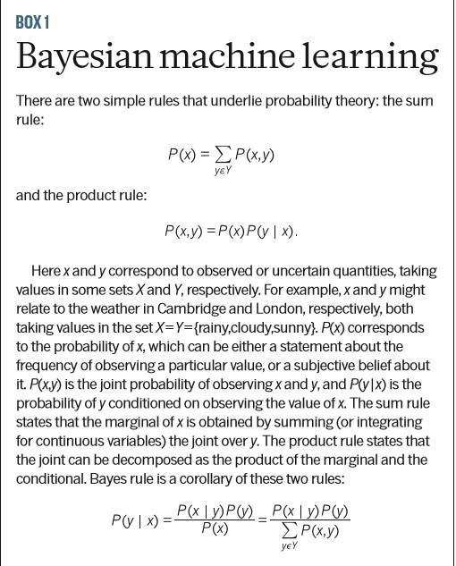
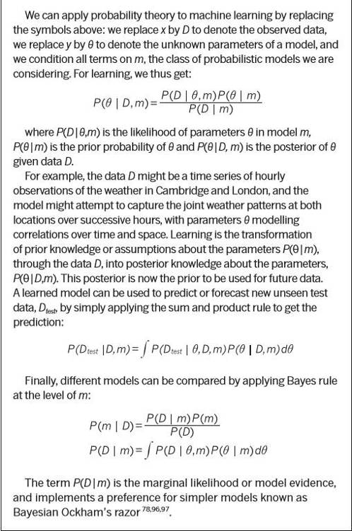
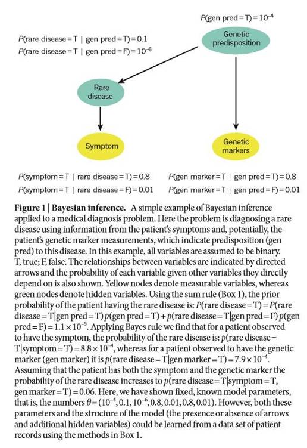
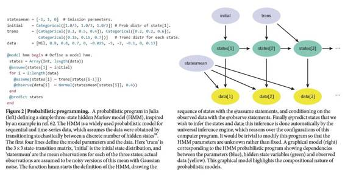
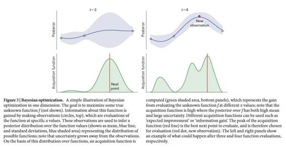

# 深度 | Nature 论文详解概率机器学习：从不确定性表征到自动建模（附论文）

选自 Nature

**作者：Zoubin Ghahramani**

**机器之心编译**

**参与：Quantum Cheese、微胖、李亚洲、盛威、黄清纬、杜夏德、吴攀**

> *机器如何从经验中学习？概率建模提供了一个框架，帮助我们理解什么是学习，也因此成为了设计可从经验数据中学习的机器的主要理论和实践办法。这种描述了如何表征和控制模型和预测的不确定性的概率框架，在科学数据分析、机器学习、机器人技术、认知科学以及人工智能领域中扮演着中心角色。这篇评论介绍了这种框架，并讨论了该领域的最新进展——即概率编程、贝叶斯优化、数据压缩以及自动模型发现。*

机器学习概率框架的核心思想是：学习可被看作是推理合理模型以用于解释被观测到的数据的过程。一台机器可以利用此模型去预测未来数据，并基于这些预测理性决策。不确定性在这一切中都起到了基础的作用。观测数据可以符合多个模型，因此哪个模型适用于给定数据是不确定的。相似的，未来数据的预测和未来活动的结果是不确定的。概率理论提供了一个对不确定性建模的框架。

这篇论文回顾从对机器学习概率方法和贝叶斯推理的介绍开始，然后将讨论一些该领域的最新进展。学习和智能的许多方面都十分依赖于谨慎的不确定性概率表征。概率方法仅在最近才发展成人工智能[1]、机器人[2]和机器学习[3,4]的主流方法。即使到现在，这些领域在完全表征不确定性的重要性方面仍存争议。例如，使用深度神经网络来解决模式识别问题（如语音识别[5]、图像分类[6,7]和文本预测[8]）的新进展中没有在这些神经网路的结构或参数中明显表征不确定性。然而，我不会关注这些被大量数据的可用性特征化的这些类型的模式识别问题，而着重于不确定性是真正关键成分的问题，例如决策可能依赖于不确定性的数量的问题。

我向许多领域的科学家强调 5 个目前概率机器学习的前沿研究领域，它们都是有广泛相关性的领域：概率编程（probabilistic programming）（一个将概率模型表示成计算机程序的通用框架，这可能对科学建模会相当深刻的影响）；贝叶斯优化（Bayesian optimization）（一种全局优化未知函数的方法）；概率数据压缩（probabilistic data compression）；自动化探索合理和可解读的数据模型；用于学习许多相关模型的分层建模（hierarchical modelling），例如个性化用药或推荐。虽然仍有相当大的挑战，但未来十年有望在基于概率框架的人工智能和机器学习上取得很大进展。

**概率建模和表征不确定性**

在最基础的层面上，机器学习在寻找提升计算机在基于观测数据的特定任务上的表现的方法。类似任务的典型案例可能包括检测无人驾驶汽车拍下的图片中的行人、将白血病病人的基因表达模式按临床结果分类、或将英语句子翻译成法语。然而，我猜机器学习的任务范围甚至比这些模式分类或地图测绘任务更广，并且可以包括优化和决策、压缩数据和自动从数据中提取可解读的模型。

数据是所有机器学习系统的关键成分。但是数据，甚至是所谓的大数据，本身是没用的，直到某人从它们中提取出了知识或推理。几乎所有机器学习任务都可以表示为基于观测数据对缺失或潜在的数据做出推理——我会以各种方式使用推理（inference）、预报（forecasting）或预测（prediction）这些术语来指代这些一般任务。详细说明之前提到的例子：考虑根据每个白血病人测量的基因表达模式将他们分类成 4 个主要的白血病子类（subtype）。这里，观测数据是成对的基因表达模式和被标记的子类，而需要推理的未被观测或缺失数据是新患者的子类。

为了从观测数据中推理未被观测的数据，学习系统需要做出一些假设；这些假设形成一个模型。一个模型可以很简单而稳定，例如一个经典的统计线性回归模型，也可以很复杂而灵活，例如一个大且深的神经网络，甚至是一个有无穷多参数的模型。下一节我再讨论这点。如果一个已经在观测数据上训练过的模型可以预报或预测未被观测的数据，它就被认为是定义明确的，（否则，如果一个模型不能预测，从哲学家 Karl Poper 的建议评估假设的意义上说，它就不可证伪，或像理论物理学家 Wolfgang Pauli 所说的：此模型「连错误都不如（not even wrong）」）。例如，在分类的情况中，一个明确定义的模型应该能够预测新病人的分类标签。因为当预测未被观测的数据时，任何合理模型都是不确定的，所以不确定性是建模的基础部分。

建模中的不确定性有多种形式。在最低层面上，建模不确定性是由测量噪音引起的，比如像素噪点或图像模糊。在更高的层面上，一个模型会有很多参数，如线性回归系数，而这些参数的哪些值对预测新数据有用是不确定的。最后，在最高层面上甚至还往往存在着总体结构上不确定性：线性回归合适还是神经网络合适，如果是后者，它应该有多少层，等等。

概率方法的建模用概率来表达不确定性的所有形式[9]。概率理论是一种表征和操作不确定性的数学语言[10]，正如微积分是表征和操作变化率的数学语言。幸运的是，概率方法的建模在概念上非常简单：用概率分布代表模型中所有那些不确定的未被观测到的变量（包括结构性的、参数的、噪音相关的）以及它们与数据的关系。然后再用概率论的基本法则从观测到的数据来推断未被观测到的变量。在前概率分布（观测数据之前定义）到后概率分布（观测数据之后）的转变过程中会产生数据，这些就是用来学习的数据。这种运用概率论从数据中学习的方法叫做贝叶斯学习。（框图 1）

除了概念上的简单，机器智能的概率论框架还有几个极具吸引力的优势。单一变量或几个变量的简单概率分布模式可以组合构建成某些更大更复杂模型的基本架构。过去二十年来，表示这种复合概率模型的主流机器学习范式就是图形模型（ graphical model）[11]，还有一些变体，比如定向图形（directed graphs，也叫做贝叶斯网络，信念网络）、非定向图形（ undirected graphs，也叫马尔可夫网络，随机场），以及同时具备定向和非定向边缘的混合图形（mixed graphs）。（图 1）后文会讲到，概率编程提供了一种归纳图形模型的简练方法，而且允许更丰富的模型表征方法。如果与耦合两个非线性动态系统（比如循环神经网络）相比，概率模型的复合性意味着这些基本架构通常更容易理解。特别的，通常是可以从一个定义明确的概率模型中生成数据的；这种「假想的」数据能打开一扇通向概率模型「心智」的窗户，帮助我们理解初始前提假设并在后期任一阶段了解模型学到了什么。

与其他方法相比，概率建模同样也有一些概念性的优势，因为它是一个人工智能系统学习领域规范理论。一个人工智能系统应该如何根据数据表征和更新它对世界的信念（belief）呢？Cox 公理为表征信念定义了一些必需之物（desiderata）；这些公理的结果是：范围从「不可能」一直延伸到「完全确定」所谓的「信念程度（degrees of belief）」必须遵循概率论的规则[10,12,13]。这证明了在人工智能中运用主观贝叶斯概率表征的合理性。关于贝叶斯表达在决策驱动型人工智能中运用的争论来自于荷兰赌定理。通过提问一个代理是否愿意接受多种赔率（回报的比率）的赌局可以来评估它的信念强度，这是产生论据的地方。荷兰赌定理认为除非一个人工智能系统（抑或人类）的信念程度与概率规则相一致，否则它（或他／她）就会欣然接受注定输钱的赌局[14]。

由于这些论据以及其它关于智能不确定性的原理性操作的重要性论据的力量，贝叶斯概率建模法不仅是一种人工智能系统合理性的理论基础，而且也是一种人类和动物的规范行为模型[15-18（参考文献 19,20 也有讨论]），在理解神经回路可能会如何执行贝叶斯推论方面也有很多研究[21,22]。

虽然概念很简单，但要建立一个完整的机器学习概率方法依旧面临着很多计算和建模上的挑战。在计算方面，学习的过程需要排除意向变量意外的其他变量（这需要对其他所有变量求和）。如此高维的求和及积分计算是很困难的，因为很多模型并没有能够准确执行它们的多项式时间算法（polynomial time algorithm）。不过幸运的是，还有很多近似积分算法已经被开发出来，包括马尔可夫链蒙特卡洛（MCMC）法、变分近似法（variational approximations）、期望传播法（expectation propagation）和连续蒙特卡洛法[23-26]。值得注意的是在计算技术领域中，贝叶斯机器学习与其它机器学习是不同的：对于贝叶斯研究人员来说最大的计算问题是积分，而其他方向的研究者关注的则是模型参数的优化。然而这种分裂并没有看起来那么彻底：很多基于梯度的优化方法可以通过朗之万和汉密尔顿蒙特卡洛（Langevin and Hamiltonian Monte Carlo）法转化成积分方法[27,28]，而用变分近似法则可以把积分问题转化为优化问题[24]。我会在下面章节重述优化法。

概率机器学习在建模上面临的挑战主要在于模型需要具备足够的灵活性，以获取实现意向预测任务所需的数据的所有性质。解决这个挑战的一种方法是开发一个围绕开端（open-ended universe）宇宙模型的先验分布，这种模型能够适应数据的复杂性质。在灵活模型下的关键概念就是随数据复杂性的成长是非参数化的。

**通过非参数化实现灵活性**

现代机器学习的经验总结之一就是，最好的预测表现通常来自高度灵活的学习系统，特别是从大型数据集中学习时。灵活的模型能够做出更好的预测，因为他们允许数据在更大程度上「为自己代言」（但是请注意，所有预测包括假设，因此，数据不可能专门为自己代言）。获得灵活性有两个基本的办法：一是带有大量参数（相对于数据集而言）的模型（例如，最近一种用于实现英语到法语句子翻译的神经网络的准确度已经接近了当前最先进的方法，这个神经网络就是一个概率模型，带有 3.84 亿个参数[29]）。另一个是，用非参数化组成部分定义的模型。

理解非参数化模型的最好办法是与参数模型相比较。在一个参数模型中，会有固定、有限数量的参数，而且，无论观察到多少训练数据，所有数据能做的就是设置有限的控制对未来的预测的参数。相反，不论是考虑嵌套的，参数数量增长的参数模型，还是从一个有无限多参数的模型开始，非参数化预测的复杂度都会随训练数据数量增加而增加。例如，在一个分类问题中，一个线性（参数）分类器会在类之间进行线性复杂度的预测，然而一个非参数分类器的复杂度是非线性的，数据越多越复杂。通过思考随着参数模型逼近无限多参数的极限时会发生什么，许多非参数模型可以从中推导出来[30]。毫无疑问，用无限多的参数的模型拟合有限的训练数据会导致「过拟合」，因为模型的预测可能会反映训练数据的特殊值，而不是可以从测试数据中归纳出来的一般规律。幸运的是，贝叶斯方法不容易出现这种类型的过拟合，因为其对参数取平均值而不是拟合（框图 1）。此外，对于许多大数据集应用，我们的关注点是从一个过分简单的参数模型中进行选择的欠拟合（underfitting），而不是过拟合。

完整讨论贝叶斯非参数化已超出了本文的讨论范围[9,31,32]，但是，几个重要模型还是值得一提的。高斯过程是一个非常灵活非参数化模型（针对未知函数），而且被广泛用于回归、分类以及许多其他应用中，这些应用要求基于函数进行推论[33]。比如学习一种化学品剂量和微生物对该化学品的反应之间的关系的函数。比起用线性参数方程建立这个关系的模型，高斯过程可以用于直接学习一个与数据一致的非线性函数的非参数分布。高斯过程应用的一个著名案例是 GaussianFace——胜过人类和深度学习方法的当前表现最佳的面部识别方法[34]。在统计学[35]里，狄利克雷过程是一个历史悠久的非参数模型并被用于密度估计、聚类、时间序列分析和文件主题建模[36]。为了进一步阐明狄利克雷过程，可以考虑一个社交网络友谊建模的应用，其中每个人属于一个社区（有许多社区）。狄利克雷过程可以构建一个模型，其中推测出的社区数量（即聚类）随着人数的增长而增长[37]。狄利克雷过程也被用于聚类基因表达模式(clustering gene-expression patterns)[38,39]。印度自助餐过程（IBP）[40]是一个可被用于隐含特征建模（latent feature modelling）、学习重叠集群（learning overlapping clusters）、稀疏矩阵分解（sparse matrix factorization）或非参数学习深度网络结构的非参数模型[41]。以社交网络建模为例，一个基于 IBP 的模型允许每个人属于一些大量潜在社区的子类（例如，不同的家庭、工作场所、学校、业余爱好等等），而不是一个单一的社区，两人之间的友谊概率取决于他们重叠社区的数量[42]。

在这种情况下，每个人的隐含特征都与社区相对应，无法直接观察到。可以将 IBP 视为一种将「分布表征」赋予贝叶斯非参数化模型的办法，正如神经网络文献中所流行的那样[43]。贝叶斯非参数化和神经网络之间的有趣联系在于：在相当普遍的情况下，一个具有无限多隐藏单元的神经网络等同于一个高斯过程[44]。请注意，上述非参数化部分应当被再次视为构造模块 ，可以加入到更加复杂的模型中，正如之前所描述的那样。下一部分，我们将介绍更加强大的建模方法——概率编程。

**概率编程**

概率编程的基本思路是：用计算机编程表示概率模型（http://probabilistic-programming.org）  [45 - 47]。一种方法是,从为数据从概率模型中设定一个数据生成器，也就是一个模拟器。（图.2）这个模拟器会以这样一种方式访问一个随机的数字生成器：从模拟器（repeated runs from the simulator ）中重复运行，从模型中取出不同的可能的数据集样本。这个模拟架构比之前描述过的图像模型架构还要普遍，因为计算机程序能够允许诸如递归之类的构建，而且还能控制流语句（ flow statements ），在一个有限的图表中表征这些，是很困难甚至是不可能的。事实上，许多近期概率编程语言（基于延伸的图灵完备语言）可以将任何可计算概率分布表征成一种概率程式。[48] 

 

概率编程的全部潜力来自于在观测数据（框图 1）条件约束下的模型中，对非观测变量推断流程的自动化。概念上，条件需要计算输入的编程的状态，这个编程可产生与观测数据相匹配的数据。鉴于我们通常认为程序从输入运行到输出，条件涉及到输入匹配特定编程输出的推断（尤其是随机的数字调用）的逆问题（inverse problem）的解决。这样的条件通过一个「通用推理引擎」而实现，通常由蒙特卡罗采样法实施与观测数据一致的模拟器编程中可能的执行。事实上，定义这样的计算机编程通用推断算法甚至是可能，这非常令人惊讶，但它与来自采样法的特定关键思路的概论有关，比如舍选采样法（rejection sampling），序列蒙特卡罗方法（sequential  Monte Cralo）[25]以及近似贝叶斯计算（approximate Bayesian computation）[49]。

举例说明，想象你编写一段概率程序模拟一个基因规则模型，这个模型将非测量的转录因素和特定基因的表达级别联系起来。模型每一部分不确定的地方将由模拟器中的概率分布表达出来。而后，这个通用推断引擎会在可测量的表达层级上以输出为条件，并自动推断不可测量的转录因素的活动以及其他不确定的模型参数。另一个概率编程的应用是执行一个计算机视觉系统，作为计算机图像编程的倒像（inverse）[50]。

有多种原因可以证明：为什么概率编程能对机器智能和科学建模产生革命性影响（它的潜力已经被美国 DARPA 注意到，目前 DARPA 正在资金支持一个名为概率编程推进机器学习的主要项目，Probabilistic Programming for Advancing Machine Learning）。首先，通用推断引擎消除了模型中手动产生推断方法的需要。因为在建模中，生成以及执行推断方法通常是速度最受限制、最容易产生漏洞的步骤，经常会花费数个月才能完成，因此这一步骤自动化之后只需要花费几分钟或者几秒钟就能完成，将大大加速机器学习系统的部署。第二点，概率编程极有可能对科学产生变革，因为它使数据不同模型的快速原型设计和测试成为可能。概率编程语言在模型与推断过程之间创造了一个非常清晰分割，鼓励了基于模型的思考[51]。概率编程语言的数量也在逐渐增多：BUGS[52]、Stan[53]、AutoBayes[54]以及 Infer.Net[55]，相比于基于图灵完整语言的系统，这些系统只允许模型的一个受限类别被表达。作为这种限制的回报，这些语言中的推断相比于更为一般的语言[56]的速度要快得多，比如 IBAL[57]、BLOG[58]、Church[59]、Figaro[60]、Venture[61]和 Anglican[62]。近期研究主要关注的重点是在一般语言上的快速推断。几乎所有的概率编程方法都是贝叶斯类型的，因为创造其他的关于不确定因素的自动推理连贯框架是一件非常困难的事。值得关注的例外是 Theano 这样的系统，自身不是一个概率编程语言，但它使用符号差异加速并自动化对神经网络和其他概率模型参数的优化。

尽管参数优化普遍应用于改善概率模型，但在下一节中，我将介绍近期在如何使用概率模型改善优化上的研究。

 

**贝叶斯优化**

人们认为，发现一个未知函数的总体最大值时，所遇到的最普遍的问题就是：评估过程太过昂贵 (或者说，评估函数需要执行大量计算或进行一个实验)。借用数学语言就是，对于一个位于 X 域的 f 函数，目标是找出一个总体最大值 x*。

贝叶斯优化将之视为一个序贯决策理论（sequential decision theory）问题：将未知函数 f 信息增益考虑在内，我们应该在哪里评估下一个，以便最快地最大化 f？例如，在三个点上评估后，也测量了这些点上函数的对应数值[(x1, f(x1)), (x2,f(x2)),(x3,f(x3))], 算法应该在哪一个点上评估下一个，它预料最大化值会在哪里？这是一个经典机器智能问题，在科学和工程领域有着广泛的应用，从药物设计到机器人技术。它也可以被用于任何昂贵函数的优化问题上；昂贵的原因在于贝叶斯优化会占用大量计算资源来决定在哪里评估下一个，为了这些资源，也不得不和函数评估成本做笔交易。

目前表现最好的全局优化方法，继续用贝叶斯表征正被优化的不确定函数 f 上的概率分布，并用这种不确定来决定在哪里（in X）查询下一个。[67-69] 在连续空间中，绝大多数贝叶斯优化方法（见图 3）使用了高斯过程（就像非参数部分描述的）来对未知函数建模。最近，一个有着高度影响力的应用就是优化机器学习模型训练过程，包括深度神经网络。[70] 这以及相关研究，[71] 都是将机器智能应用到改善机器智能的进一步例子。

贝叶斯优化和强化学习之间有一些有趣的联系。具体来说，就是贝叶斯优化是一个序贯决策难题，其中，决策（选择 x 进行评估）并不影响系统状态（实际函数 f）。这类  state-less 序贯决策问题属于多臂老虎机问题（multi-arm bandits）[72] ——强化学习问题的一个分支。更广泛地说，最近重要的成果是采用贝叶斯学习方法来解决学习控制不确定系统问题。[73]。在决策和控制问题上，忠实地表征对未来行动结果的不确定性非常重要。好的决策依赖于对不同结果以及相关回报的良好表征。

更普遍的是，贝叶斯优化是一种特殊情况下的贝叶斯数值计算，[75,76] 这正在成为一个非常活跃的研究领域( (http://www.probabilistic-numerics.org)，而且还包括一些主题，比如，解常微分方程和数值积分。在所有的这些案例中，概率理论正被用来表示计算的不确定性，亦即一个确定性计算结果的不确定性。

**数据压缩**

你可以将数据压缩的问题看作是：为了传递或存储数据，将它们以一种可以从压缩数据中完全恢复原数据的形式尽可能地压缩成更少的比特。用于这种无损压缩的方法在信息技术中无处不在——从计算机硬盘到互联网上的数据传输。数据压缩和概率建模是同一个硬币的两面，而且贝叶斯机器学习方法也正在逐渐推进最先进的压缩技术的发展。压缩和概率建模之间的联系建立在数学家克劳德·香农在信源编码定理（source coding theorem）[77]的开创性成果上，该定理指出，无损形式的压缩数据所需的比特量受限于数据分布概率的熵。所有广泛应用的无损数据压缩算法（如 gzip）都可以被看作是符号序列的概率模型。

其与贝叶斯机器学习的联系是：学习到的概率模型越好，压缩率就越高[78]。这些模型需要灵活性和适应性，因为不同类型的序列具有非常不同的模式（如，莎士比亚的戏剧或计算机源代码）。事实证明，世界上最好的一些压缩算法（如，Sequence Memoizer[79]和带有动态参数更新的 PPM[80]）都相当于贝叶斯非参数序列模型，而且通过更好地了解如何学习序列的统计结构，还能对压缩进行改进。未来，压缩将与概率机器学习一起进步发展，包括用于图像、图形和其它结构化对象等非序列数据的特殊压缩方法。

**从数据中自动发现可解释模型**

机器学习的一个巨大挑战是完全自动化学习过程和解释来自数据的统计模型。这是 Automatic Statistician(http://www.automaticstatistician.com) 的目标——它是一个可以从数据中自动发现合理模型的系统，而且还能用简单的英语解释其发现[81]。这可能对几乎任何依赖于从数据中提取知识的领域内的工作都有用。和许多机器学习文献中所描述的方法不同，Automatic Statistician 使用了核方法、随机森林或深度学习等技术来专注于提取在模式识别问题上不断增长的性能提升，从而打造了一个由可解读组件构成的模型，并有表征给定数据模型结构的不确定性的原则性方法。它不仅能为大数据集给出合理的答案，而且也能用于小数据集。贝叶斯方法提供了一种权衡模型复杂度和数据复杂度的优雅方式，而且如前面描述的，概率模型是组分式的和可解读的。

Automatic Statistician 的一个原型版本是用于时间序列数据的，能自动生成 5-15 页报告描述其发现的模型（图 4）。这个系统基于这个想法：概率构建模块可通过一种语法（grammar）进行结合，从而构建一种模型的开端语言[82]。不同于等式学习（equation learning，案例参见参考文献 83）上的工作，该模型试图获取函数的通用性质（如：平滑性、周期性或趋势），而非一个精确的等式。处理不确定性是 Automatic Statistician 的核心；其使用贝叶斯的非参数性（non-parametrics）获得灵活性，从而实现当前最佳的预测表现，并使用了度量边际似然（metric marginal likelihood）（框图 1）来搜索模型空间。

更早期的重要工作包括统计专家系统[84,85]和机器人科学家（Robot Scientist），其在微生物研究中将机器学习和科学发现整合到了与实验平台的闭环中，从而自动化了新实验的设计和执行[86]。Auto-WEKA 是最近一个自动学习分类器的项目，其大量使用了前面描述过的贝叶斯优化技术[71]。最近，对数据的机器学习应用方法实现自动化的努力获得了动力，并可能最终得到用于数据科学的人工智能系统。

**展望**

信息革命已经为我们带来越来越大的数据集合。在为这种大数据建模的过程中，不确定性的作用是什么？经典统计结果表明，在某种规律性条件下， 在大型数据集极限下，贝叶斯参数模型的参数后验分布会聚敛于最大可能性估测附近的单独一点。这是否意味着如果拥有很多数据，不确定性的贝叶斯概率建模就是不必要的呢？

并非如此，原因至少有两点[87]。首先，正如我们所见，贝叶斯非参数模型拥有本质上近乎无限多的参数，因此，无论一个人有多少数据，他们的学习能力都无法饱和，而且预测质量都可以继续加以提升。

第二，许多大型数据组，实际上是大型的小型数据组的集合。在诸如个性化医学、推荐系统中，或许数据很多，但是，针对每位病人或顾客的数据量，分别都相对较小。为了实现对每个人的定制化预测，就有必要为每个人建模——带有其内在的不确定性——并将这些模型连接分层，这样，就可以从其他类似人口那里借用信息。亦即所谓的模型个性化，而且使用分层贝叶斯方法（比如，分层 Dirichlet 流程[36]，以及贝叶斯多任务学习）就可以自然实现之。[88,89]

机器学习以及智能的概率研究方法，是一个非常活跃的研究领域，其广泛影响力已经超越传统模式识别问题范围。正如前文所述，这些问题包括数据压缩、优化、决策、科学模型发现和解释，以及个性化。概率方法在哪些问题中很重要，以及可以用非概率机器学习办法加以解决的问题——这两者之间的关键区别很重要。而且，几乎所有传统基于优化的机器学习方法都有概率上的类似物，它们能以一种更加原则的方式来处理不确定性。比如，贝叶斯神经网络表征神经网络的参数不确定性，[44]而混合模型和聚簇方法，具有统计上的类似性。[78]尽管概率机器学习方法经常定义原则上如何解决一个问题，但是，该领域的中心问题就是：寻找如何在实践中以一种计算高效的方式实现这一点的方法。[90,91]有很多办法可以解决计算上很困难的推理的有效近似问题。现代的推理方法已经可以让我们可以将数据处理规模扩展到数以百万的数据点，构建计算上能与传统方法相媲美的概率方法。[92-95]最终，智能依赖的是理解，以及在这个无法完美感觉到且不确定的世界中行动。在研发更加强大的机器学习和人工智能系统过程中，概率建模会继续扮演着中心角色。

***©本文由机器之心编译，***转载请联系本公众号授权***。***

✄------------------------------------------------

**加入机器之心（全职记者/实习生）：hr@almosthuman.cn**

**投稿或寻求报道：editor@almosthuman.cn**

**广告&商务合作：bd@almosthuman.cn**

**点击「阅读原文」，下载此论文↓↓↓**