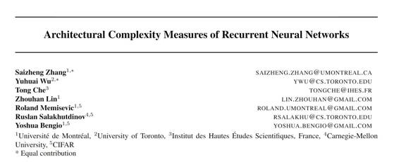
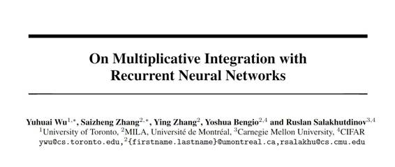
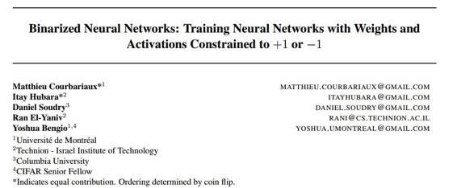
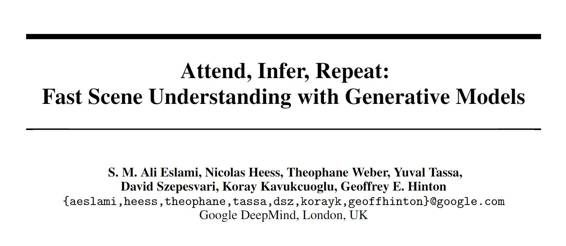
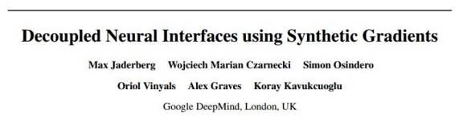
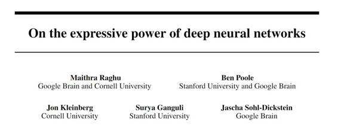

# 学界 | NIPS 2016 公布 571 篇接收论文

选自 NIPS2016

**机器之心编译**

**参与：杜夏德、吴攀、李亚洲**

> *神经计算领域最顶级的会议之一 NIPS 2016 召开在即，日前官方刚公布所接收论文的名单。这篇文章挑选出了 Yoshua Bengio、Yann LeCun、Geoffrey Hinton、DeepMind 等的 6 篇论文进行了摘要介绍，完整的接收论文名单可点击「阅读原文」查看。*

*   **标题：循环神经网络的架构复杂度度量（Architectural Complexity Measures of Recurrent Neural Networks）**

 

作者：Saizheng Zhang*, University of Montreal; Yuhuai Wu, University of Toronto; Tong Che, IHES; Zhouhan Lin, University of Montreal; Roland Memisevic, University of Montreal; Ruslan Salakhutdinov, University of Toronto; Yoshua Bengio, U. Montreal

摘要：本论文中，我们系统地分析了循环神经网络（RNN）的连接架构。我们的主要贡献有两个方面：第一，我们提出了一个严格的图论框架，描述了循环神经网络的一般架构。第二，我们提出了 3 个 RNN 的架构复杂度度量：（a）循环深度，获取了 RNN 长时间内的非线性复杂度，（b）前馈深度，获取了局部的输入-输出非线性（类似于前馈神经网络（FNN）中的「深度」），以及（c）循环跳跃系数（ recurrent skip co-efficient），获取信息如何快速随着时间传播。我们的试验结果发现 RNN 或许会从更大的循环深度和前馈深度中获益。我们进一步证明了当改进序列 MNIST 数据集最好结果时，不断增大的循环跳跃系数可为长期依赖性问题（longterm dependency problems）提供性能提升。

*   **标题：关于递归神经网络的 Multiplicative Integration（On Multiplicative Integration with Recurrent Neural Networks）**

 

作者： Yuhuai Wu, University of Toronto; Saizheng Zhang, University of Montreal; ying Zhang, University of Montreal; Yoshua Bengio, U. Montreal; Ruslan Salakhutdinov, University of Toronto

摘要：我们介绍了一种叫 Multiplicative Integration（MI）的通用的简单结构设计，可用来改进循环神经网络（RNN）。MI 可以改变不同来源的信息的流动方式，并且可被整合到一个 RNN 的计算部件中，同时还几乎不会引入额外的参数。这个新结构可以很容易嵌入到很多流行的 RNN 模型中，包括 LSTM 和 GRU。我们实证分析了它的学习行为并在使用不同 RNN 模型的任务中进行了评估。我们的实验结果证明 Multiplicative Integration 能让很多现有的 RNN 模型的性能大幅提升。

*   **标题：二值神经网络：使用限定于 +1 或 -1 的权重和激活来训练神经网络（Binarized Neural Networks：Training Neural Networks with Weights and Activations Constrained  to +1 or -1）**

 

作者：Itay Hubara, Technion; Matthieu Courbariaux, Université de Montréal; Daniel Soudry, Columbia University; Ran El-Yaniv, Technion; Yoshua Bengio, Université de Montréal

摘要：我们介绍了一种用来训练二值神经网络（Binarized Neural Networks (BNNs)）的方法——二值神经网络是指在运行时间（run-time）只使用二元的权重和激活的神经网络。在训练时间（training-time），该二元的权重和激活可被用于计算参数梯度（parameters gradients）。在前向通过的过程中，BNN 会极大地降低内存大小和减少访问，并能使用位方式的运算替代大部分算术运算，这有望能大幅提升能效。为了验证 BNN 的效果，我们在 Torch7 和 Theano 框架上进行了两组实验。在这两种框架上，BNN 在 MNIST、CIFAR-10 和 SVHN 数据上都得到了几近目前最佳的结果。最后但仍然很重要的是，我们编写了一个二元矩阵乘法 GPU 核（binary matrix multiplication GPU kernel）；比起未优化过的 GPU 核，它让我们运行 MNIST BNN 的速度可能能够快上 7 倍，而且不会在分类准确度上遭受任何损失。用于训练和运行我们的 BNN 的代码现已发布在了网络上。

*   **论文：注意、推理、重复：使用生成模型的快速场景理解（Attend, Infer, Repeat: Fast Scene Understanding with Generative Models）**

 

作者：S. M. Ali Eslami, Google DeepMind; Nicolas Heess, ; Theophane Weber, ; Yuval Tassa, Google DeepMind; David Szepesvari, Google DeepMind; Koray Kavukcuoglu, Google DeepMind; Geoffrey Hinton, Google

摘要：我们提出了一种可以结构化图像模型中进行有效推理的框架，其可以明确地对目标进行推理。我们使用了一个循环神经网络来执行概率推理（probabilistic inference）而实现了这个框架——该循环神经网络会关注场景元素并一次一个地对它们进行处理。重要的是，该模型可以自己学习选择合适的推理步骤数量。我们使用这一方法在部分特定的 2D 模型（大小可变的变分自编码器（variational auto-encoders））和完全特定的 3D 模型（概率渲染器（probabilistic renderers））中学习了执行推理。我们发现这样的模型可以学习识别多个对象——无需任何监督就能计数、定位和分类一个场景中的元素，比如以前所未有的速度在一个神经网络的单次前向通过中将 3D 图像分解成各种数目的对象。我们进一步发现在与监督式的方法进行比较时，该网络可以得到更准确的推理，而且它们的结构也能实现更好的泛化。

*   **标题：使用合成梯度的解耦神经接口（Decoupled Neural Interfaces using Synthetic Gradients）**

作者：Max Jaderberg, Wojciech Marian Czarnecki, Simon Osindero, Oriol Vinyals, Alex Graves, Koray Kavukcuoglu

摘要：训练 directed neural networks 通常需要将数据前向传播通过一个计算图（computation graph），然后再反向传播误差信号，从而生成权重更新。因此，网络中所有层——或称为模块（module）——就会被锁定，在某种意义上，他们必须等待该网络的剩余部分前向执行，然后反向传播误差之后才能实现更新。在本研究成果中，我们通过引入网络图（network graph）的一个未来计算模型而对模块进行解耦，从而打破了这种限制。这些模型仅使用局部信息就能预测建模的子图（subgraph）将会产生的结果。我们尤其关注建模误差梯度（modelling error gradients）：通过使用建模的合成梯度来取代真正的反向传播误差梯度，我们可以解耦子图并独立和异步地对它们进行更新，即我们可以实现解耦神经接口。我们展示了三项实验结果，前向传播模型（其中每一层都是异步训练）、循环神经网络（RNN）（预测某个未来梯度可在 RNN 可以有效建模的时间上进行扩展）、和分层 RNN 系统(在不同时间尺度上执行的)。最后，我们证明：除了预测梯度，该框架还可被用于预测输入，得到可以以前向和反向通过的方式解耦的模型——从而发展成可以联合学习（co-learn）的独立网络，它们可通过这种方式被组合成一个单一的 functioning corporation。

*   **论文：在深度神经网络表达能力上的研究（On the expressive power of deep neural networks）**

作者：Maithra Raghu， Google Brain and Cornell University；Ben Poole ，Stanford University and Google Brain；Jon Kleinberg ，Cornell University Surya Ganguli Stanford University； Jascha Sohl-Dickstein， Google Brain

摘要：我们研究了神经网络在其表达能力（expressive power）深度与广度上的影响。精确的理论和实验结果源于神经网络随机初始化之后的生成集。我们发现了功能表达性的三种不同测量方式：转变的数量（对非线性/复杂性的评测）、网络激活模式（一个新定义，在输入空间与超平面构型有内在联系）、以及一些二分法，展示出在深度而非广度上的指数相关性。这三种评测互相关联，也与第四个量（轨迹长度）成正比。更重要的是，我们从理论和实验两个方面展现出，轨迹长度随深度而指数增长，这也是为什么三种测量都显示出在深度上的指数相关性。这些结果也表明网络中早期的参数对网络的表达能力有极大的影响。所以。任何一个层在表达上的影响都是该网络此层之后剩余层的深度所决定的，这得到了在完全连接网络与卷积神经网络在 MNIST 和 CIFAR-10 进行的实验的证实。

***©本文由机器之心编译，***转载请联系本公众号获得授权***。***

✄------------------------------------------------

**加入机器之心（全职记者/实习生）：hr@almosthuman.cn**

**投稿或寻求报道：editor@almosthuman.cn**

**广告&商务合作：bd@almosthuman.cn**