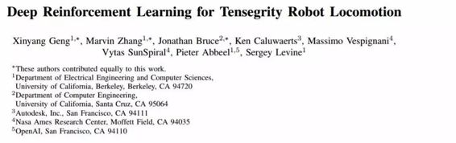
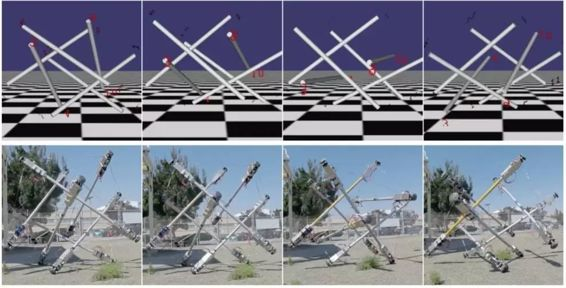
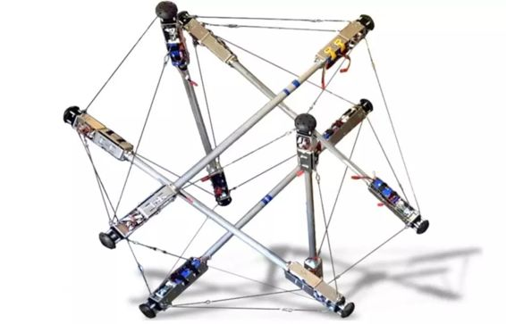

# 学界 | OpenAI 与 NASA 合著论文：用于张拉整体机器人运动的深度强化学习（附论文）

选自 arXiv.org

**机器之心编译**

**参与：吴攀**

**摘要**

张拉整体机器人（tensegrity robot）由弹性线缆所连接刚性杆组成，它拥有许多独特的性质，这些性质让它们有望被用作行星地面运动探测器。但是，因为它们不寻常的结构和复杂的动力学，张拉整体机器人的控制仍然是一项艰巨的挑战。在本研究成果中，我们展示了可以如何使用一种应用于周期运动动作的镜像下降引导策略搜索（MDGPS: mirror descent guided policy search）的全新扩展方法来自动学习运动步态（locomotion gaits）；我们的实验也证明了我们的方法在张拉整体机器人运动上有效性。我们通过在 SUPERball 张拉整体机器人进行真实的和模拟的实验而对我们的方法进行了评估，结果表明其所学到的策略可以泛化至系统参数的改变、不可靠的传感器测量和环境条件的变化，其中包括不同的地形和一个不同的重力范围。我们的实验表明我们的方法不仅能学到用于滚动步态（rolling gaits）的高速且高能效的反馈策略，而且还表明这些策略只需 SUPERball 的加速度计所提供的有限的板载传感信号就能成功实现。我们将所学到的反馈策略和所学到的开环策略与人工设计的控制器进行了比较，发现其所学习到的策略能为 SUPERball 机器人带来最连续的和可靠的运动步态。

*图 1：从左至右：SUPERball 模拟（上）和真实 SUPERball 机器人（下）所执行的朝向相机的滚动运动。该滚动步态是使用我们提出的算法在模拟环境中从零开始学习到的，而且仅使用了板载加速度计的反馈信号。*

*图 2：SUPERball 张拉整体机器人。该机器人由 6 根同样的杆和 24 根线缆组成，其中 12 根可使用连接到杆的端部的电机来致动。该机器人在每个端盖上都使用了板载 IMU 和电机编码器。*

******©本文由机器之心编译，***转载请联系本公众号获得授权******。***

✄------------------------------------------------

**加入机器之心（全职记者/实习生）：hr@almosthuman.cn**

**投稿或寻求报道：editor@almosthuman.cn**

**广告&商务合作：bd@almosthuman.cn**

**点击「阅读原文」，下载此论文↓↓↓**